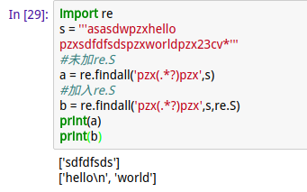
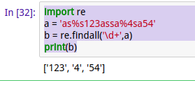

# 正则表达式
### 1.常用符号
`.`：匹配任意字符；
`*`：匹配前一个字符0次或者无限次
`？`：匹配前一个字符0次或者1次
`.*`：贪心算法
`.*？`：非贪心算法
`（）`：括号内的数据作为结果返回

### 2.常用方法
* findall:匹配所以符合规律的内容，返回包含结果的列表
* Search：匹配并且提取第一个符合规律的内容，返回一个正则表达式对象
* Sub：替换符合规律的内容，返回替换后的值

### 3.符号的简单使用
#### .的使用
是一个占位符，例如:
```python
import re
a='xyz123'
b = re.findall('x..',a)#表示x及后面的两位，
b = re.findall('..',a) #将a拆分成两个一组，几个点就拆分成几个一组
print(b)# b=xyz
```
#### \*的使用
\*会匹配前面的字符0次或者无数次，例如
```python
import re
a = 'xyz12z3yz'
b = re.findall('z*',a)#在字符串a中匹配‘z’字符，只要有‘z’就匹配
print(b)#b=['', '', 'z', '', '', 'z', '', '', 'z', '']，它只匹配所有的‘z’。
```
#### ？的使用
匹配前一个字符0次或1次，例如：
```python
import re
a = 'xyz1234'
b = re.findall('x?',a)
print(b)#b=['x','','','','','','']
```
#### .\* 和.\*？的使用及比较
```python
import re

sec = 'hadkfalifexxIxxfasdjifja134xxamxx23345sdfxxezrealxx8dfse'
b = re.findall('xx.*xx',sec)#贪心算法，匹配第一个`xx`到最后一个`xx`之间的所以内容
c = re.findall('xx.*?xx',sec)
print(b)
print(c)
结果：
b=['xxIxxfasdjifja134xxamxx23345sdfxxezrealxx']#贪心算法，匹配第一个`xx`到最后一个`xx`之间的所以内容
c=['xxIxx', 'xxamxx', 'xxezrealxx']#非贪心算法，匹配成对的`xx`之间的内容
```
#### （）的使用
返回（）内的结果,例如
```python
import re

sec = 'hadkfalifexxIxxfasdjifja134xxamxx23345sdfxxezrealxx8dfse'
b = re.findall('xx(.*)xx',sec)
c = re.findall('xx(.*?)xx',sec)
print(b)
print(c)
结果：
b=['Ixxfasdjifja134xxamxx23345sdfxxezreal']
c=['I', 'am', 'ezreal']
```
**当字符串有换行符时，如果加上re.S,则可以匹配换行符**
```python
import re
s = '''asasdwpzxhello
pzxsdfdfsdspzxworldpzx23cv*'''
#未加re.S
a = re.findall('pzx(.*?)pzx',s)
#加入re.S
b = re.findall('pzx(.*?)pzx',s,re.S)
print(a)
print(b)
```
结果：
###### 效果很显著！！

#### sub的使用
sub是搜寻符合规则的内容，然后使用给定的内容替换搜索到的内容，并且返回给定的内容：
```python
import re
a = '123zasdd32a123'
b = re.sub('123(.*?)123','456789',a)
print(b)
结果：
456789
```

### 4.常用技巧
1.匹配纯数字
```python
import re
a = 'as%s123assa%4sa54'
b = re.findall('\d+',a)
print(b)
```
结果：



我们已经成功的匹配到了有的数字
