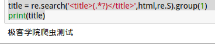
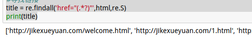
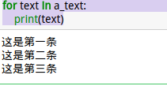
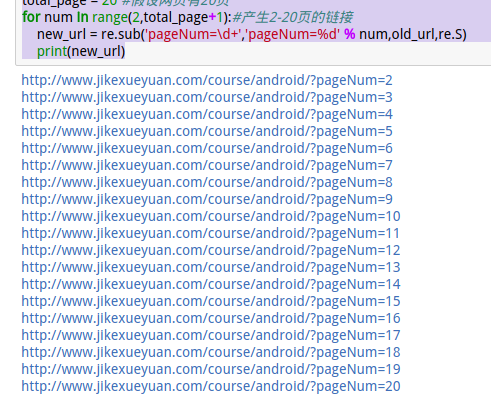

# 正则表达式的应用
#### 1.获得HTML文件中的title
用serach来寻找，因为title只寻找一次，找到了就退出，一般HTML中只有一个title。
```python
import re

old_url = 'http://www.jikexueyuan.com/course/android/?pageNum=2'#假设的网址
total_page = 20 #假设网页有20页

f = open('../txt/text.txt','r')
html = f.read()
f.close()
#寻找标题
title = re.search('<title>(.*?)</title>',html,re.S).group(1)
print(title)
```
**结果：**



#### 2.获得链接：
链接一般都是 `<a href = ""></a>`,所以想要获得链接的地址，只要`href=""`的内容就可以了：
```python
import re

old_url = 'http://www.jikexueyuan.com/course/android/?pageNum=2'#假设的网址
total_page = 20 #假设网页有20页

f = open('../txt/text.txt','r')
html = f.read()
f.close()
#寻找链接
href = re.findall('href="(.*?)"',html,re.S)
print(href)
```
**结果：**



#### 3.获取部分文字
遵循先`大`后`小`的原则：
```python
import re

old_url = 'http://www.jikexueyuan.com/course/android/?pageNum=2'#假设的网址
total_page = 20 #假设网页有20页

f = open('../txt/text.txt','r')
html = f.read()
f.close()
#提取部分文字
ul = re.findall('<ul>(.*?)</ul>',html,re.S)[0]#先获取包含我们想要得到的文本信息的大框架
a_text = re.findall('">(.*?)</a>',ul,re.S)#从得到的大框架中再获取文本信息，避免获得不想要的内容
for text in a_text:
    print(text)
```
**结果：**



#### 4.sub实现翻页功能
sub的使用方法：`result=re.sub('被代替的内容','内容'，被操作的字符串,re.S)`
```python
import re

old_url = 'http://www.jikexueyuan.com/course/android/?pageNum=2'#假设的网址
total_page = 20 #假设网页有20页
for num in range(2,total_page+1):#产生2-20页的链接
    new_url = re.sub('pageNum=\d+','pageNum=%d' % num,old_url,re.S)
    print(new_url)
```
**结果：**



可以看到，已经成功实现了翻页，但是只针对有规则的页面，对于不规则的链接，只能采取其他方法。