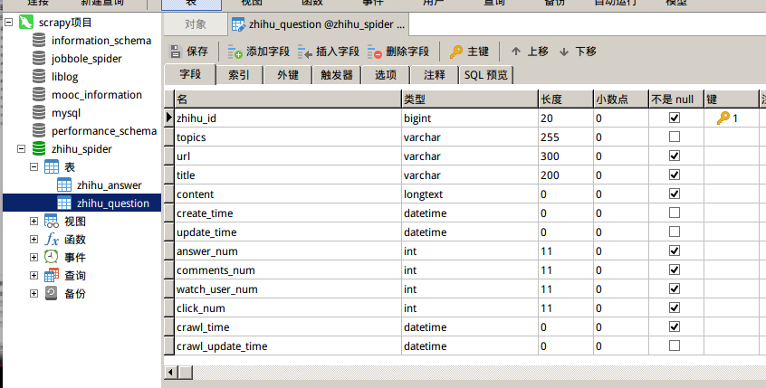
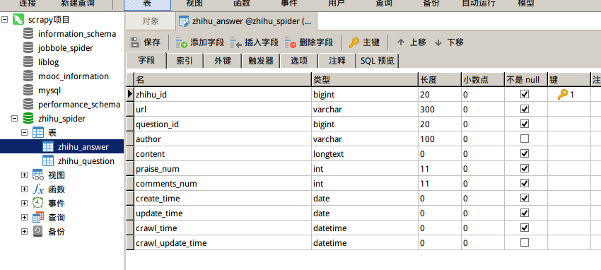
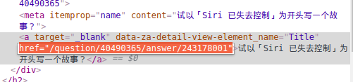
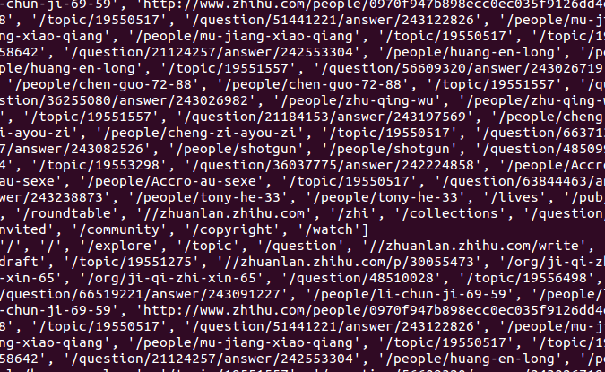
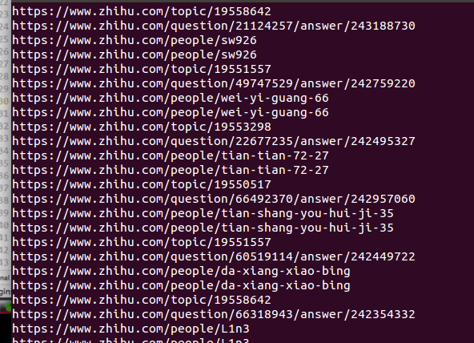
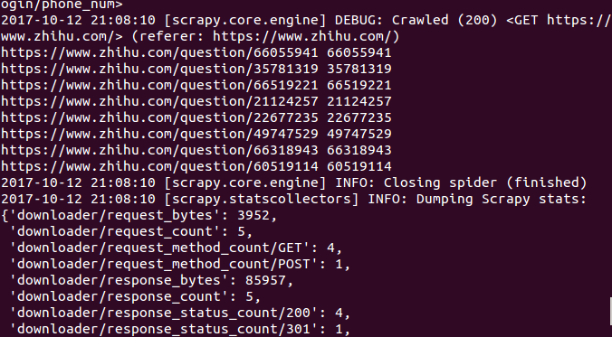
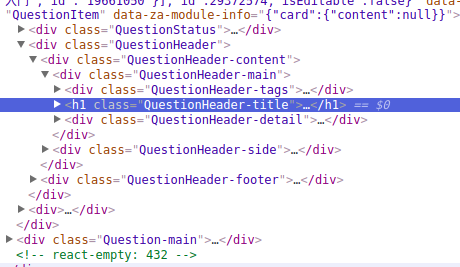
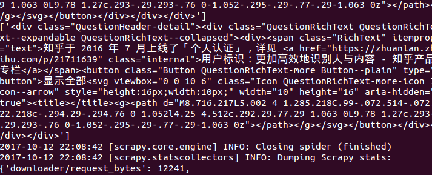
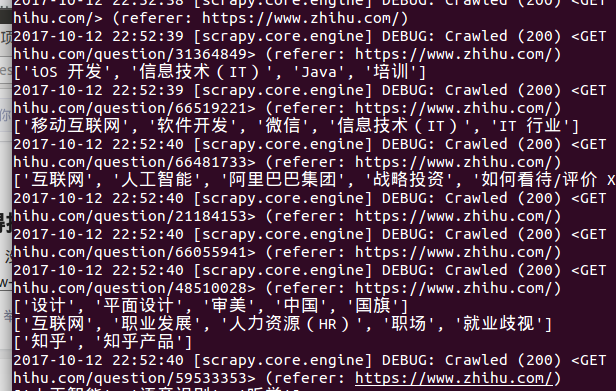

# 知乎具体字段提取

[TOC]

### 1 数据表的设计
新建一个名为`zhihu_spider`的数据库，在数据库中新建一个名为`zhihu_answer`的数据表和一个名为`zhihu_question`，它的具体信息如下：
*数据表`zhihu_question`:*



*数据表`zhihu_answer`：*



### 2 爬虫代码与逻辑
#### 一、策略
采用深度优先的算法。即提取出`HTML`页面中的所有URL，并跟踪这些URL进一步爬取。如果提取的URL中格式为`/question/xxx`就在下载之后直接进入解析函数。
获取主页中的所有`a`标签
```python
def parser(self, response):
	all_urls = response.css('a：:attr(href)').extract()
    
```
*但是得到的URL地址是不全的：*
**浏览器端：**



**爬到的URL：**



所有需要用到Python的一个包：
```python
from urllib import  parse #py3写法
import urlparse #py2写法
def parser(self, response):
	all_urls = response.css('a：:attr(href)').extract()
    all_urls = [parse.urljoin(response.url, url) for url in all_urls]
```
*处理后的结果：*



但是其中一些不是链接，而是其他的，所以载添加一句进行过滤：
```Python
from urllib import  parse #py3写法
import urlparse #py2写法
def parser(self, response):
	all_urls = response.css('a：:attr(href)').extract()
    all_urls = filter(lambda x:True if x.startswith("https") else False, all_urls)
    all_urls = [parse.urljoin(response.url, url) for url in all_urls]
```

#### 二、使用正则表达式区分新URL和旧的URL
```Python
import re
def parser(self, response):
	all_urls = response.css('a：:attr(href)').extract()
    all_urls = filter(lambda x:True if x.startswith("https") else False, all_urls)
    all_urls = [parse.urljoin(response.url, url) for url in all_urls]
    for url in all_urls:
    	match_obj = re.match('.*zhihu.com/question/(\d+).*',url)
        if match_obj:
        	match_obj = re.match("(.*zhihu.com/question/(\d+))(/|$).*", url)
            if match_obj:
                print(match_obj)
```
*过滤结果：*




#### 三、把问答的URL传给下载器执行
```Python
def parse(self, response):
        #提取所有的URL并跟踪下载
        all_urls = response.css('a::attr(href)').extract()
        all_urls = [parse.urljoin(response.url, url) for url in all_urls]
        all_urls = filter(lambda x:True if x.startswith('https') else False, all_urls)
        for url in all_urls:
            match_obj = re.match("(.*zhihu.com/question/(\d+))(/|$).*", url)
            if match_obj:
                request_url = match_obj.group(1)
                question_id = match_obj.group(2)
                # print(request_url, question_id)
                yield scrapy.Request(request_url, headers=self.headers, callback=parse_question)
```
打开`items.py`文件，定义Items，他的Items字段和数据表中的一致：
```Python
 #知乎问题的Item
class ZhihuQuestionItem(scrapy.Item):
    zhihu_id = scrapy.Field()
    topics = scrapy.Field()
    url = scrapy.Field()
    title = scrapy.Field()
    content = scrapy.Field()
    answer_num = scrapy.Field()
    comments_num = scrapy.Field()
    watch_user_num = scrapy.Field()
    click_num = scrapy.Field()
    crawl_time = scrapy.Field()
```
```Python
#知乎回答的items
class ZhihuAnswerItem(scrapy.Item):
    zhihu_id = scrapy.Field()
    url = scrapy.Field()
    question_id = scrapy.Field()
    author = scrapy.Field()
    content = scrapy.Field()
    praise_num = scrapy.Field()
    comments_num = scrapy.Field()
    create_time = scrapy.Field()
    update_time = scrapy.Field()
    crawl_time = scrapy.Field()
```

### 3 处理新旧版本的问答页面
*新版本的源码：*



优先处理新版本。
```python
 #获得页面中的具体字段
    #处理question页面，获得具体的items
    def parse_question(self, response):
        match_obj = re.match("(.*zhihu.com/question/(\d+))(/|$).*", response.url)
        if match_obj:
            question_id = int(match_obj.group(2))
        if "QuestionHeader-title" in response.text:
            #处理新版本
            item_loader = ItemLoader(item=ZhihuQuestionItem(), response = response)
            item_loader.add_css("title", "h1.QuestionHeader-title::text")
            item_loader.add_css("content", ".QuestionHeader-detail")
            item_loader.add_value("url", response.url)
            item_loader.add_value("zhihu_id", question_id)
            item_loader.add_css("answer_num", "h4.List-headerText span::text")
            item_loader.add_css("comments_num", ".QuestionHeader-Comment button::text")
            item_loader.add_css("watch_user_num", ".QuestionFollowStatus-counts button .NumberBoard-value::text")
            item_loader.add_css("click_num", ".NumberBoard-value::text")
            item_loader.add_css("topics", ".Tag-content a div div::text")
            print(topics)
```
*字段提取过程：*



