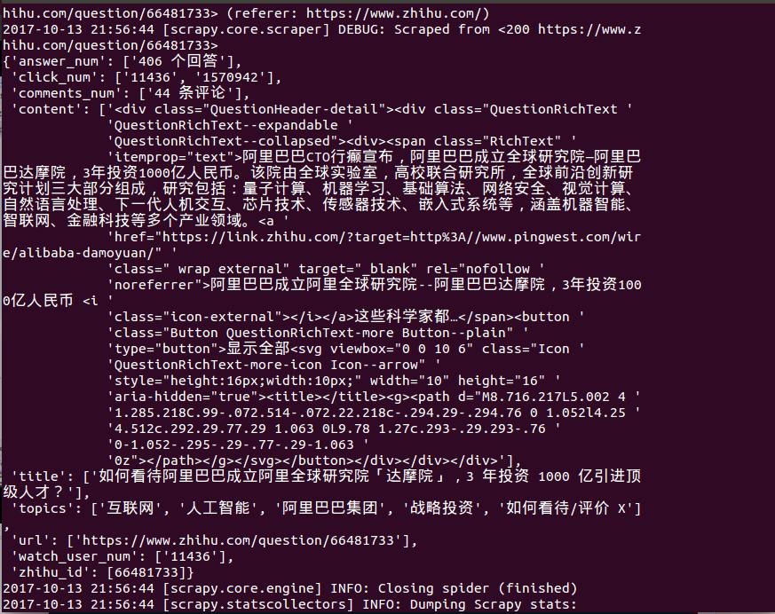
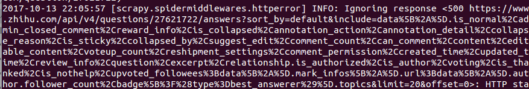
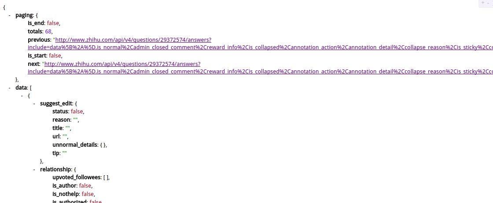
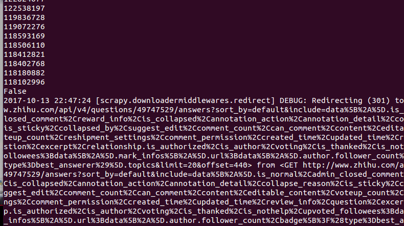
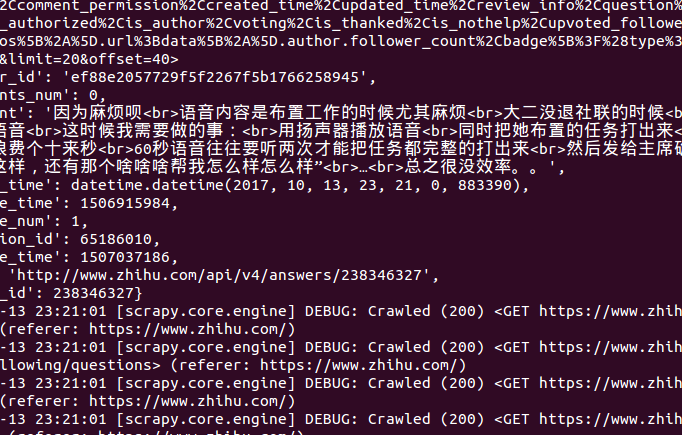

# 爬取展示
### 1 成功提取
`zhihu.py`:
```Python
# -*- coding: utf-8 -*-
import scrapy
from bs4 import BeautifulSoup
import json
import re
import datetime
from urllib import parse
from scrapy.loader import ItemLoader
from Bolespider.items import ZhihuQuestionItem, ZhihuAnswerItem

class ZhihuSpider(scrapy.Spider):
    name = 'zhihu'
    allowed_domains = ['www.zhihu.com']
    start_urls = ['http://www.zhihu.com/']

    #question的answer起始页
    start_answer_url = "https://www.zhihu.com/api/v4/questions/{0}/answers?sort_by=default&include=data%5B%2A%5D.is_normal%2Cadmin_closed_comment%2Creward_info%2Cis_collapsed%2Cannotation_action%2Cannotation_detail%2Ccollapse_reason%2Cis_sticky%2Ccollapsed_by%2Csuggest_edit%2Ccomment_count%2Ccan_comment%2Ccontent%2Ceditable_content%2Cvoteup_count%2Creshipment_settings%2Ccomment_permission%2Ccreated_time%2Cupdated_time%2Creview_info%2Cquestion%2Cexcerpt%2Crelationship.is_authorized%2Cis_author%2Cvoting%2Cis_thanked%2Cis_nothelp%2Cupvoted_followees%3Bdata%5B%2A%5D.mark_infos%5B%2A%5D.url%3Bdata%5B%2A%5D.author.follower_count%2Cbadge%5B%3F%28type%3Dbest_answerer%29%5D.topics&limit={1}&offset={2}"

    headers = {
        'User-Agent': 'Mozilla/5.0 (X11; Linux x86_64) AppleWebKit/537.36 (KHTML, like Gecko) Chrome/61.0.3163.100 Safari/537.36',
        'Host': 'www.zhihu.com',
        "Referer": "https://www.zhihu.com/",
    }

    def parse(self, response):
        #提取所有的URL并跟踪下载
        all_urls = response.css('a::attr(href)').extract()
        all_urls = [parse.urljoin(response.url, url) for url in all_urls]
        all_urls = filter(lambda x:True if x.startswith('https') else False, all_urls)
        for url in all_urls:
            match_obj = re.match("(.*zhihu.com/question/(\d+))(/|$).*", url)
            if match_obj:
                request_url = match_obj.group(1)
                # print(request_url)
                yield scrapy.Request(request_url, headers=self.headers, callback=self.parse_question)
            # else:
            #     yield scrapy.Request(url, headers=self.headers, callback=self.parse)
    
    #获得页面中的具体字段
    #处理question页面，获得具体的items
    def parse_question(self, response):
        if "QuestionHeader-title" in response.text:
            match_obj = re.match("(.*zhihu.com/question/(\d+))(/|$).*", response.url)
            if match_obj:
                question_id = int(match_obj.group(2))
            #处理新版本
            item_loader = ItemLoader(item=ZhihuQuestionItem(), response = response)
            item_loader.add_css("title", "h1.QuestionHeader-title::text")
            item_loader.add_css("content", ".QuestionHeader-detail")
            item_loader.add_value("url", response.url)
            item_loader.add_value("zhihu_id", question_id)
            item_loader.add_css("answer_num", "h4.List-headerText span::text")
            item_loader.add_css("comments_num", ".QuestionHeader-Comment button::text")
            item_loader.add_css("watch_user_num", ".QuestionFollowStatus-counts button .NumberBoard-value::text")
            item_loader.add_css("click_num", ".NumberBoard-value::text")
            item_loader.add_css("topics", ".Tag-content a div div::text")
            #传递上面的字段到items
            question_item = item_loader.load_item()
        yield 
        yield question_item
```

*结果展示：*



### 2 获得回答页面的内容
先测试一下，成功了再完善代码：
```Python
  #解析回答页面的函数
    def paser_answer(self, response):
        ans_json = json.loads(response.text)
        print(ans_json)
```

*成功了,得到的回答页面的数据：*





### 3 回答页面字段提取





```python
# -*- coding: utf-8 -*-
import scrapy
from bs4 import BeautifulSoup
import json
import re
import datetime
from urllib import parse
from scrapy.loader import ItemLoader
from Bolespider.items import ZhihuQuestionItem, ZhihuAnswerItem

class ZhihuSpider(scrapy.Spider):
    name = 'zhihu'
    allowed_domains = ['www.zhihu.com']
    start_urls = ['http://www.zhihu.com/']

    #question的answer起始页
    start_answer_url = "https://www.zhihu.com/api/v4/questions/{0}/answers?sort_by=default&include=data%5B%2A%5D.is_normal%2Cadmin_closed_comment%2Creward_info%2Cis_collapsed%2Cannotation_action%2Cannotation_detail%2Ccollapse_reason%2Cis_sticky%2Ccollapsed_by%2Csuggest_edit%2Ccomment_count%2Ccan_comment%2Ccontent%2Ceditable_content%2Cvoteup_count%2Creshipment_settings%2Ccomment_permission%2Ccreated_time%2Cupdated_time%2Creview_info%2Cquestion%2Cexcerpt%2Crelationship.is_authorized%2Cis_author%2Cvoting%2Cis_thanked%2Cis_nothelp%2Cupvoted_followees%3Bdata%5B%2A%5D.mark_infos%5B%2A%5D.url%3Bdata%5B%2A%5D.author.follower_count%2Cbadge%5B%3F%28type%3Dbest_answerer%29%5D.topics&limit={1}&offset={2}"

    headers = {
        'User-Agent': 'Mozilla/5.0 (X11; Linux x86_64) AppleWebKit/537.36 (KHTML, like Gecko) Chrome/61.0.3163.100 Safari/537.36',
        'Host': 'www.zhihu.com',
        "Referer": "https://www.zhihu.com/",
    }

    def parse(self, response):
        #提取所有的URL并跟踪下载
        all_urls = response.css('a::attr(href)').extract()
        all_urls = [parse.urljoin(response.url, url) for url in all_urls]
        all_urls = filter(lambda x:True if x.startswith('https') else False, all_urls)
        for url in all_urls:
            match_obj = re.match("(.*zhihu.com/question/(\d+))(/|$).*", url)
            if match_obj:
                request_url = match_obj.group(1)
                # print(request_url) 
                yield scrapy.Request(request_url, headers=self.headers, callback=self.parse_question)
            else:
                #如果不是question就进一步跟踪
                yield scrapy.Request(url, headers=self.headers, callback=self.parse)
    
    #获得页面中的具体字段
    #处理question页面，获得具体的items
    def parse_question(self, response):
        if "QuestionHeader-title" in response.text:
            match_obj = re.match("(.*zhihu.com/question/(\d+))(/|$).*", response.url)
            if match_obj:
                question_id = int(match_obj.group(2))
            #处理新版本
            item_loader = ItemLoader(item=ZhihuQuestionItem(), response = response)
            item_loader.add_css("title", "h1.QuestionHeader-title::text")
            item_loader.add_css("content", ".QuestionHeader-detail")
            item_loader.add_value("url", response.url)
            item_loader.add_value("zhihu_id", question_id)
            item_loader.add_css("answer_num", "h4.List-headerText span::text")
            item_loader.add_css("comments_num", ".QuestionHeader-Comment button::text")
            item_loader.add_css("watch_user_num", ".QuestionFollowStatus-counts button .NumberBoard-value::text")
            item_loader.add_css("click_num", ".NumberBoard-value::text")
            item_loader.add_css("topics", ".Tag-content a div div::text")
            #传递上面的字段到items
            question_item = item_loader.load_item()
        yield scrapy.Request(self.start_answer_url.format(question_id, 20, 0), headers=self.headers, callback=self.paser_answer)
        yield question_item


    #解析回答页面的函数
    def paser_answer(self, response):
        #回答页面的请求
        ans_json = json.loads(response.text)
        is_end = ans_json["paging"]["is_end"]
        next_url = ans_json["paging"]["next"]
        #提取回答页面的具体字段
        for answer in ans_json["data"]:
            answer_item = ZhihuAnswerItem()
            answer_item['zhihu_id'] = answer['id']
            answer_item['url'] = answer['url']
            answer_item['question_id'] = answer['question']['id']
            #增加判断匿名回答的情况
            answer_item['author_id'] = answer['author']['id'] if "id" in answer['author'] else None
            #同理。内容不存在是传递其他东西
            answer_item['content'] = answer['content'] if "content" in answer else answer['excerpt']
            answer_item['praise_num'] = answer['voteup_count']
            answer_item['comments_num'] = answer['comment_count']
            answer_item['create_time'] = answer['created_time']
            answer_item['update_time'] = answer['updated_time']
            answer_item['crawl_time'] = datetime.datetime.now()
            
            #把上面得到的字段传到items交给pipeline处理
            yield answer_item
        #判断是不是回答页面的最后一页，不是的话就进入下一页的URL
        if not is_end:
            yield scrapy.Request(next_url, headers=self.headers, callback=self.paser_answer)


    #向登录页面发送请求
    def start_requests(self):
        return[scrapy.Request('https://www.zhihu.com/#signin', headers =self.headers, callback = self.login)]


    #模拟登录需要的数据获取
    def login(self, response):
        text = response.text
        soup = BeautifulSoup(text,'html.parser')
        xsrf = soup.select('input[name="_xsrf"]')[0]['value']
        if xsrf:
            post_url = 'https://www.zhihu.com/login/phone_num'
            post_data = {
                '_xsrf': xsrf,
                'phone_num': '账号',
                'password': '密码'
            }
            import time
            t = str(int(time.time() * 1000))
            captcha_url = "https://www.zhihu.com/captcha.gif?r={0}&type=login".format(t)
            yield scrapy.Request(captcha_url, headers=self.headers, meta={"post_data":post_data}, callback=self.login_after_captcha)


    #通过验证码验证
    def login_after_captcha(self, response):
        with open("captcha.jpg", "wb") as f:
            f.write(response.body)
            f.close()

        from PIL import Image
        try:
            im = Image.open('captcha.jpg')
            im.show()
            im.close()
        except:
            pass

        captcha = input("输入验证码\n>")

        post_data = response.meta.get("post_data", {})
        post_url = "https://www.zhihu.com/login/phone_num"
        post_data["captcha"] = captcha
        return [scrapy.FormRequest(
            url=post_url,
            formdata=post_data,
            headers=self.headers,
            callback=self.check_login
        )]


    # 检查登录是否成功
    def check_login(self,response):
        url = 'https://www.zhihu.com/login/phone_num'
        text_json = json.loads(response.text)
        if "msg" in text_json and text_json["msg"] == "登录成功":
            for ur in self.start_urls:
                yield scrapy.Request(url, dont_filter=True, headers=self.headers)


```

