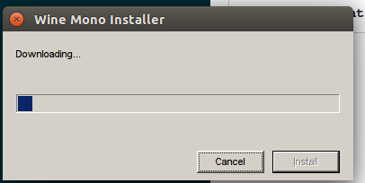
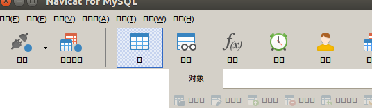
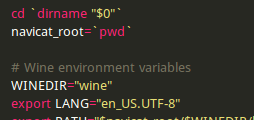
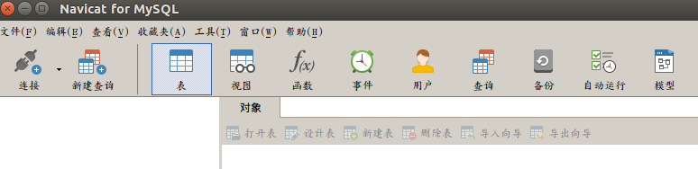

# Ubuntu Navicat for MySQL安装以及破解方案
#### 安装
1.下载`navicat120_mysql_cs_x64.tar.gz`，网站： (http://www.navicat.com.cn/products)
2.下载好以后解压文件
```
$ cd 下载
$ tar -zxvf navicat120_mysql_cs_x64.tar.gz
```
3.解压后，进入目录运行命令：
```
$ cd navicat120_mysql_cs_x64
$ ./start_navicat
```
**安装中：**



等它安装完成重新打开就可以了。
#### MySQL中文乱码解决
1.外部访问MySQL
```
$ sudo vim /etc/mysql/my.cnf
```
找到这一行：


把`bind-address =127.0.0.1`修改为：`bind-address =0.0.0.0`,保存退出。
然后重启Mysql即可：
```
$ sudo service mysql restart
```
(http://www.cnblogs.com/mufire/p/6697994.html)

#### 破解方案
第一次执行`start_navicat`时，会在用户主目录下生成一个名为`.navicat64`的隐藏文件夹。
```
$ cd /home/pzx/.navicat64/  
```
此文件夹下有一个`system.reg`文件
```
$ rm system.reg
```
把此文件删除后，下次启动`navicat `会重新生成此文件，30天试用期会按新的时间开始计算。

##### 乱码问题
打开后是这样：



**解决方法：**
进入navicat所在的目录，打开`start_navicat`文件，找到这几行：



把`export LANG="en_US.UTF-8"`改为：`export LANG="zh_CN.UTF-8`,然后保存，重新启动navicat就可以了。
**重启后：**

