# Node爬虫数据到跨平台APP

### 1 数据采集前分析
nodeJs爬虫采用`Request`模块来下载数据，然后使用`cheerio`模块和`css`选择器来提取关键字段。爬虫策略大致如下：

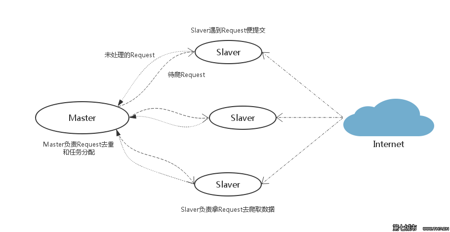

这是爬虫的开始页面：[开始页面](http://www.shicimingju.com/shicimark/tangshisanbaishou_1.html)。打开后是这个样子：

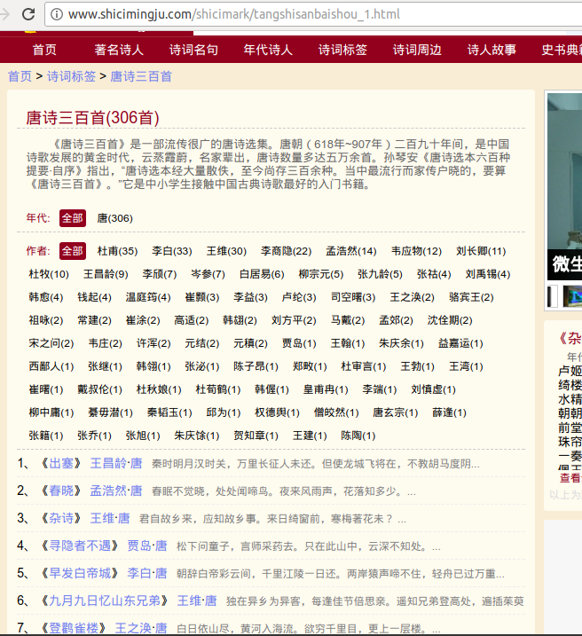

在这个页面中。我们只需要获得带序号的诗词的名字，然后获得它们的链接就行。每一页有四十个。

这是每一首诗词的具体页面：[诗词的具体页面](http://www.shicimingju.com/chaxun/list/2973.html)。这些链接毫无规律。所以我们需要从上一个页面中获得每一首诗词的具体页面的链接。
**具体页面**

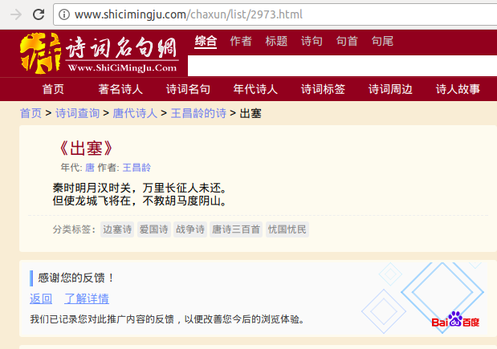

在这个页面中，我们需要的字段有：标题、年代、作者和诗词的具体内容。

### 2 数据采集及美化
经过分析，我们需要的信息已经定下来了，接下来就开始写爬虫代码实现。
**获得每个页面的所以诗词的链接：**
```JavaScript
request(url, function (error, response, body) {
    if (!error && response.statusCode == 200) {
        // console.log(body);
        var $ = cheerio.load(body, {decodeEntities: false});
        var urls = $('div.yuanjiao.shicimark>ul>li a').html();
        $('div.yuanjiao.shicimark>ul>li>a:nth-child(1)').each(function(i, e) {
                var halfUrl =$(e).attr('href');
                var completeUrl = urlSite + halfUrl;
                getContent(page,i,completeUrl);
                // console.log('第'+page+'的链接',completeUrl);
            });
```
*每一页的所有链接：*

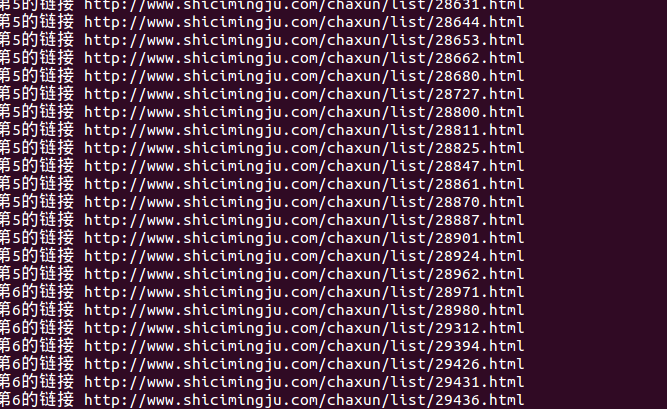

**获取诗词的具体字段：**
```JavaScript
request(url, function (error, response, body) {
    if (!error && response.statusCode == 200) {
        // console.log(body);
        var $ = cheerio.load(body, {decodeEntities: false});
        var $content = $('div#middlediv>div.zhuti.yuanjiao').html();
        var title = $('div#middlediv>div.zhuti.yuanjiao>h2').html();
        var year = $('div#middlediv>div.zhuti.yuanjiao>.jjzz>a:nth-child(1)').html();
        var author = $('div#middlediv>div.zhuti.yuanjiao>.jjzz>a:nth-child(2)').html();
        var content = $('div#shicineirong').html();
```
*具体字段*

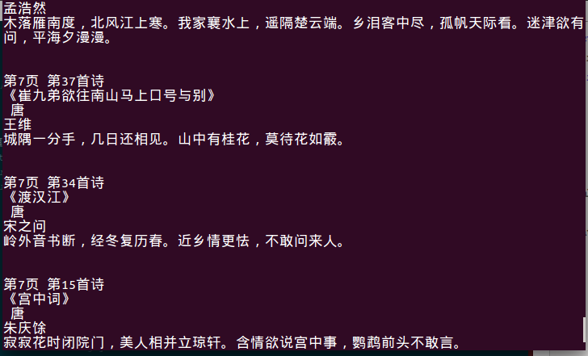

**获取下一页**
```JavaScript
由于它的页面比较小，所以就直接使用循环来获取下一页：
for (var i = 1; i<=8; i++) {
    var nextUrl = 'http://www.shicimingju.com/shicimark/songcisanbaishou_'+i+'.html';
}
```
然后分别把上面的代码封装成三个函数保存为`app.js`。调用他们就可以完成爬取。

### 3 制作APP前预了解--NW.js介绍
制作app的是一款叫做`nw.js`的工具。NW.js 基于Chromium内核与Node.js。NW.js让我们在编写应用时可以使用Node.js及其modules与web开发技术。而且，还可以非常容易的将一个WEB应用打包成一个原生应用。
**它工作流程大致是这样的：**

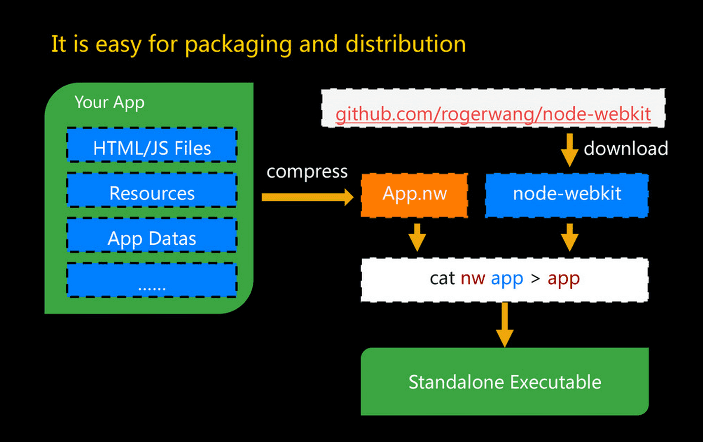

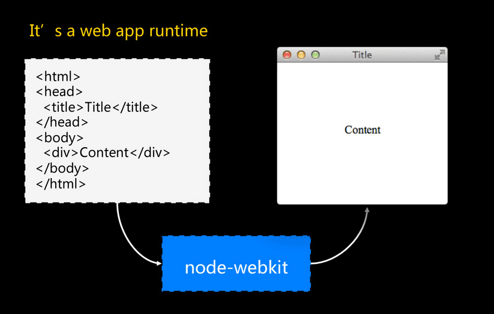

[NW.js参考文档](https://liuxp.me/nwjs/For%20Users/Getting%20Started/)
先去下载NW.js：[NW.js下载地址](https://nwjs.io/)。由于它是跨平台的所以选择自己系统对应的版本。下载完成后，先简单的测试一下：

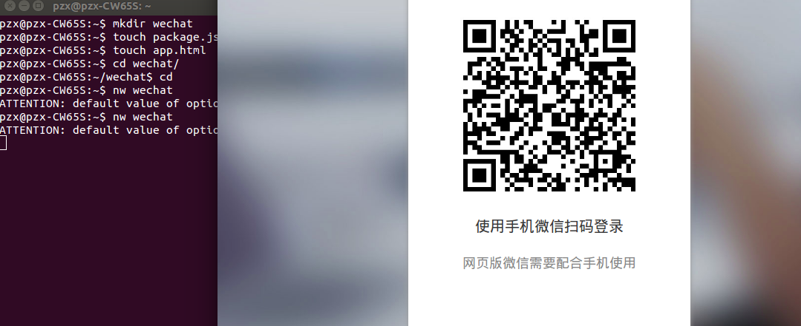

可以运行的。

### 4 制作APP
下载完成`NW.js`并且测试可以运行后，新建项目：`gushici`。新建`package.json`文件：
```json
{  
    "name": "诗词阅读器",  
  
    "main": "index.html",  
  
    "window": {  
          
        "title": "诗词阅读器",  
      
        "resizable":true,  
  
        "toolbar": true,  
  
        "width": 900,  
      
    "height": 600  
      
    }  
  
}  
```
其中，`main`和`name`是必须字段。分别是项目的开始页面和名字。然后新建一个HTML文件。加入下面的代码：
```JavaScript
<!DOCTYPE html>
<html lang="en">
<head>
    <title>诗词阅读器--Ezreal</title>
    <meta charset="utf-8">
    <meta name="viewport" content="width=device-width, initial-scale=1.0">
    <link rel="stylesheet" type="text/css" href="css/index.css">
</head>
<body>
    <h1>诗词阅读器</h1>
    <h2>宋词</h2>
<div id="content">
</div>
<script data-main='app.js' src="node_modules/requirejs/require.js" charset="utf-8"></script>
</body>
</html>
```
然后修改`app.js`，把获得的信息添加到页面上去：
```JavaScript
//获取页面中的诗歌的标题、年代、作者和内容
function getContent(page,i,url) {
    request(url, function (error, response, body) {
    if (!error && response.statusCode == 200) {
        // console.log(body);
        var $ = cheerio.load(body, {decodeEntities: false});
        // var $content = $('div#middlediv>div.zhuti.yuanjiao').html();
        var title = $('div#middlediv>div.zhuti.yuanjiao>h2').text();
        var year = $('div#middlediv>div.zhuti.yuanjiao>.jjzz>a:nth-child(1)').text();
        var author = $('div#middlediv>div.zhuti.yuanjiao>.jjzz>a:nth-child(2)').text();
        var content = $('div#shicineirong').text();
        var contents = '<div calss=complete-songci>' + '<h3>' + title + '</h3>' + '<div class=year-author>' + year + '*' + author + '</div>' + '<div class=songci><p>' + content + '</p></div>' + '</div>';
        document.getElementById('content').innerHTML += contents;
    }
});
}
```
然后运行试试效果：
```
$ nw 项目的名字
$ nw gushici
```

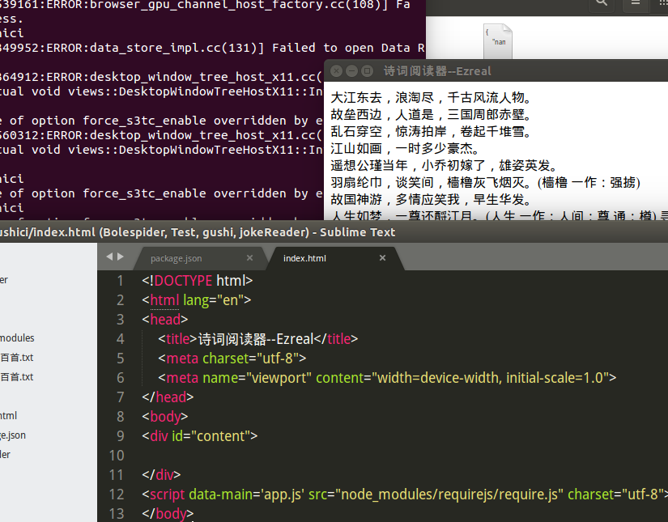

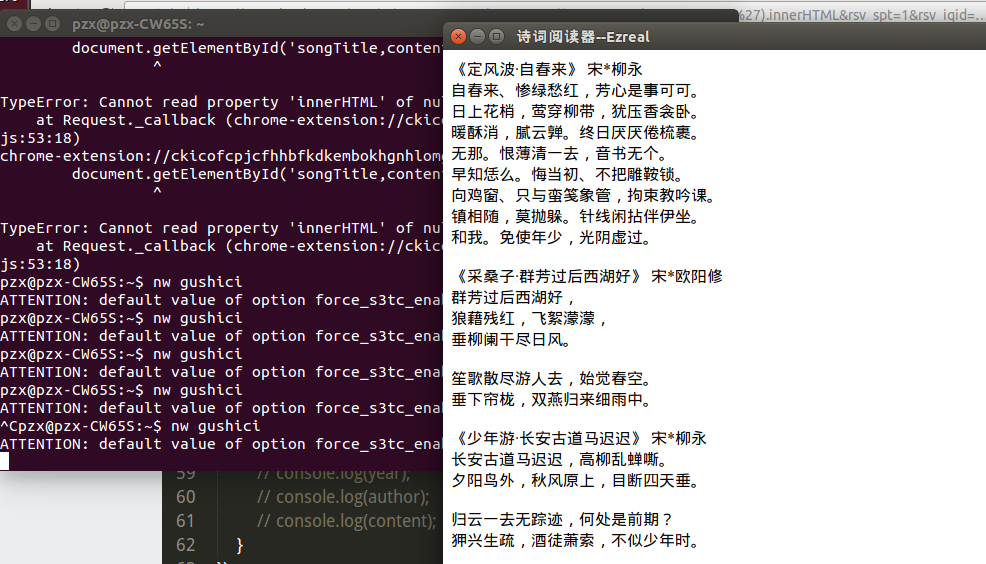

这样的页面不好看。可以添加css来美化我们的页面
**美化后的页面**

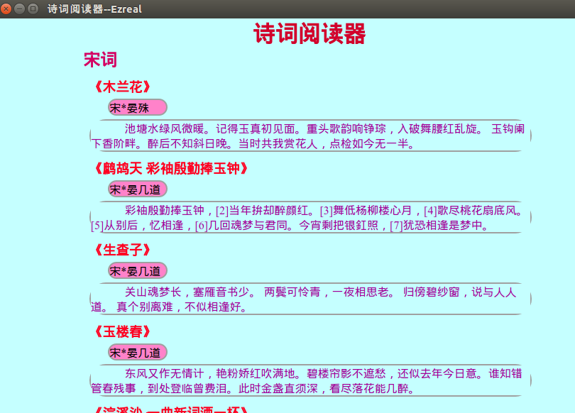

### 5 制作成.exe
在Windows环境下进行操作：
1.把项目打包，然后压缩成`.zip`文件，然后把后缀名由`.zip`改成`.nw`，把它复制到`nw.js`安装目录
2.打开`cmd`,进入`nw.js`的安装目录：`copy /b nw.exe+gushiic.nw Reader.exe`
这样一个原生的应用程序就做好了：

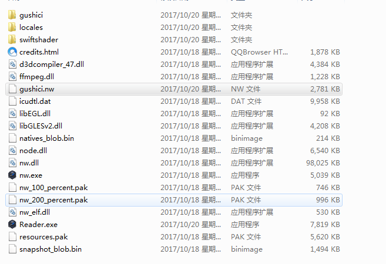

运行一下：

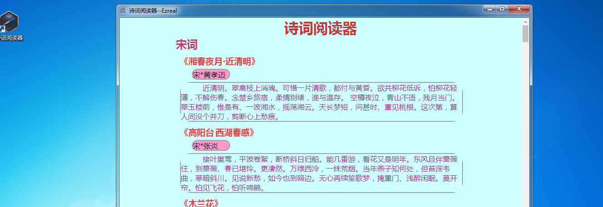

运行没问题。

在liunx操作系统下：
```
$ cat nw gushici.nw > Reader.exe && chmod +x Reader.exe
```
就可以了。如果要打包成在Linux下可运行的应用，则相对要麻烦一些：
```
在Linux系统中，你需要创建合适的.desktop 文件。
$ cd /usr/share/applications
$ sudo touch Reader.desktop
$ sudo chmod u+x Reader.desktop //赋予执行权限
然后给他添加图片作为图标

要创建一个自动安装脚本，你可以使用shar 或 makeself。

要通过包管理系统分发您的应用程序，比如apt、yum、pacman等，请按照他们的官方说明文档来创建包。
```