# 爬取拉勾网职位信息
### 1 网页分析
```
1、网站URL：https://www.lagou.com/
2、将要爬取的子域名：
	https://www.lagou.com/zhaopin/Java/?labelWords=label；
    https://www.lagou.com/gongsi/j151021.html；
    https://www.lagou.com/jobs/3025551.html；

```
在整个网站里，我们就只需要上面列举的URL的信息。其他的就可以过滤掉。所以在`lagou.py`的`rules`里添加不被过滤的域名：
**`lagou.py`**
```python
 rules = (
        Rule(LinkExtractor(allow=('zhaopin/.*',)), follow=True),
        Rule(LinkExtractor(allow=('gongsi/j\d+.html',)), follow=True),
        Rule(LinkExtractor(allow=r'jobs/\d+.html'), callback='parse_job', follow=True),
    )
```
*然后运行一下，看看是否成功：*

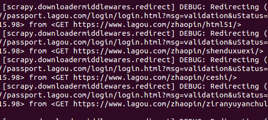

过滤已经有效了，现在的URL都是我们需要的域名的URL。

### 2 模拟登录
当我用`scrapy shell https://www.lagou.com/jobs/3025551.html`进行调试的时候，才发现需要登录：

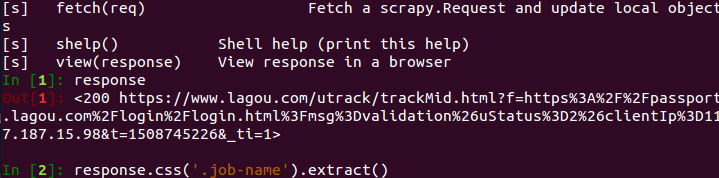

返回的response不是网页源代码而是一个网址，这是拉勾网的登录网址。打开登录页面，登录后进行抓包：

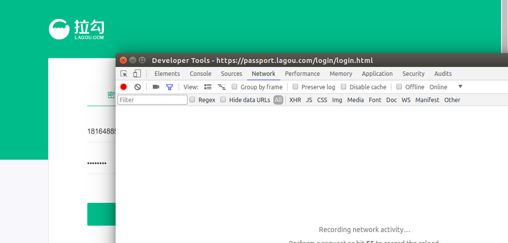

在登录的时候密码和账号不要填写正确的，成功登录了就抓不到我们想要的数据了：

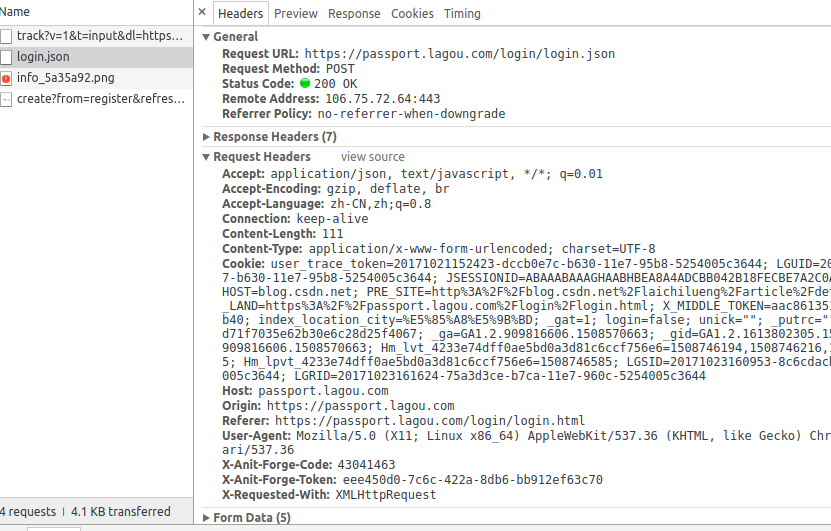

这里面包含了我们想要的信息，把它找出来。
经过一番查找后最终确定了它的登录信息是这些：

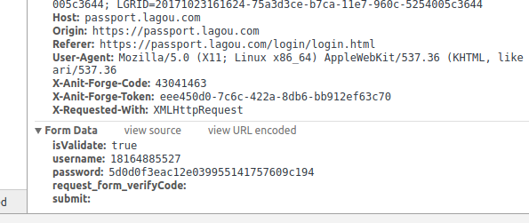

`X-Anit-Forge-Code`、`X-Anit-Forge-Token`都是在网页源代码中可以找到：

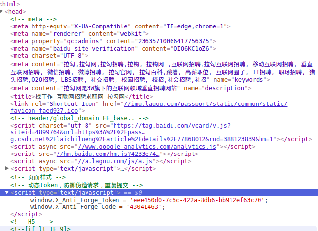

使用正则表达式就可以将它筛选出来。接下来是密码的加密方式：

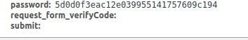

这密码是加密过的，可以在网页源代码中找找：

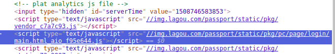

找到了这个js，打开看一下：

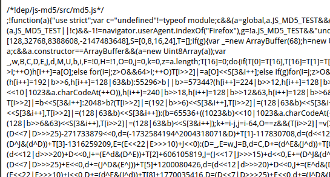

显示的是MD5.js应该就是加密的js。把它复制到编辑器进行格式化一下，方便查找。因为是在登录页面中进行密码输入，所以它的加密可能与登录页面有关`/login/login.json`，在编辑器中输入`/login/login.json`搜索一下，果然找到了：

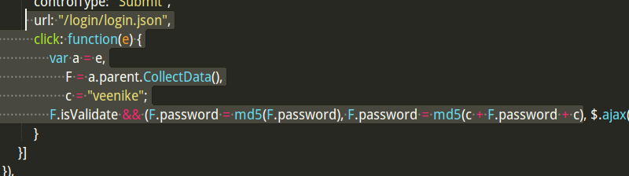

它的加密方式：
```
首先对密码进行一次md5加密：password = md5(password) 
然后前后加上veenike这串字符: password = “veenike” + password + “veenike” 
最后再次进行md5加密：password = md5(password)
```

接下来，进行模拟登录：
**`lagou_login.py`:**
```python
import requests
import hashlib
import re

#请求对象
session = requests.session()

#请求头信息
HEADERS = {
    'Referer': 'https://passport.lagou.com/login/login.html',
    'User-Agent': 'Mozilla/5.0 (X11; Linux x86_64) AppleWebKit/537.36 (KHTML, like Gecko) Chrome/61.0.3163.100 Safari/537.36',
}


def get_password(passwd):
    '''这里对密码进行了md5双重加密 veennike 这个值是在main.html_aio_f95e644.js文件找到的 '''
    passwd = hashlib.md5(passwd.encode('utf-8')).hexdigest()
    passwd = 'veenike' + passwd + 'veenike'
    passwd = hashlib.md5(passwd.encode('utf-8')).hexdigest()
    return passwd

def get_token():
    Forge_Token = ""
    Forge_Code = ""
    login_page = 'https://passport.lagou.com/login/login.html'
    data = session.get(login_page, headers=HEADERS)
    match_obj = re.match(r'.*X_Anti_Forge_Token = \'(.*?)\';.*X_Anti_Forge_Code = \'(\d+?)\'', data.text, re.DOTALL)
    if match_obj:
        Forge_Token = match_obj.group(1)
        Forge_Code = match_obj.group(2)
    return Forge_Token, Forge_Code

def login(username, passwd):
    X_Anti_Forge_Token, X_Anti_Forge_Code = get_token()
    login_headers = HEADERS.copy()
    login_headers.update({'X-Requested-With': 'XMLHttpRequest', 'X-Anit-Forge-Token': X_Anti_Forge_Token, 'X-Anit-Forge-Code': X_Anti_Forge_Code})
    postData = {
            'isValidate': 'true',
            'username': username,
            'password': get_password(passwd),
            'request_form_verifyCode': '',
            'submit': '',
        }
    response = session.post('https://passport.lagou.com/login/login.json', data=postData, headers=login_headers)
    print(response.text)

def get_cookies():
    return requests.utils.dict_from_cookiejar(session.cookies)

if __name__ == "__main__":
    username = '手机号或者邮箱'
    passwd = '密码'
    login(username, passwd)
    print(get_cookies())
```
执行了一下，登录成功：

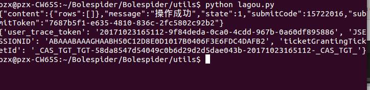


