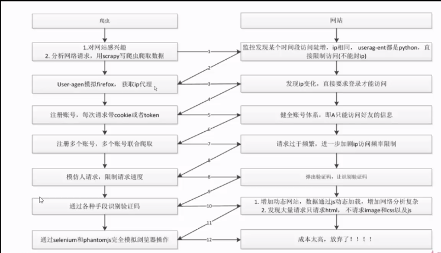
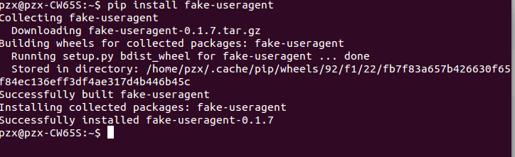
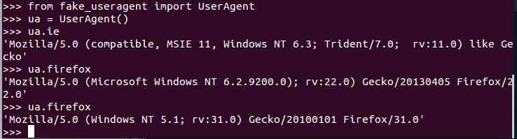

# 反爬虫
### 1 基本概念

##### 爬虫
```
>> 自动获取网站数据的程序，关键是批量
```
##### 反爬虫
```
>> 使用技术手段防止爬虫程序的方法
```
##### 误伤
```
>> 反爬虫技术将普通用户识别为爬虫，如果误伤过高，效果再好也不能用
```
##### 成本
```
>> 反爬虫需要的人力和机器成本
```

##### 拦截
```
>> 成功拦截爬虫，一般拦截率越高，误伤率越高
```

### 2 反爬虫的目的

##### 限制初级爬虫
```
>> 简单粗暴，不管服务器压力，容易弄挂网站
```

##### 数据保护
```
>> 保护自己的数据产权
```

##### 解决失控的爬虫
```
>> 由于某些情况下忘记或者无法关闭的爬虫
```

##### 预防商业竞争对手

### 3 爬虫和反爬虫对抗的过程


### 4-1 配置`download middlewares`
middleware的配置在`setting.py`文件中。
`setting.py`54-58行：
```Python
# Enable or disable downloader middlewares
# See http://scrapy.readthedocs.org/en/latest/topics/downloader-middleware.html
#DOWNLOADER_MIDDLEWARES = {
#    'Bolespider.middlewares.MyCustomDownloaderMiddleware': 543,
#}
```
把56-58行的注释取消：
```Python
# Enable or disable downloader middlewares
# See http://scrapy.readthedocs.org/en/latest/topics/downloader-middleware.html
DOWNLOADER_MIDDLEWARES = {
   'Bolespider.middlewares.MyCustomDownloaderMiddleware': 543,
}
```

### 4-2 书写自己的middleware
在使用scrapy生成项目的时候，默认会生成一个`middlewares.py`文件。
`middlewares.py`：
```Python
class RandomUserAgentMiddleware(object):
    def __init__(self, crawler):
        super(RandomUserAgentMiddleware, self).__init__()
        self.user_agent_list = crawler.settings.get('user_agent_list', [ ])

    @classmethod
    def from_crawler(self, crawler):
        return cls(crawler)

    def process_request(self, request, spider):
        request.headers.setdefault('User-Agent', random())
```
然后在`settings.py`文件中定义一个`user_agent_list`，填入相应的User-Agent，最后在`DOWNLOADER_MIDDLEWARES = {
   'Bolespider.middlewares.MyCustomDownloaderMiddleware': 543,
}`修改成自己定义的即可。

### 5 使用github开源库切换User-Agent
[开源库的地址](https://github.com/hellysmile/fake-useragent)
1.安装开源库
```
$ pip install fake-useragent
```
*安装成功：*



2.使用
```python
from fake_useragent import UserAgent
ua = UserAgent()

ua.ie
# Mozilla/5.0 (Windows; U; MSIE 9.0; Windows NT 9.0; en-US);
ua.msie
# Mozilla/5.0 (compatible; MSIE 10.0; Macintosh; Intel Mac OS X 10_7_3; Trident/6.0)'
ua['Internet Explorer']
# Mozilla/5.0 (compatible; MSIE 8.0; Windows NT 6.1; Trident/4.0; GTB7.4; InfoPath.2; SV1; .NET CLR 3.3.69573; WOW64; en-US)
ua.opera
# Opera/9.80 (X11; Linux i686; U; ru) Presto/2.8.131 Version/11.11
ua.chrome
# Mozilla/5.0 (Windows NT 6.1) AppleWebKit/537.2 (KHTML, like Gecko) Chrome/22.0.1216.0 Safari/537.2'
ua.google
# Mozilla/5.0 (Macintosh; Intel Mac OS X 10_7_4) AppleWebKit/537.13 (KHTML, like Gecko) Chrome/24.0.1290.1 Safari/537.13
ua['google chrome']
# Mozilla/5.0 (X11; CrOS i686 2268.111.0) AppleWebKit/536.11 (KHTML, like Gecko) Chrome/20.0.1132.57 Safari/536.11
ua.firefox
# Mozilla/5.0 (Windows NT 6.2; Win64; x64; rv:16.0.1) Gecko/20121011 Firefox/16.0.1
ua.ff
# Mozilla/5.0 (X11; Ubuntu; Linux i686; rv:15.0) Gecko/20100101 Firefox/15.0.1
ua.safari
# Mozilla/5.0 (iPad; CPU OS 6_0 like Mac OS X) AppleWebKit/536.26 (KHTML, like Gecko) Version/6.0 Mobile/10A5355d Safari/8536.25

# and the best one, random via real world browser usage statistic
ua.random
```
*使用情况:*



它不仅可以生成各种浏览器的UserAgent，而且还可以生成每个浏览器的各个版本，相对于我们自己写的`middlewares`文件，方便和全面许多。

编辑`settings.py`：
```Python
DOWNLOADER_MIDDLEWARES = {
   'Bolespider.middlewares.RandomUserAgentMiddleware': 543,#引入自己定义的
   'Bolespider.middlewares.MyCustomDownloaderMiddleware': None,
}

#随机获得UserAgent
RANDOM_UA_TYPE = 'random'
```
编辑`middlewares.py`文件：
```Python
from fake_useragent import UserAgent
class RandomUserAgentMiddleware(object):
    def __init__(self, crawler):
        super(RandomUserAgentMiddleware, self).__init__()
        self.ua = UserAgent()
        self.ua_type = crawler.settings.get("RANDOM_UA_TYPE", "random")

    @classmethod
    def from_crawler(self, crawler):
        return cls(crawler)

    def process_request(self, request, spider):

        #获取使用浏览器的类型，然后根据类型产生随机UserAgent
        def get_ua():
            return getattr(self.ua, self.ua_type)
            
        request.headers.setdefault('User-Agent', get_ua())
```


