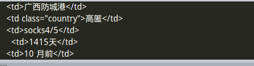

# 设置IP代理

### 1 代理IP原理


### 2 设置IP代理
```Python
request.meta["proxy"] = "http://61.135.217.7:80"
```

### 3 设置IP代理池
代理池的IP来源于西刺网的免费代理IP，所以需要把它爬取下来。
在项目根目录下新建存放脚本的文件夹`tools`，然后在`tools`文件夹中新建`crawl_xici_ip.py`文件：
```Python
#-*-coding: utf-8-*-
import requests

#爬取西刺的免费IP
def crwal_ips():
    headers = {'User-Agent': 'Mozilla/5.0 (X11; Linux x86_64) AppleWebKit/537.36 (KHTML, like Gecko) Chrome/61.0.3163.100 Safari/537.36'}
    re = requests.get('http://www.xicidaili.com/', headers=headers)
    print(re.text)

crwal_ips()#测试一下是否成功
```
*成功了：*



继续完善它：
```Python
import requests
from scrapy.selector import Selector

import MySQLdb

#链接数据库
conn = MySQLdb.connect(host="localhost", user="root", passwd="69615345", db="zhihu_spider", charset='utf8')
cursor = conn.cursor()

#爬取西刺的免费IP
def crwal_ips(url):
    headers = {'User-Agent': 'Mozilla/5.0 (X11; Linux x86_64) AppleWebKit/537.36 (KHTML, like Gecko) Chrome/61.0.3163.100 Safari/537.36'}
    re = requests.get(url, headers=headers)
    print(re.text)

    selector = Selector(text=re.text)
    all_trs = selector.css('#ip_list tr')

    ip_list = []
    for tr in all_trs[1:]:
        speed_str = tr.css('div.bar::attr(title)').extract()[0]
        if speed_str:
            speed = float(speed_str.split("秒")[0])
            print(speed)
        all_texts = tr.css("td::text").extract()
        ip = all_texts[0]
        port = all_texts[1]
        proxy_type = all_texts[5]
        ip_list.append((ip, port, proxy_type, speed))
        print(ip, port, proxy_type)
    #数据入库
    for ip_info in ip_list:
        print(ip_info[0],ip_info[1],ip_info[2],ip_info[3])
        cursor.execute(
            "insert ip_pool(ip, port, proxy_type, speed) VALUES('{0}', '{1}', '{2}', {3})".format(ip_info[0], ip_info[1], ip_info[2], ip_info[3])
            )
        conn.commit()

class GetIp(object):
    #删除不可用的IP
    def delete_ip(self, ip):
        delete_sql = "delete from ip_pool where ip='{0}' ".format(ip)
        cursor.execute(delete_sql)
        conn.commit()
        return True

    #判断IP是否可用
    def judge_ip(self, ip, port):
        http_url = 'http://www.baidu.com'
        proxy_url = 'http://{0}:{1}'.format(ip, port)
        try:
            proxy_dict = {
            'http':proxy_url,
            }
            response = requests.get(http_url, proxies=proxy_dict)
            return True
        except Exception as e:
            print("无效的IP和端口")
            self.delete_ip(ip)
            return False
        else:
            code = response.status_code
            if code >= 200 and <300:
                print("可用IP")
                return True
            else:
                print("无效的IP和端口")
                self.delete_ip(ip)
                return False 

    #从数据库中随机获取IP
    def get_random_ip(self):
        random_sql = "SELECT ip,port,proxy_type FROM ip_pool ORDER BY RAND() LIMIT 1"
        result = cursor.execute(random_sql)
        for ip_info in cursor.fetchall:
            ip = ip_info[0]
            port = ip_info[2]
            if ip_info[-2]:
                proxy_type = ip_info[-2]

            judge_re = self.judge_ip(ip, port)
            if judge_re:
                return "http://{0}:{1}".format(ip, port)
            else:
                return self.get_random_ip()
if __name__ == "__main__":
    get_ip = GetIp()
    get_ip.get_random_ip()
```
然后在`middlewares.py`添加IP代理的类：
`middlewares.py`
```Python
from Bolespider.tools.crawl_xici_ip import GetIP
#使用IP代理池
class RandomProxyMiddleWare(object):
    def process_request(self, request, spider):
        get_ip = GetIP()
        request.meta["proxy"] = get_ip.get_random_ip()
```