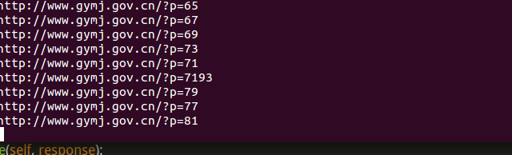

# 验证码识别方法

### 1 编码实现
识别率低，实现难
### 2 在线打码
识别率高，实现简单
### 3 人工打码
人工识别，成本高，识别率也是最高
### 4 降低自己爬虫被识别的概率

#### 1 禁用cookie
`settings.py`文件36,37行:
```Python
# Disable cookies (enabled by default)
#COOKIES_ENABLED = False
把注释去掉：
# Disable cookies (enabled by default)
COOKIES_ENABLED = False
```

#### 2 限制下载速度
`settings.py`文件30,31行:
```python
# See also autothrottle settings and docs
#DOWNLOAD_DELAY = 3
把注释取消掉
DOWNLOAD_DELAY = 10
```
`settings.py`文件100,101行:
```Python
# See http://doc.scrapy.org/en/latest/topics/autothrottle.html
#AUTOTHROTTLE_ENABLED = True
注释去掉：
AUTOTHROTTLE_ENABLED = True
```
*运行试试：*



果然有延时了，下载完一个页面后后等10s再下一个。

#### 3 Spider文件指定setting
打开任意一个Spider文件：
```Python
custom_settings = {
	执行的语句
}
```