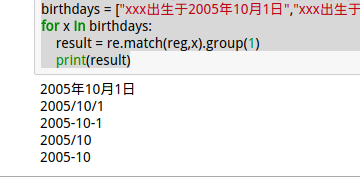

# 正则表达式
#### 目录
```
re.match()：从右边开始匹配
```
* 特殊字符
  1.`^`:以某个字符开头
  2.`.`：可以代表任意字符，除了`\n`外
  3.`*`：前面的字符可以出现**0次**到**任意**多次
  4.`$`：以某个字符串结尾，例如"d$"就是以`d`结尾的字符串
  5.`？`：非贪婪匹配模式
  6.`+`：前面的字符出现了一次或者多次
  7.`{1};{1，};{1，4}`：限定字符出现的次数，分别为：1次、1次以上、一次到四次
  8.`|`：表示`“或”`，只要条件有一个成立即可。
  9.`[];[^];[a-z]`：`[14896]`表示一个选择器，只要满足其中一个就可以；`[^]`表示非；`[a-z]`表示一个区间
  10.`\s;\S;\w;\W`：`\s`表示匹配**一个**`空格符`；`\S`表示匹配**一个**`除了空格符的字符`；`\w`表示匹配**在这个区间内**的任意字符:`[A-Za-z0-9_]`都可以；`\W`表示匹配**不在这个区间**的所有字符：`[A-Za-z0-9_]`
  11.`[\u4E00-\u9FA5]`：表示匹配**一个**汉字
  12.`\d`：表示匹配**一个**数字

#### 应用
###### 匹配各种出生日期格式
```
birthday = “xxx出生于2005年10月1日”
birthday = “xxx出生于2005/10/1”
birthday = “xxx出生于2005-10-1”
birthday = “xxx出生于2005年10月”
birthday = “xxx出生于2005/10”
birthday = “xxx出生于2005-10”
```
使用一个正则表达式，可以适用上述所有字符串
```Python
reg = ".*出生于(\d{4}[年/-]\d{1,2}([月/-]\d{1,2}([日]|$)|[月/-]$|$))"
```
经过多次测试，终于让正则表达式满足以上所有的关系。完整的代码：
```Python
import re
#birthday = "xxx出生于2005年10月1日"
#birthday = "xxx出生于2005/10/1"
#birthday = "xxx出生于2005-10-1"
#birthday = "xxx出生于2005年10月"
#birthday = "xxx出生于2005/10"
#birthday = "xxx出生于2005-10"
reg = ".*出生于(\d{4}[年/-]\d{1,2}([月/-]\d{1,2}([日]|$)|[月/-]$|$))"
birthdays = ["xxx出生于2005年10月1日","xxx出生于2005/10/1","xxx出生于2005-10-1","xxx出生于2005/10","xxx出生于2005-10"]#把所有情况放在一个列表里
for x in birthdays:#适用迭代分别对每一个列表进行操作
    result = re.match(reg,x).group(1)
    print(result)
```
**结果：**

