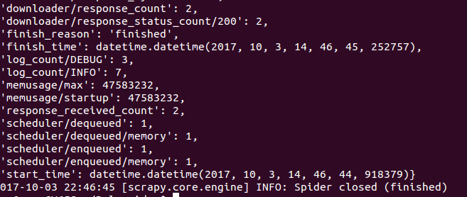

# scrapy爬取伯乐在线文章
#### 爬虫策略
经过观察，所有文章的链接都在`http://blog.jobbole.com/all-posts/`下面，所以用这个就行。

#### 开始爬去
1.安装scrapy环境
```
$ pip install -i https://pypi.douban.com/simple/ scrapy #豆瓣加速安装
```
安装完成：


2.创建项目
```
$ scrapy startproject Bolespider
$ cd Bolespider
$ scrapy genspider jobbole blog.jobbole.com
```
创建完成：


3.启动项目
```
$ scrapy crawl jobbole
```
启动成功：



#### xpath使用

