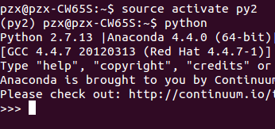
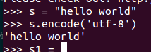
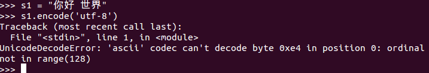
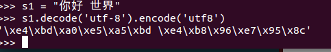
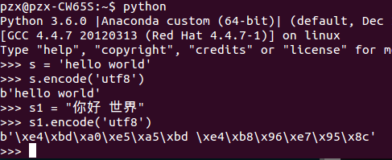

# 爬虫去重策略|字符串编码
#### 爬虫去重策略
1.把访问过的url保存到数据库中
2.把访问过的URL保存到内存（set）中，但是内存占用很大
3.URL经过MD5等方法哈希后保存到内存（set）
4.用bitmap方法，将访问过的URL通过hash函数映射到某一位（0或1），但是冲突高
5.bloomfilter方法对bitmap进行改进。多重hash函数降低冲突

#### 字符串编码
1.计算机只能处理数字，文本转换为数字才能处理。在计算机中**8个bit(位)**作为**1个byte（字节）**，所以一个能表示的最大数为255。
2.ASCII编码是美国人的标准编码，一个字节表示一个字符
3.GB2312编码，处理中文的编码，包含ASCII编码。**2个字节**表示**一个普通的汉字**，**生僻的汉字**用**3个以上**的字节去表示。
4.Unicode把所有语言统一到一套编码里，统一用**2个**或者**3个字节**来表示**1个字符**；缺点是：当内容全部为英文时，需要多出一倍的储存空间，传输时传输量加倍。
5.utf8编码是可变长编码，**英文1个字节**，**汉字3个**字节，特别生僻的用4-6个字节，解决了英文传输的问题。

一般在内存中是Unicode编码，传输和使用时utf8编码
#### 编码转换
##### 1.python2中的转换
**Python2环境：**



```python
1.英文转换：
s = u'hello world'#(指定该字符串的编码是Unicode编码)
s.encode('utf-8')#被转换的字符串必须是Unicode编码

2.中文转换
#在Windows下将非Unicode编码转为Unicode编码：
s = "你好 世界"
s1 = s.decode('gb2312').encode('utf-8')#再转换为utf-8编码

#在Linux下将非Unicode编码转为Unicode编码：
s = "你好 世界"
s1 = s.decode('utf-8').encode('utf-8')#再转换为utf-8编码
```
**英文的直接就转换了：**



**中文直接转换就报错：**



**中文的先转为Unicode再转utf8就可以了：**



##### 2.python3的转换
在Python3中，默认将编码视为Unicode编码。所以在所有的环境中，都可以直接转换：

