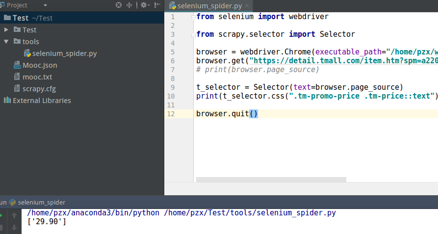

# Selenium的使用

### 1 Selenium
Selenium是一个用于Web应用程序测试的工具。Selenium测试直接运行在浏览器中，就像真正的用户在操作一样。支持的浏览器包括IE（7, 8, 9, 10, 11），Mozilla Firefox，Safari，Google Chrome，Opera等。这个工具的主要功能包括：测试与浏览器的兼容性——测试你的应用程序看是否能够很好得工作在不同浏览器和操作系统之上。测试系统功能——创建回归测试检验软件功能和用户需求。支持自动录制动作和自动生成 .Net、Java、Perl等不同语言的测试脚本。

### 2 安装selenium
```
$ pip install selenium
```
我已经安装过了，所以显示已经存在：


接下来安装Drivers：[selenium python api](http://selenium-python.readthedocs.io/installation.html)

我使用的是chrome浏览器，所以[这是我下载的Driver](https://chromedriver.storage.googleapis.com/index.html?path=2.33/)

### 3 创建一个Selenium
新建一个`Selenium_spider.py`文件：
```python
from selenium import webdriver
browser = webdriver.Chrome(executable_path="对应的浏览器的Driver路径")
browser.get("某个网站的URL")
print(browser.page_source)
browser.quit()
```
*执行成功：*


### 4 select选择器的使用
编辑上一步中创建的`Selenium_spider.py`文件：
```Python
from selenium import webdriver

from scrapy.selector import Selector

browser = webdriver.Chrome(executable_path="/home/pzx/webdriver/chromedriver")
browser.get("https://www.zhihu.com/#signin")
# print(browser.page_source)

t_selector = Selector(text=browser.page_source)
print(t_selector.css(".tm-promo-price .tm-price::text").extract())

browser.quit()
```
*提取成功：*


