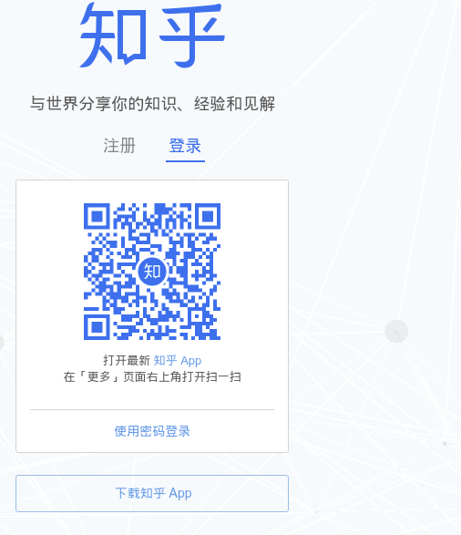
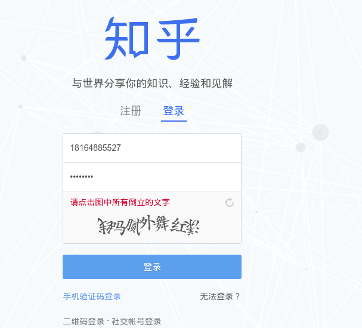
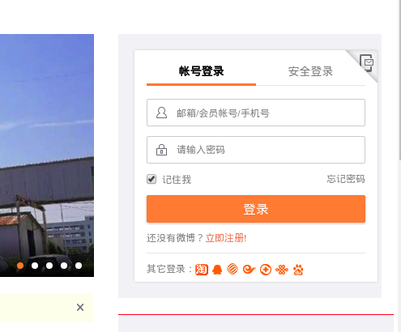
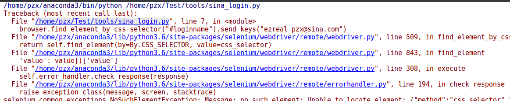
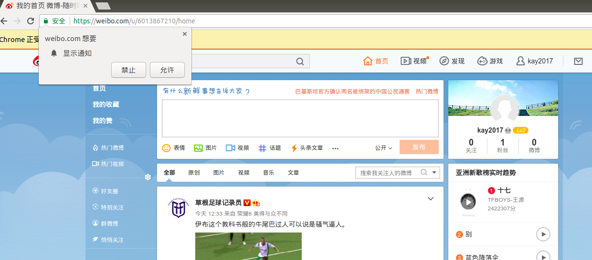
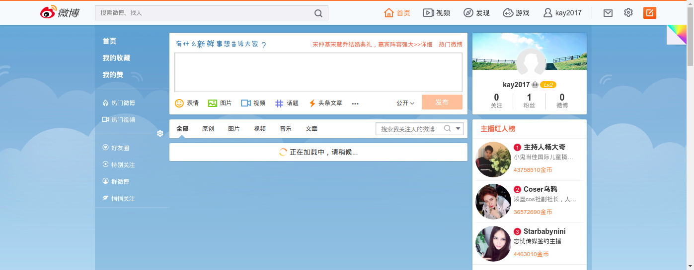
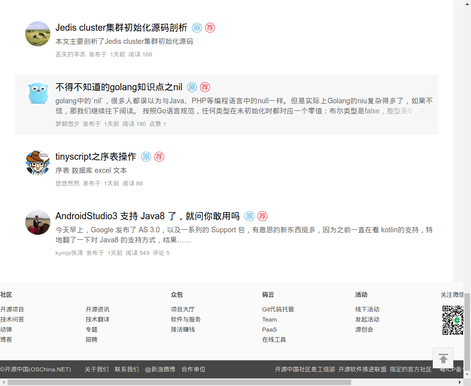
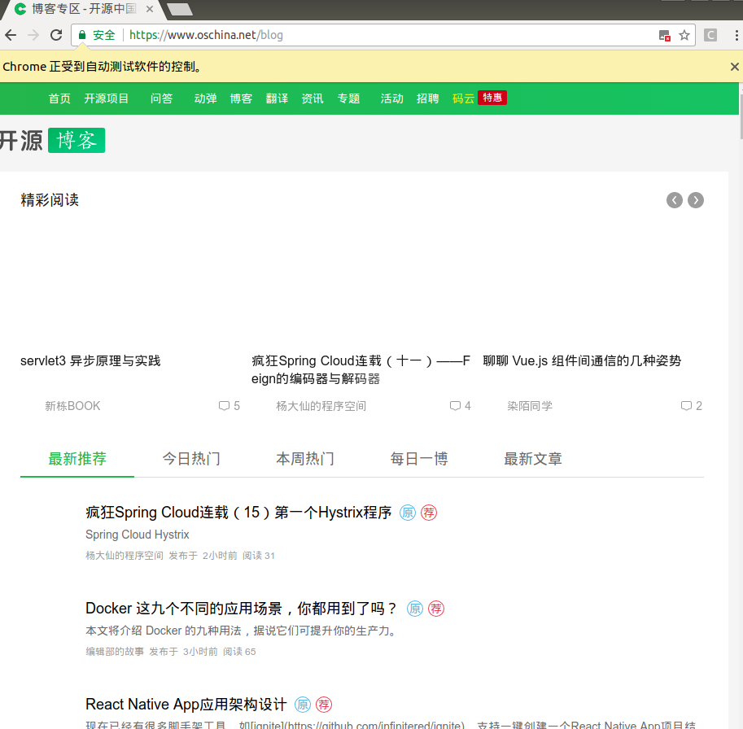

# selenium模拟登录

### 1 模拟登录知乎
首先打开[知乎登录页面](https://www.zhihu.com/#signin)：



我们手动登录的步骤为：
1.点击“使用密码登录”
2.输入账号和密码
3.点击“登录”
4.弹出验证码，输入正确的验证码即可

新建`test_zhihu.py`文件：
```python
from selenium import webdriver

from scrapy.selector import Selector

browser = webdriver.Chrome(executable_path="/home/pzx/webdriver/chromedriver")
browser.get("https://www.zhihu.com/#signin")
# print(browser.page_source)

#点击登录页面下的“使用密码登录”
browser.find_element_by_css_selector("span.signin-switch-password").click()

#找到登录框然后输入密码和用户名
browser.find_element_by_css_selector(".view-signin input[name='account']").send_keys("18164885527")
browser.find_element_by_css_selector(".view-signin input[name='password']").send_keys("69615345")

#密码输入完成后点击“登录按钮”
browser.find_element_by_css_selector(".view-signin button.sign-button").click()
# browser.quit()
```
*登录成功：*



登录成功。

### 2 模拟登录微博
打开微博页面：[微博登录](https://weibo.com/),找到登录框：



经过分析后写代码：
`sina_login.py`：
```Python
from selenium import webdriver

from scrapy.selector import Selector

browser = webdriver.Chrome(executable_path="/home/pzx/webdriver/chromedriver")
browser.get("https://www.weibo.com")
browser.find_element_by_css_selector("#loginname").send_keys("`****`@sina.com")
browser.find_element_by_css_selector(".info_list.password input[name='password']").send_keys("`******`")
browser.find_element_by_css_selector(".info_list.login_btn a[node-type='submitBtn']").click()
```
*运行：*



报错了，是元素选择器出了问题，找不到这些元素，这是因为还没有加载完，所以找不到。换一种写法：
```Python
from selenium import webdriver

browser = webdriver.Chrome(executable_path="/home/pzx/webdriver/chromedriver")
browser.implicitly_wait(10)
browser.get("https://www.weibo.com/login.php")
browser.find_element_by_id("loginname").clear()
browser.find_element_by_id("loginname").send_keys("`****`@sina.com")
browser.find_element_by_name("password").send_keys("`******`")
browser.find_element_by_css_selector(".W_btn_a.btn_32px").click()

time.sleep(60)#增加延时，等页面加载完成再截图
browser.quit()
```
*执行一下：*



**增加它的功能。把登录结果截图：**



### 3 selenium鼠标下滑
```Python
from selenium import webdriver
import time

browser = webdriver.Chrome(executable_path="/home/pzx/webdriver/chromedriver")
browser.get("https://www.oschina.net/blog")
time.sleep(3)
#鼠标下滑3次，下滑一次截一次图
for i in range(3):
    browser.execute_script("window.scrollTo(0, document.body.scrollHeight); var lenOfPage=document.body.scrollHeight; return lenOfPage")
    browser.get_screenshot_as_file("/home/pzx/图片/博客{0}.png".format(i))
    time.sleep(2)
```
*运行结果：*



### 4 设置访问不加载图片
```Python
from selenium import webdriver

chrome_opt = webdriver.ChromeOptions()
prefs = {"profile.managed_default_content_settings.images":2}
chrome_opt.add_experimental_option("prefs", prefs)
browser = webdriver.Chrome(executable_path="/home/pzx/webdriver/chromedriver", chrome_options=chrome_opt)
browser.get("https://www.oschina.net/blog")
```
*一张图片都没有：*



