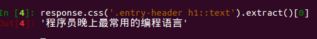

# css选择器实现信息提取
#### 提取标题
##### 使用scrapy shell启动：
```
$ scrapy shell http://blog.jobbole.com/110140/
```
##### 开始提取信息
```
#网页的源代码在Response中
$ title = response.css('.entry-header h1::text').extract()[0]
```
**Successful:**



