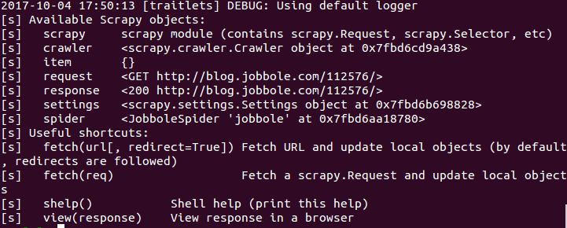
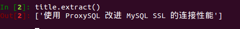
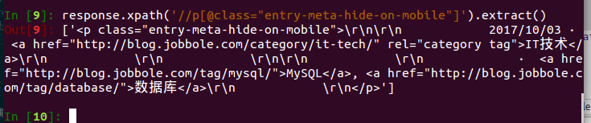
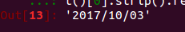
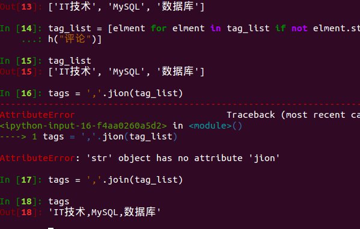

# xpath、scrapy shell的使用
#### scrapy shell的使用
启动：
```
$ scrapy shell 目标网址
```
方便代码的调试，不用每次都进行数据请求，节约了时间。运行之后得到这些内容：



然后在下面的命令行中进行数据的操作，就不用每运行一次代码都要爬去一次数据那么麻烦了；其中的response就是爬到的网页数据。
#### 在scrapy shell调试获得title
```
#使用xpath获得标题的内容
$ title = response.xpath('//div[@class="entry-header"]/h1/text()')
#打印标题看看是否正确
$ title.extract()
```



xpath语法正确，成功提取了文章标题；如果不正确，就修改它，直到正确为止。

##### 获取文章日期


```
#使用xpath定位到时间所在的位置
$ create_date = response.xpath('//p[@class="entry-meta-hide-on-mobile"]')
#查看是否正确
$ response.xpath('//p[@class="entry-meta-hide-on-mobile"]').extract()
```



接下来就是获取具体日期的值：
```
# 获得存在日期的文字
$ response.xpath('//p[@class="entry-meta-hide-on-mobile"]/text()').extract()
# 日期的文字获得了，但是有空格和换行符等，去掉它
$ response.xpath('//p[@class="entry-meta-hide-on-mobile"]/text()').extract()[0].strip()
#h 获得日期的值，再进一步处理
$ response.xpath('//p[@class="entry-meta-hide-on-mobile"]/text()').extract()[0].strip().replace('·','').strip()
```
**获得了日期：**把scrapy shell中的代码复制到项目里


#### 获取评论、点赞和收藏的数量
当要取的属性有多个属性值，但是我们只选择其中一个作为xpath的寻找时对象，可以这样：
```
$ response.xpath("//某个元素[contains(@要取的属性名，'属性值')]")
```
```
#获得点赞数量
$ praise = response.xpath("//span[contains(@class,'vote-post-up')]/h10/text()").extract()[0]
# 获取收藏数量
$ fav_num = re.match('.*(\d+).*', response.xpath('//span[contains(@class,"bookmark-btn")]/text()').extract()[0]).group(1)
#获取评论数量
$ comment_num = re.match('.*(\d+).*',response.xpath('//a[@href="#article-comment"]/span').extract()[0]).group(1)
```
#### 获取正文
```
$ content = response.xpath('//div[@class="entry"]').extract()[0]
```
#### 获取正文的标签
```
#获得正文所有标签
$ tag_list = response.xpath('//p[@class="entry-meta-hide-on-mobile"]/a/text()').extract()
#去掉评论
$ tag_list = [elment for elment in tag_list if not elment.strip().endswith("评论")]
#写为字符串
$ tags = ','.join(tag_list)
```
**标签的处理**




