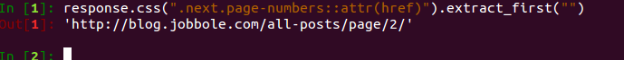
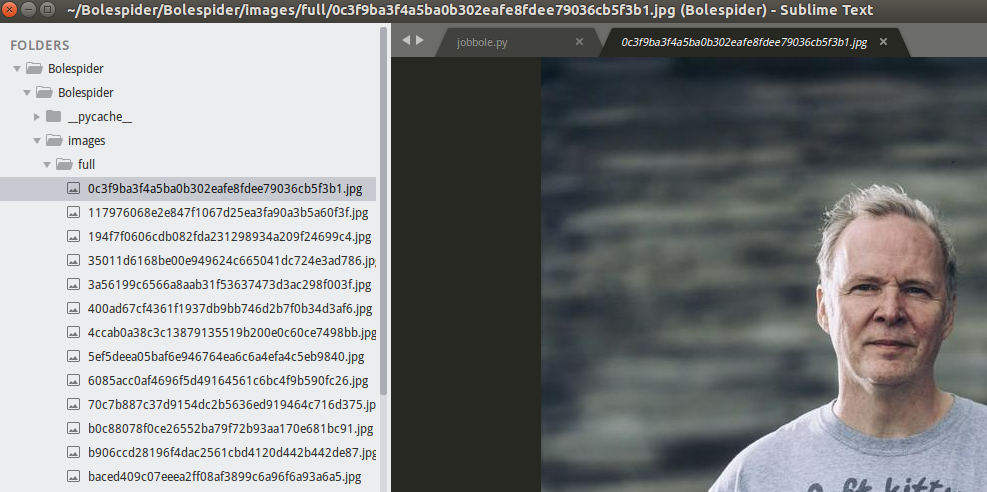

# scrapy函数介绍
##### 1.urljoin
连接两个URL：
```Python
urljoin.(reponse.url, post_url)#参数是两个URL
```
##### 2.Request
```python
Request(url=, meta={"front_image_url":img_url}, callback = self.parse_detail)
```
##### 3.在Response中获得图片URL
```Python
front_image_url = response.meta.get("front_image_url", "")
```
##### 4.提取“下一页”的URL
```Python
#提取下一页URL并且交给scrapy下载
#根据实际情况获得“下一页“的URL
next_urls = response.css(".next.page-numbers::attr(href)").extract_first("")
	#如果不是最后一页
	if next_urls:
    	#组合URL，防止获得的URL不全，所以和主域名进行连接
		yield Request(url=parse.urljoin(response.url, post_url),callback=self.parse)
```
**成功获得了下一页的URL：**



这个网站的URL是全的，但是有些网站只有`.com`后面的部分，所以把它和主域名进行拼接

##### 5.数据写入item
打开`items.py`文件，根据自己的需求写一个类，大致如下：
```Python
class JobBoleItem(scrapy.Item):
    url = scrapy.Field()
    url_object_id = scrapy.Field()
    title = scrapy.Field()
    create_date = scrapy.Field()
    praise_num = scrapy.Field()
    fav_num = scrapy.Field()
    comment_num = scrapy.Field()
    content = scrapy.Field()
    tags = scrapy.Field()
    front_image_url = scrapy.Field()
    front_image_path = scrapy.Field()
```
把在爬虫文件中爬取到的加到这里即可
1. 在爬虫文件中引用
```python
from Bolespider（项目的名字）.items import JobBoleItem(items定义的``class的名字)
#在爬虫函数下生成：
article_item = JobBoleItem()
```

2.加入数据
在获得数据的循环里：
```python
#把值传入Item
		article_item['title'] = title
		article_item['url'] = response.url
		article_item['create_date'] = create_date
		article_item['front_image_url'] = front_image_url
		article_item['praise_num'] = praise_num
		article_item['fav_num'] = fav_num
		article_item['comment_num'] = comment_num
		article_item['content'] = content
		article_item['tags'] = tags
```

3.调用items
```python
yield article_item
```
调用items后，它会把值传入pipline，所以需要修改pipline

4.修改settings文件
打开`settings.py`，找到（一般是在67行）：
```python
ITEM_PIPELINES = {
#    'Bolespider.pipelines.BolespiderPipeline': 300,
# }
```
然后把注释取消就可以

5.下载图片
要下载图片，首先要进行配置。打开`settings.py`，找到`67`行，加入：
```Python
ITEM_PIPELINES = {
   'Bolespider.pipelines.BolespiderPipeline': 300,
   #加入的行，数字代表优先级，越小越优先
   'scrapy.pipelines.images.ImagesPipeline': 1,
}在它的下面再加入：
#设置从items中读取图片URL字段
IMAGES_URLS_FIELD = "front_image_url"
#获取items文件相对路径
project_dir = os.path.abspath(os.path.dirname(__file__))
#把图片下载进文件夹
IMAGES_STORE = os.path.join(project_dir, 'images（和settings.py在同个文件夹下）')
```
6.修改爬虫文件
找到你把图片的链接传入items的哪一行：
```Python
article_item['front_image_url'] = front_image_url
#改为：
article_item['front_image_url'] = [front_image_url]
```
**然后运行爬虫，图片下载好了**



