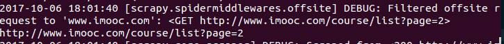
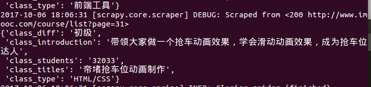
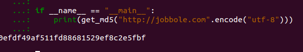
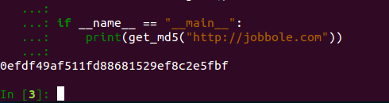
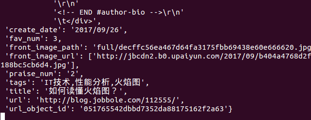

# scrapy学习跟进
[TOC]
### 0.序言
#### (i)报错

**解决方法：**
```
官方对这个的解释，是你要request的地址和allow_domain里面的冲突，从而被过滤掉。可以停用过滤功能。
yield Request(url, callback=self.parse_item, dont_filter=True)
```
**修改后成功的爬到了最后一页（31）**



#### (ii)图片下载大小设置
打开`settings.py`文件，加入下面的代码：
```Python
#图片必须大于100x100才会被下载
IMAGES_MIN_HEIGHT = 100 #最小高度必须是100
IMAGES_MIN_WIDTH = 100 #最小宽度是100
```

### 1.piplines中定制图片处理
#### (i)引入并继承属性
打开`piplines.py`文件，继承`settings.py`中设置的pipline：
```python
#引入在`settings.py`中67行后的设置
from scrapy.pipelines.images import ImagesPipeline
class BoleImagePipeline(ImagesPipeline):
    pass

#定制自己的类，一个仅仅处理图片的类
#对图片进行筛选过滤等
```
#### (ii)使用自己定制的piplines
函数定制后，在settings.py文件中修改用来处理的pipline(67行)：
```python
ITEM_PIPELINES = {
   'Bolespider.pipelines.BolespiderPipeline': 300,
   #'scrapy.pipelines.images.ImagesPipeline': 1,
   'Bolespider.pipelines.BoleImagePipeline(刚才在piplins文件中定制的类的名字)': 1,
}
```

#### (iii)重载函数
一、获取图片信息的函数
```python
def item_completed(self, results, item, info)：
	for ok, value in results:
    	image_file_path = value['path']
    item["front_image_path"] = image_file_path
    
    return item
在这个函数中，results存放了下载的图片的信息,它是一个list，里面的每一个元素是一个tuple,有二个字段：

1.True：表示图片下载是否成功

2.一个dist(字典)，字典的第二个值是'path',表示图片存放的路径
```
**修改以后删掉原来的图片，再次运行**


### 2.piplines设置数urlMd5
#### (i).建立公共函数目录
建立一个名为`utils`的文件夹，和`Spiders`文件夹在同一个目录；在`utils`文件夹下建立一个名为`common.py`的Python文件

#### (ii).建立md5函数
##### 一、函数建立
```python
import hashlib

def get_md5(url):
    m = hashlib.md5()
    m.update(url)
    return m.hexdigest()#选取摘要信息进行Md5
#测试是否成功
if __name__ == "__main__":
    print(get_md5("http://jobbole.com".encode("utf-8")))#python3的默认编码是Unicode，但是hashlib.md5()不接受Unicode编码，所以转换成utf8编码
```
**md5成功**



##### 二、优化md5函数，增加编码的判断
```python
import hashlib
#在Python2中，判断函数应该这样写：if isinstance(url, unicode):
def get_md5(url):
    if isinstance(url, str):#判断传入的URL如果是Unicode编码，进行转码
        url = url.encode("utf-8")
    m = hashlib.md5()
    m.update(url)
    return m.hexdigest()

if __name__ == "__main__":
    print(get_md5("http://jobbole.com"))#注意！测试的时候没有转码
```
**测试结果：**



#### (iii).引入Md5函数
在爬虫Python文件中加入：
```python
from Bolespider.utils.common import get_md5
article_item['url_object_id'] = get_md5(response.url)#保存到items
```

## items datas show

