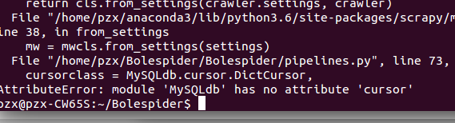
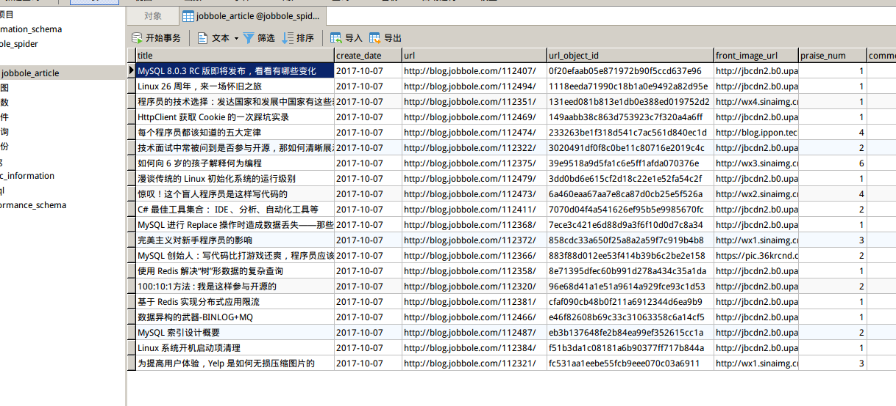

# items数据保存方式(二)
[TOC]
#### 二、把items数据存入数据库(二)
这种方法适用于数据量很大的情况，可以很好的避免数据存入数据库时速度跟不上带来的数据拥堵。也就是异步操作。
###### 1.数据库配置
打开`settings.py`文件，在里面添加数据库配置代码：
```python
#数据库配置
MYSQL_HOST = 'localhost'
MYSQL_DBNAME = 'jobbole_spider'
MYSQL_USER = 'root'
MYSQL_PASSWORD = '69615345'
```

###### 2.编写pipeline
打开`pipelines.py`文件，新建一个类，引入twisted的相关库：
```python
from twisted.enterprise import adbapi
import MySQLbd.cursors

#数据写入数据库，异步、连接池写入，适用大量数据
class MysqlTwistedPipeline(object):
    def __init__(self, dbpool):
        self.dbpool = dbpool

    @classmethod
    def from_settings(cls, settings):
        dbparms = dict(
                host = settings['MYSQL_HOST'],
                db = settings['MYSQL_DBNAME'],
                user = settings['MYSQL_USER'],
                passwd = settings['MYSQL_PASSWORD'],
                charset = 'utf8',
                cursorclass = MySQLdb.cursors.DictCursor,
                use_unicode = True,
        )
        
        dbpool = adbapi.ConnectionPool('MySQLdb', **dbparms)

        return cls(dbpool)
    #使用twisted将Mysql插入变成异步执行
    def process_item(self, item, spider):
        query = self.dbpool.runInteraction(self.do_insert, item)
        query.addErrback(self, handle_error) #处理异常
    #c处理异常函数
    def handle_error(self, failure):
        print(failure)

    # 执行具体插入的函数
    def do_insert(self, cursor, item):
        insert_sql = """
                insert into jobbole_article(title, create_date, url, url_object_id, front_image_url, praise_num, comment_num, fav_num, tags, content)
                VALUES (%s, %s, %s, %s, %s, %s, %s, %s, %s, %s)
        """
        cursor.execute(insert_sql, (item['title'], item['create_date'], item['url'], item['url_object_id'], item['front_image_url'], item['praise_num'], item['comment_num'], item['fav_num'], item['tags'], item['content']))
```
**Err1：**



没有引入包，加入`import MySQLdb.cursors`就可以了

**存入成功：**
