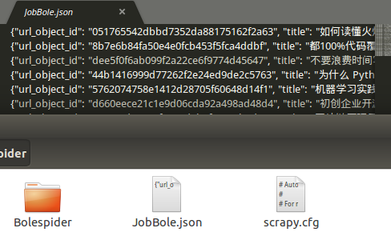
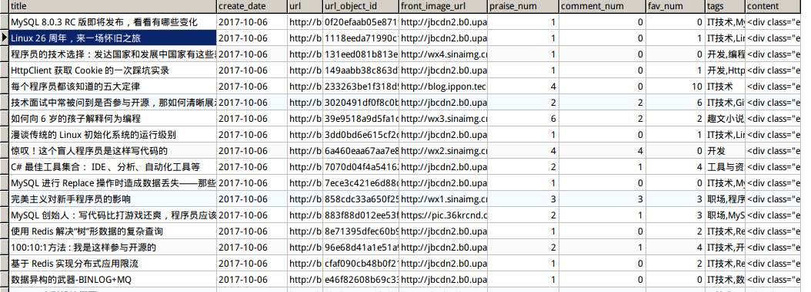

# items数据保存方式
[TOC]

#### 一、保存为json数据
###### 1.在`pipelines.py`文件中定义一个新的类
```Python
import json
import codecs #免去编码带来的麻烦
class JsonWithPipeline(object):
    def __init__(self):#打开待写入的文件
        self.file = codes.open('JobBole.json', 'w', encoding = "utf-8")
	#将items中的数据写入刚才打开的Json文件
    def process_item(self, item, spider):
        lines = json.dumps(dict(item), ensure_ascii=False) + '\n' #ensure_ascii=False避免写入中文乱码
        self.file.write(lines)
        return item

    #关闭文件
    def spider_closed(self, spider):
        self.file.close()
```

###### 2.载入刚才写好的piplines
打开`settings.py`文件，67行加入：
```python
ITEM_PIPELINES = {
   # 'Bolespider.pipelines.BolespiderPipeline': 300,
   'Bolespider.pipelines.JsonWithPipeline': 2,
   # 'scrapy.pipelines.images.ImagesPipeline': 1,
   'Bolespider.pipelines.BoleImagePipeline': 1,
}
```
**写入成功：**



#### 二、把items数据存入数据库
###### 1.建立数据库和表
先建立一个名为`jobbole_spider`的数据库，然后根据项目中的`items.py`中的字段建立一个表：


###### 2.格式化`create_time`字段
编辑`jobbole.py（你的爬虫文件）`文件:
```python
import datetime

在把字段传入items的时候加入：
#把字符串日期转换为日期格式
		try: 
			create_date = datetime.datetime.strptime(create_date, "%Y%m%d").date()
		except Exception as e:
			create_date = datetime.datetime.now().date()
```
###### 3.安装相关库及依赖
**Windows下安装**
```
ezreal> pip install -i https://pypi.douban.com/simple/ mysqlclient #豆瓣源加速安装
```
**Ubuntu下安装**
```
$ sudo apt-get install libmysqlclient-dev #必须先安装依赖，否则会安装失败
$ pip install -i https://pypi.douban.com/simple/ mysqlclient #豆瓣源加速安装
```
**CentOS安装**
```
$ sudo yum install python-devel mysql-devel #必须先安装依赖，否则会安装失败
$ pip install -i https://pypi.douban.com/simple/ mysqlclient #豆瓣源加速安装
```

###### 4.在piplins文件中定义数据存入Mysql类
**`在pipelines.py`中定义类**
```python
class MysqlPipeline(object):
    def __init__(self):
        self.conn = MySQLdb.connect('localhost', 'root' ,'69615345', 'jobbole_spider',charset='utf8', use_unicode=True)
        self.cursor = self.conn.cursor()

    def process_item(self, item, spider):
        insert_sql = """
                insert into jobbole_article(title, create_date, url, url_object_id, front_image_url, praise_num, comment_num, fav_num, tags, content)
                VALUES (%s, %s, %s, %s, %s, %s, %s, %s, %s, %s)
        """
        self.cursor.execute(insert_sql, (item['title'], item['create_date'], item['url'], item['url_object_id'], item['front_image_url'], item['praise_num'], item['comment_num'], item['fav_num'], item['tags'], item['content']))
        self.conn.commit()
```
**在`settings.py`中加载刚才定义pipeline**
```python
{
 'Bolespider.pipelines.MysqlPipeline': 3,
}
```
**存入成功**

