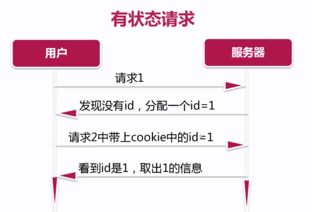
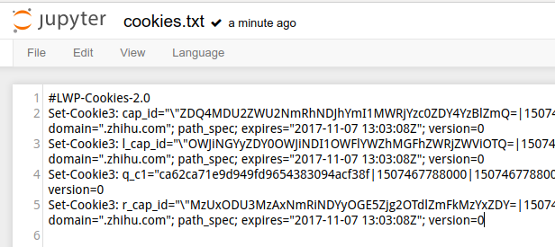

# cookie、session的区别
### cookie
本地存储机制，不是存在服务器，是浏览器的行为。以键值对的形式存在对应的域名下面。
`http`是一种无状态的协议，无法记录客户端的请求记录；所以有了`cookie`，把`http协议`变成了有状态。会记录一些请求记录，如下图：



他可以保存一些信息，但是存在泄露的隐患。

### session
根据用户名设密码**服务器**随机生成**有过期时间**的的字符串，由服务器发送给客户端，客户端把它保存在`cookie`中，直到它过期或者被用户清除为止。

### request模拟登录知乎
###### **常见httpcode:**

|code|说明|
|---|---|
|200|请求被成功处理|
|301/302|永久性重定向/临时性重定向|
|403|没有权限访问|
|404|没有对应资源|
|500|服务器错误|
|503|服务器停机或者正在维护|

###### 创建知乎模拟登录
在`utils`文件夹下新建一个`py`文件，代码如下：
```Python
import requests
#python2请求：import cookielib
import http.cookiejar as cookielib
import re

#使用session来模拟登录，不用每一次都向服务器发出请求,提高工作效率
session = requests.session()
session.cookies = cookielib.LWPCookieJar(filename="cookies.txt")

agent = 'Mozilla/5.0 (X11; Linux x86_64) AppleWebKit/537.36 (KHTML, like Gecko) Chrome/61.0.3163.100 Safari/537.36'
header = {
    "Host": "www.zhihu.com",
    "Referer": "https://www.zhihu.com",
    "User-Agent": agent
}
#获取xsrfcode
def get_xsrf():
    response = session.get('https://www.zhihu.com', headers = header)
    match_obj = re.match('.*name="_xsrf" value="(.*?)".*? ', response.text, re.S)
    if match_obj:
        return (match_obj.group(1))
    else:
        return " "

#模拟登录参数设置
def zhihu_login(account, password):
    if re.match('1\d{10}', account):
        print("手机号码登录")
        post_url = "https://www.zhihu.com/login/phone_num"
        post_data = {
            "_xsrf": get_xsrf(),
            "phone_num": "",
            "password": password
        }
        #模拟登陆
        response_text = session.post(post_url, data = post_data, headers = header)
        #保存登录请求数据，再次登录就不需要请求那些数据了，提高了速度
        session.cookies.save()
```
**运行结果**



成功产生了cookie文件

