# 模拟使用手机号码登录知乎
[TOC]
### 1 获取知乎的headers信息
这个很重要，如果不获取headers信息，就无法对服务器发出请求，就像这样：

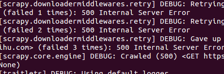

使用的浏览器不一样，他们的内核就不一样，就会产生不同的headers信息，我使用的是Google浏览器，这是我的headers信息：

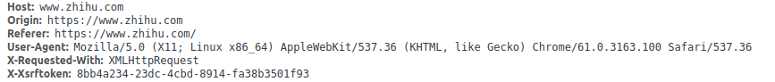

### 2 创建模拟登陆文件
###### 测试请求
根据上一步中获得的headers信息，创建一个Python文件,用来模拟登录知乎：
```python
import requests
header = {
    'User-Agent': 'Mozilla/5.0 (X11; Linux x86_64) AppleWebKit/537.36 (KHTML, like Gecko) Chrome/61.0.3163.100 Safari/537.36',
    'Host': 'www.zhihu.com',
    "Referer": "https://www.zhihu.com/",
}

res = requests.get(url='https://www.zhihu.com')#不加headers肯定无法访问
res = requests.get(url='https://www.zhihu.com',headers = header)
```
执行结果：
*未加headers信息：*

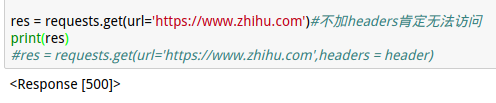

*添加headers信息*

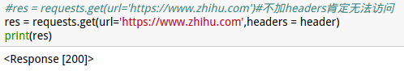

第一个错误代码500，表示服务器错误，无法向服务器发送请求；第二个代码200，表示向服务器发送请求成功。
请求测试完成后，就要进行下一步操作了。
###### 获取跨站点请求伪造:srf
在知乎主页的源代码中找到下面这一行：

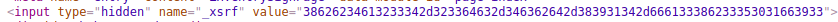

发现它是在一个`<input>`标签里的，我们可以通过两种方法获取它：
1 使用正则表达式获得：
```python
import re
def get_xsrf():
    #获取xsrf code
    response = requests.get("https://www.zhihu.com", headers=header)
    match_obj = re.match('.*name="_xsrf" value="(.*?)"', response.text,re.DOTALL)
    if match_obj:
        return (match_obj.group(1))
    else:
        return ""
```
*运行结果*

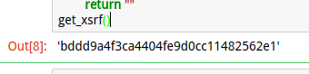

2 使用BeatifulSoup获取
```python
# 获取xsrf
from bs4 import BeautifulSoup as bs
def get_xsrf():
    res = resquests.get('https://www.zhihu.com', headers=header)
    soup = bs(res.text,'html.parser')
    crsf = soup.select('input[name="_xsrf"]')[0]['value']
    print(soup.select('input[name="_xsrf"]')[0]['value'])
    return crsf
```
*提取结果*

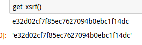

xrsf获得了，接下来就要定义如何使用通过知乎登录验证

###### 通过知乎登录验证
统计了前几步中得到的信息，发现只差得到验证信息就可以成功模拟登录知乎了，创建一个函数，用来获得验证码
```Python
import time
# 获取验证码
def get_captcha():
    t = str(int(time.time() * 1000))
    captcha_url = 'https://www.zhihu.com/captcha.gif?r=' + t + "&type=login"
    print(captcha_url)
    response = requests.get(captcha_url, headers=header)
    with open('captcha.gif', 'wb') as f:
        f.write(response.content)
        f.close()
    from PIL import Image
    try:
        im = Image.open('captcha.gif')
        im.show()
        im.close()
    except:
        pass

    captcha = input('请输入验证码: ')
    return captcha
```
*运行结果*

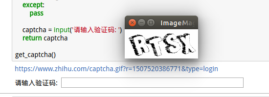

成功的获取了知乎的验证码。

###### 模拟登录
模拟登录需要的所有信息都获得了，所以就创建一个函数来模拟登录。模拟登录市，会产生cookie文件，为了避免每次登录都产生的麻烦，所以把第一次产生的保存下来，直到过期了再重新产生。
```python
from http import cookiejar
# 获取session
session = requests.session()
# 获取cookies
session.cookies = cookiejar.LWPCookieJar(filename='cookies.txt')
```
然后把所有的`requests`都改成`session`,创建登录函数：
```Python
def zhihu_login(username, passwd):
    login_url = 'https://www.zhihu.com/login/phone_num'
    login_data = {
        '_xsrf': get_xsrf(),
        'phone_num': username,
        'password': passwd,
        'captcha': get_captcha()
    }
    response = session.post(login_url, data=login_data, headers=header)
    print(response.text)
    session.cookies.save() # 保存cookie
```
*调用函数：*

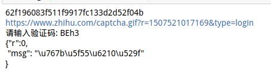

`msg`的类型是Unicode，把它输出看一下：

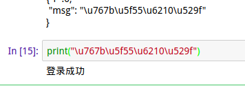

模拟登录成功了，并且还生成了`cookies.txt`文件：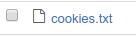

### 3 增加功能
在`python`文件中增加：
```Python
# 获取cookie，如果之前登录成功，并且已经cookie，则可以获取到
try:
    session.cookies.load(ignore_discard=True)
except:
    print ("cookie未能加载")
```
这样，在上一步中获得了cookie后，就可以自动登录了。

### 4 完整的代码
```Python
# -*- coding: utf-8 -*-

import requests
from http import cookiejar
from bs4 import BeautifulSoup as bs
import time

# 获取session
session = requests.session()
# 获取cookies
session.cookies = cookiejar.LWPCookieJar(filename='cookies.txt')
# 获取cookie，如果之前登录成功，并且已经cookie，则可以获取到
try:
    session.cookies.load(ignore_discard=True)
except:
    print ("cookie未能加载")

# 设置请求头
header = {
    'User-Agent': 'Mozilla/5.0 (X11; Linux x86_64) AppleWebKit/537.36 (KHTML, like Gecko) Chrome/61.0.3163.100 Safari/537.36',
    'Host': 'www.zhihu.com',
    "Referer": "https://www.zhihu.com/",
}

# 获取xsrf
def get_xsrf():
    res = session.get('https://www.zhihu.com', headers=header)
    soup = bs(res.text,'html.parser')
    crsf = soup.select('input[name="_xsrf"]')[0]['value']
    print(soup.select('input[name="_xsrf"]')[0]['value'])
    return crsf

# 获取验证码
def get_captcha():
    t = str(int(time.time() * 1000))
    captcha_url = 'https://www.zhihu.com/captcha.gif?r=' + t + "&type=login"
    print(captcha_url)
    response = session.get(captcha_url, headers=header)
    with open('captcha.gif', 'wb') as f:
        f.write(response.content)
        f.close()
    from PIL import Image
    try:
        im = Image.open('captcha.gif')
        im.show()
        im.close()
    except:
        pass

    captcha = input('请输入验证码: ')
    return captcha
#下载登录页面
def get_index():
    response = session.get('https://www.zhihu.com', headers = header)
    with open("index.html", "wb") as f:
        f.write(response.text.encode('utf-8'))
    print("写完了")

# 判断是否登录成功
def is_login():
    inbox_url = 'https://www.zhihu.com/inbox'
    response = session.get(inbox_url, headers=header, allow_redirects=False)
    if response.status_code == 200:
        print('登录成功')
    else:
        print('登录失败')

# 登录方法
def zhihu_login(username, passwd):
    login_url = 'https://www.zhihu.com/login/phone_num'
    login_data = {
        '_xsrf': get_xsrf(),
        'phone_num': username,
        'password': passwd,
        'captcha': get_captcha()
    }
    response = session.post(login_url, data=login_data, headers=header)
    print(response.text)
    session.cookies.save() # 保存cookie


#get_captcha()
#get_xsrf()
#zhihu_login('注册了的手机号码','密码')
#is_login()
#get_index()
```


