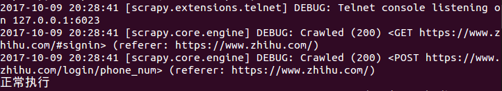
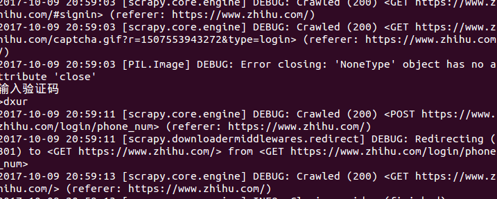
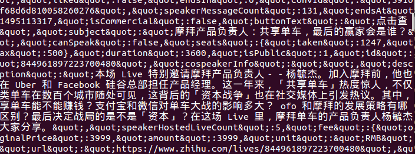
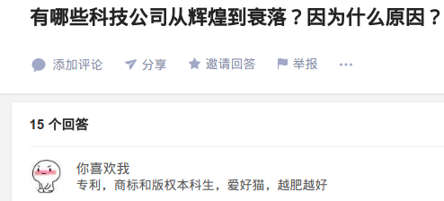
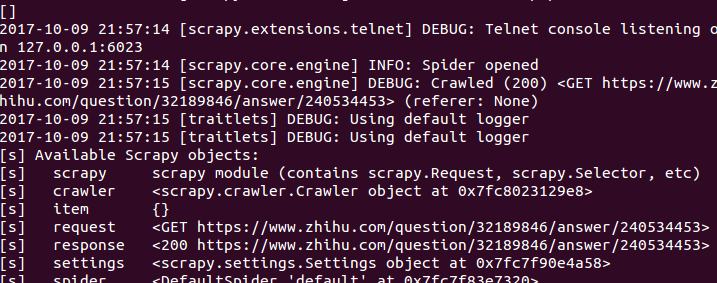

# scrapy爬知乎过程记录
[TOC]
### 1 创建项目
在终端通过命令进入项目所在根目录，然后创建爬知乎的爬虫文件
```
$ cd Bolespider
Bolespider$ scrapy genspider zhihu www.zhihu.com
```
知乎的爬虫文件创建好了，接下来是给它添加功能，让它获取我们想要的信息

### 2 爬取前编辑
###### 1 重写请求
在步骤一产生的爬虫文件`zhihu.py`中进行编辑
```python
import scrapy
from bs4 import BeautifulSoup

class ZhihuSpider(scrapy.Spider):
    name = 'zhihu'
    allowed_domains = ['www.zhihu.com']
    start_urls = ['http://www.zhihu.com/']

    headers = {
        'User-Agent': 'Mozilla/5.0 (X11; Linux x86_64) AppleWebKit/537.36 (KHTML, like Gecko) Chrome/61.0.3163.100 Safari/537.36',
        'Host': 'www.zhihu.com',
        "Referer": "https://www.zhihu.com/",
    }

    def parse(self, response):
        pass
	#对登录页面发起请求
    def start_requests(self):
        return [scrapy.Request('https://www.zhihu.com/#signin', headers =self.headers, callback = self.login)]
	#登录
    def login(self, response):
        text = response.text
        soup = BeautifulSoup(text,'html.parser')
        xsrf = soup.select('input[name="_xsrf"]')[0]['value']
        if xsrf:
            login_url = 'https://www.zhihu.com/login/phone_num'
            login_data = {
                '_xsrf': xsrf,
                'phone_num': '18164885527',
                'password': '69615345'
            }
        return [scrapy.FormRequest(
            url = 'https://www.zhihu.com/login/phone_num',
            formdata = login_data,
            headers = self.headers,
            callback = self.check_login
        )]
	#检查登录是否成功
    def check_login(self,response):
        print("正常执行")
        pass
```
*测试了一下，返回值是`200`*



###### 2 通过验证码验证
在上一步中，虽然做到了模拟登录，但是想要获取主页信息，还要通过验证码验证。如果没有验证码就请求主页数据的话，会报错。
```python
def login(self, response):
        text = response.text
        soup = BeautifulSoup(text,'html.parser')
        xsrf = soup.select('input[name="_xsrf"]')[0]['value']
        if xsrf:
            post_url = 'https://www.zhihu.com/login/phone_num'
            post_data = {
                '_xsrf': xsrf,
                'phone_num': '18164885527',
                'password': '69615345'
            }
            import time
            t = str(int(time.time() * 1000))
            captcha_url = "https://www.zhihu.com/captcha.gif?r={0}&type=login".format(t)
            yield scrapy.Request(captcha_url, headers=self.headers, meta={"post_data":post_data}, callback=self.login_after_captcha)

    def login_after_captcha(self, response):
        with open("captcha.jpg", "wb") as f:
            f.write(response.body)
            f.close()

        from PIL import Image
        try:
            im = Image.open('captcha.jpg')
            im.show()
            im.close()
        except:
            pass

        captcha = input("输入验证码\n>")

        post_data = response.meta.get("post_data", {})
        post_url = "https://www.zhihu.com/login/phone_num"
        post_data["captcha"] = captcha
        return [scrapy.FormRequest(
            url=post_url,
            formdata=post_data,
            headers=self.headers,
            callback=self.check_login
        )]

    def check_login(self,response):
        url = 'https://www.zhihu.com/login/phone_num'
        text_json = json.loads(response.text)
        if "msg" in text_json and text_json["msg"] == "登录成功":
            for ur in self.start_urls:
                yield scrapy.Request(url, dont_filter=True, headers=self.headers)
```
*增加验证码识别后的效果*



### 3 爬虫提取具体字段
###### 验证一下
先在`zhihu.py`文件中的`def parse(self, response):‘添加一行：
```python
def parse(self, response):
        print(response.text)#输出获取的内容，看看是不是主页的信息
        pass
```
*看来我们模拟登录是没问题的：*



###### 后续逻辑
经过对知乎的问题与回答页面分析得知，它的页面有两中样式：
*一种：*



*另一种：*


所以要对得到的URL进行判断，然后再确认怎样解析对应的样式。通过命令行调试不产生500的方式：
```
$ scrapy shell -s USER_AGENT = "" http://
```
```python
scrapy shell -s USER_AGENT="Mozilla/5.0 (X11; Linux x86_64) AppleWebKit/537.36 (KHTML, like Gecko) Chrome/61.0.3163.100 Safari/537.36" https://www.zhihu.com/question/32189846/answer/240534453
```
*加了USER_AGENT后明显成功了：*




