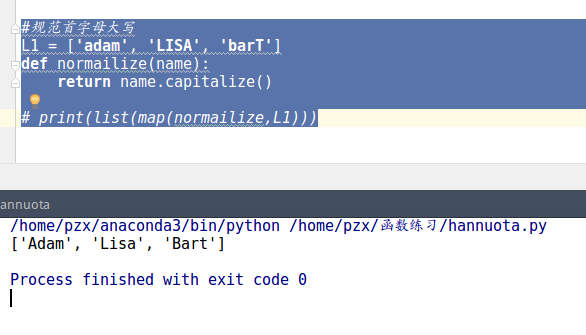

# python函数式编程
### 1 高阶函数
一、map/reduce
**`map的用法：`**
map()函数接受两个参数，一个是函数，一个是`Iterable（可以迭代的对象）`，**map将传入的函数依次作用到序列的每个元素**，并把结果作为新的`Iterator`返回。
```python
eg:
def square(number):
    return number*number

result = map(square, [1,3,5,7,9])
print(list(result))

#规范首字母大写
L1 = ['adam', 'LISA', 'barT']
def normailize(name):
    return name.capitalize()

print(list(map(normailize,L1)))
```
*运行结果：*




**`reduce的用法：`**
reduce把一个函数作用在一个序列[x1, x2, x3, ...]上，这个函数必须接收两个参数，reduce把**结果继续和序列的下一个元素做累积计算。**
```python
reduce把一个函数作用在一个序列[x1, x2, x3, ...]上，这个函数必须接收两个参数，reduce把[结果]继续和序列的下一个元素做累积计算。

eg:把序列[1，3，5，7]转换成整数1357：
from functools import reduce
def fn(x,y):
	return x*10+y
print(fn,[1,3,5,7])

#列表求积
L2 = [1,3,5,7]
def prod(x, y):
    return x*y

print(reduce(prod,L2))
```
*运行结果：*


**map结合reduce:**
```python
from functools import reduce

def str2float(s):
    nums = map(lambda ch: char_to_float[ch], s)
    point = 0
    def to_float(f, n):
        nonlocal point
        if n == -1:
            point = 1
            return f
        if point == 0:
            return f * 10 + n
        else:
            point = point * 10
            return f + n / point
    return reduce(to_float,nums,0.0)

print(str2float("12.456"))
```

*运行结果：*


