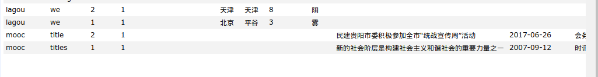
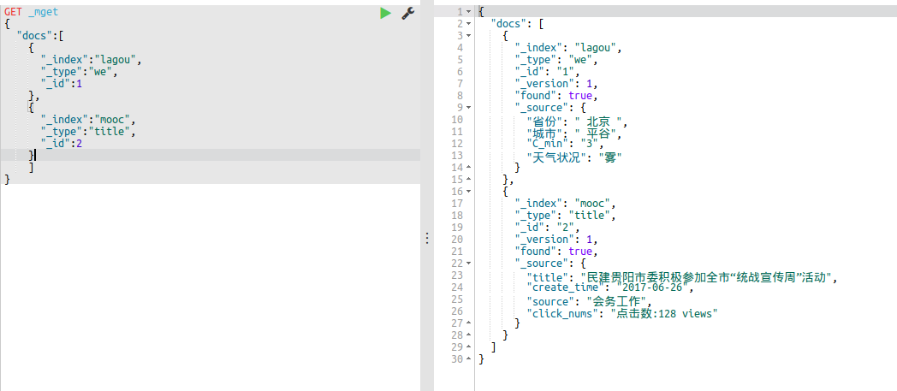
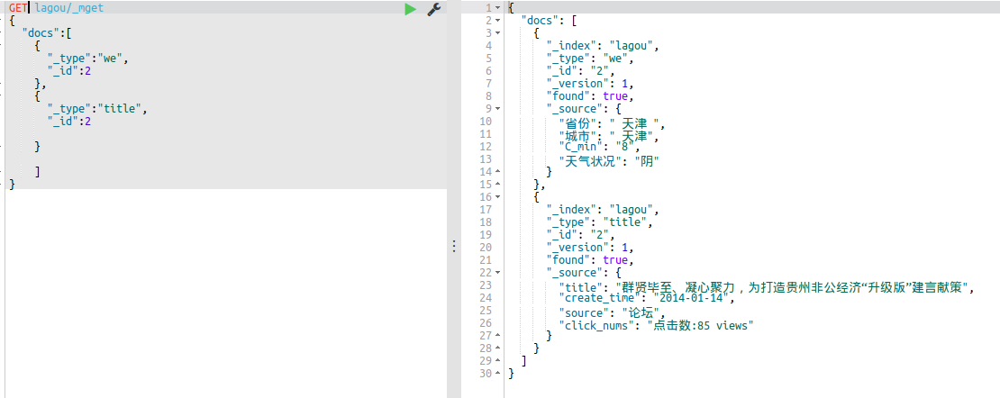
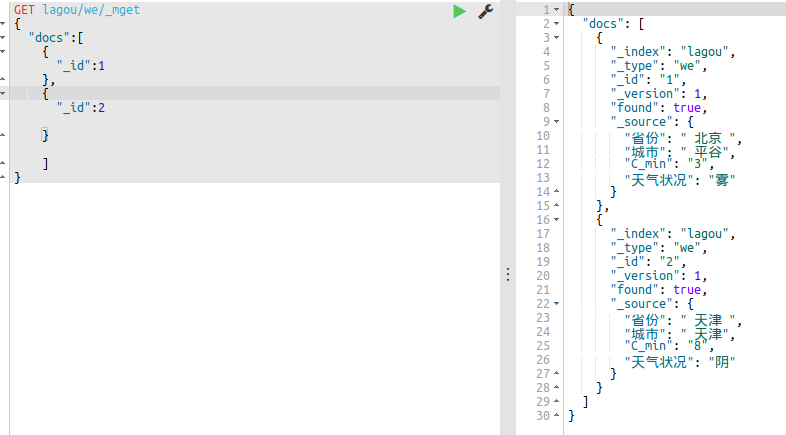
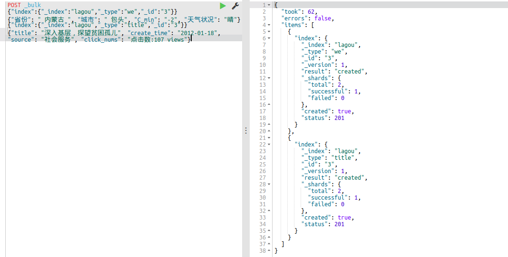
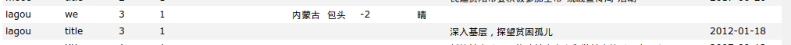

# ES批量操作

## GET _mget操作
#### 1 GET _mget
首先。有这样四条数据：



**批量查询语法**
```Json
GET  _mget
{
	"docs":[
    {
    	"_index":"要查询的索引名字"，
        "_type":"数据所在的type"，
        "_id":"数据id"
    }，
    ...
    "docs":{
    	"_index":"要查询的索引名字"，
        "_type":"数据所在的type"，
        "_id":"数据id"
    }
    ]
}
```
**具体查询代码：**
```json
GET _mget
{
  "docs":[
    {
      "_index":"lagou",
      "_type":"we",
      "_id":1
    },
    {
      "_index":"mooc",
      "_type":"title",
      "_id":2
    }
    ]
}
```
*执行一下，查询成功了：*



#### 2 一个索引下的不同type
```Json
GET lagou/_mget
{
  "docs":[
    {
      "_type":"we",
      "_id":1
    },
    {
      "_type":"title",
      "_id":2
    },
    ...,
    {
      "_type":"n_title",
      "_id":"id名字"
    }
    ]
}
```
*结果：*



#### 3 同索引、type下不同id数据的查询
```Json
GET lagou/we/_mget
{
	"docs":[
    	{
        	"id":1
        },
        ...,
        {
        	"id":n
        },
    ]
}
上面的代码等效下面的代码：
GET lagou/we/_mget
{
  "ids":[1,2]
}
```
*查询成功：*



## bulk批量操作
批量导入可以合并多个操作，比如`index`，`delete`，`update`，`create`等等。也可以从一个索引导入到另一个索引。
操作基本结构：
```
action_and_meta_data\n
optional_source\n
action_and_meta_data\n
optional_source\n
...
action_and_meta_data\n
optional_source\n
```
通过上面我们可以清楚的看到：
每一条数据都是由两行构成（`delete`除外）。
其他命令比如`index`和`create`都是由元信息行和数据行组成。
`update`比较特殊，它的数据行可能是`doc`，也可能是`upser`或者`script`。
**插入两条记录：**
```Json
POST _bulk
{"index":{"_index":"lagou","_type":"we","_id":"3"}}
{"省份": " 内蒙古 ", "城市": " 包头", "C_min": "-2", "天气状况": "晴"}

{"index":{"_index":"lagou","_type":"title","_id":"3"}}
{"title": "深入基层，探望贫困孤儿", "create_time": "2012-01-18", "source": "社会服务", "click_nums": "点击数:107 views"}
```
*执行成功：*



*查询一下：*




