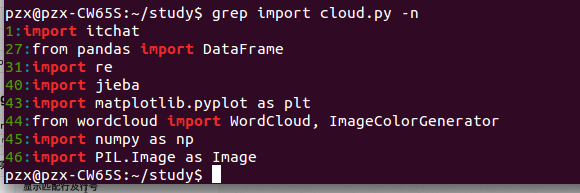

# 文件和目录常用命令

## 1 常用命令

### 1.1 查看目录内容
* `ls`
* `ls`是`list`的缩写，其功能为列出目录的内容。
* 常用选项：
|参数|含义|
|--------|--------|
|-a|显示指定目录下所有子目录与文件，包括隐藏文件|
|-l|以列表方式显示文件的详细信息|
|-h|配合-l以更加直观方式显示文件大小|

* ls通配符的使用；
|通配符|含义|
|--------|--------|
|.|代表任意个数字符|
|？|代表任意一个字符，至少一个|
|[]|表示可以匹配字符组中的任意一个|
|[abc]|匹配a，b，c中的任意一个|
|[a-f|匹配a-f范围内的任意一个字符|

使用通配符`ls *3`查看`3`结尾的文件夹：

使用通配符`ls t*.py`查看`t`开头的Python文件：

### 1.2 切换目录
* `cd`
* `cd`是英文单词**change directory**的简写，其功能是改变当前用户的工作目录
* **Linux所有的*`目录`*和*`文件名`*对大小写敏感***
* 常用选项
|命令|含义|
|--------|--------|
|cd|切换到当前用户的主目录（/home/用户目录）|
|cd ～|切换到当前用户的主目录（/home/用户目录）|
|cd .|保持在当前目录不变|
|cd ..|切换到上级目录|
|cd -|可以在最近两次工作目录之间进行来回切换|

* **`相对路径：`**相对于当前工作目录的路径
* **`绝对路径：`**相对于根目录`/`的路径

* 创建和删除操作
 * `touch`
 * `rm`
 * `mkdir`

* 拷贝和移动文件
 * `cp`
 * `mv`

### 1.3 查看文件内容
* `cat`
 * `cat -b`:对非空输出行编号
 * `cat -n`：输出所有行编号

|序号|命令|对应英文|作用|
|------|------|------|------|
|01|cat 文件名|concatenate|查看文件内容、创建文件、文件合并、追加文件内容等|
|02|more 文件名|分屏显示文件内容|
|03|grep 搜索文本 文件名|搜索文本文件内容|

* `more`
 * `空格键`：显示下一页
 * `Enter键`：一次滚动一行
 * `b`：上一屏
 * `f`：下一屏
 * `q`：退出

* `grep`
 * `-n`：显示匹配及行号
 * `-v`：显示不包含匹配文本的所有行
 * `-i`：忽略大小写
 * `^字符`：行首，以某个字符开头行
 * `字符$`：行尾，以字符结尾行

所有含有`i`的行都被忽略不显示：

查找以`i`开头的：

查找以`t`结尾的：

* 其他
 * `echo`：显示内容
 * `重定向 > 和 >>`：
   * `>`：表示输出，会覆盖文件原有的内容
   * `>>`：表示追加，会将内容追加到已有文件的末尾
   
 * `管道 |`：分为左端和右端，左端写入，右端读取

