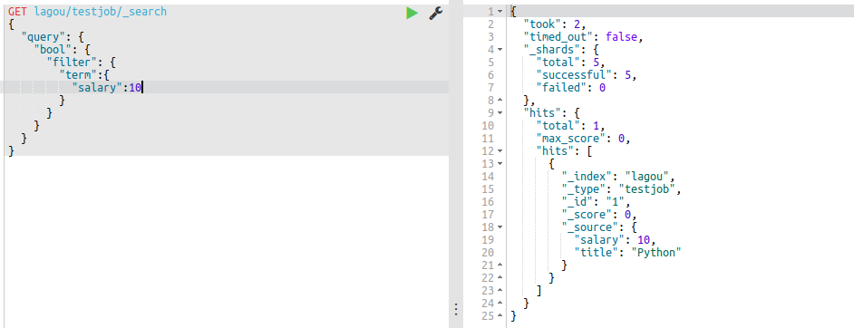

# ES组合查询
### 1 bool查询
老版本的filtered已经被bool代替，用包括：`must should must——not filter`，格式如下：
```
"bool"：{
	"filter":[], //进行字段的过滤操作，并且不进行打分
	"must":[], //数组里的查询必须都满足
	"should":[], //只要满足数组中其中一个查询就行
	"must_not":[], //不满足数组中的查询
}
```
<b>例子：</b>查询`lagou/testjob`下面“salary”为10的记录
```Json
GET lagou/testjob/_Search
{
	"query":{
    	"bool":{
        	"must": [
        		{}
      		],
        	"filter":{
            	"term":{
                	"salary":10
                }
            }
        }
    }
}
```



** 例子：** 查询`mooc/mooc_info`中课程类型是`云计算`的课程，结果只显示前两个
```Json
GET mooc/mooc_info/_search
{
  "query": {
    "bool": {
      "filter": {
        "match": {
          "class_type": "云计算"
        }
        
      }
    }
  },
  "from": 0,
  "size": 2
}
```


** 例子：** 多个关键词进行查询
```json
GET lagou/testjob/_search
{
  "query": {
    "bool": {
      "must": [
        {"match_all": {}}
      ],
      "filter": {
        "terms": {
          "salary": [
            10,
            20
          ]
        }
      }
    }
  }
}
```


### 2 分析器的解析结果
** 语法：**
```json
GET _analyze
{
	"analyzer":"ik_max_word" // 会以最多的方式进行分词
    "analyzer":"ik_smart" //以最少的方式进行分词
    "test":"关键词"
    
}
```
** 例子：** 使用`ik_smart`进行分词
```Json
GET _analyze
{
  "analyzer": "ik_smart",
  "text": "Python网络开发工程师"
}
```


** 例子：** 使用`ik_max_word`进行分词：
```Json
GET _analyze
{
  "analyzer": "ik_max_word",
  "text": "Python网络开发工程师"
}
```


### 3 bool组合过滤查询
** 例子：** 查询薪资等于20或者工作为Python的工作，排除薪资为30的
```Json
GET lagou/testjob/_search
{
  "query": {
    "bool": {
      "should": [
        {"term":{"salary":20}},
        {"term":{"title": "python"}}
      ],
      "must_not": [
        {"term":{"salary":30}}
      ]
    }
  }
}
```


### 4 嵌套查询
** 例子：** 查询*`title为Python`*或*`django并且salary为30`*
```Json
GET lagou/testjob/_search
{
  "query": {
    "bool": {
      "should": [
        {"term":{"title":"python"}},
        {"bool": {
          "must": [
            {"term":{"title":"django"}},
            {"term":{"salary":30}}
          ]
        }}
      ]
    }
  }
}
```


### 5 处理空和非空
首先插入测试数据：
```Json
POST lagou/testjob2/_bulk
{"index":{"_id":"1"}}
{"tags":["search"]}
{"index":{"_id":"2"}}
{"tags":["search","python"]}
{"index":{"_id":"3"}}
{"other_field":["some data"]}
{"index":{"_id":"4"}}
{"tags":null}
{"index":{"_id":"5"}}
{"tags":["search",null]}
```
然后开始查询`非null空值`：
```Json
GET lagou/testjob2/_search
{
  "query": {
    "bool": {
      "filter": {
        "exists": {
          "field": "tags"
        }
      }
    }
  }
}
```


查询空值：
```Json
GET lagou/testjob2/_search
{
  "query": {
    "bool": {
      "must_not": {
        "exists": {
          "field": "tags"
        }
      }
    }
  }
}
```


