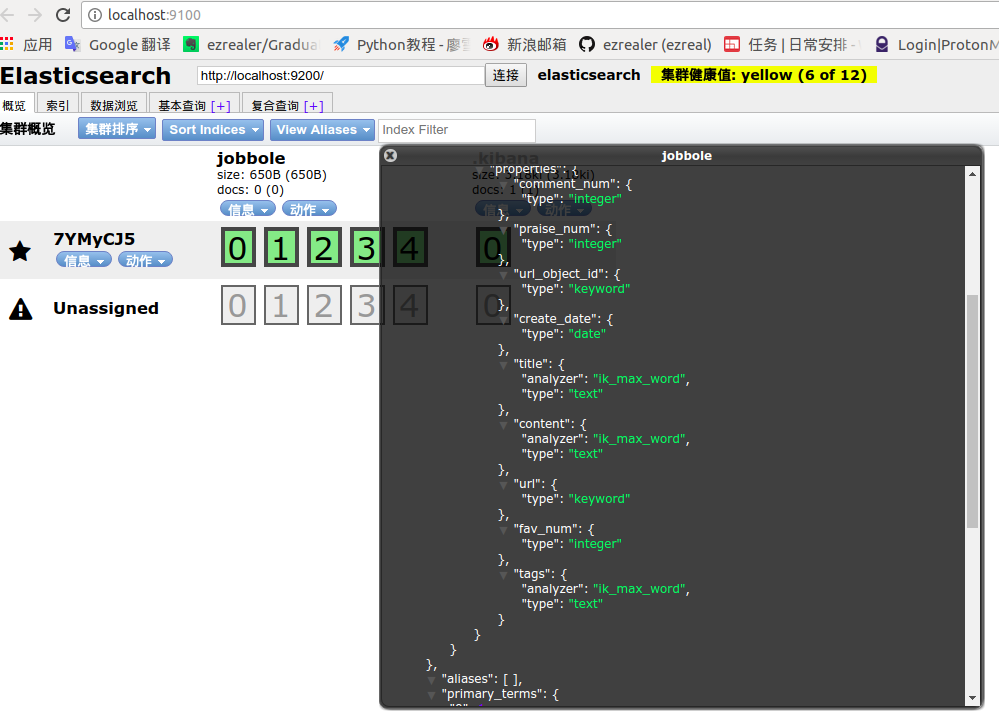
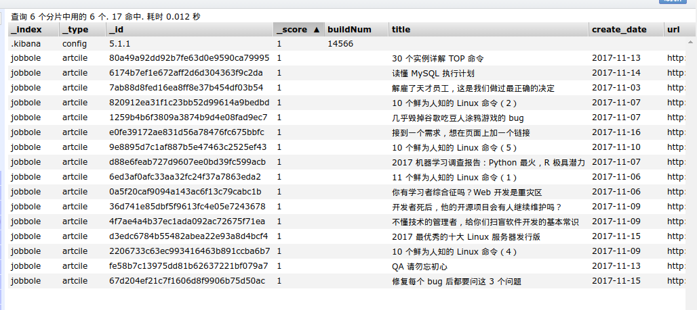

# 爬虫数据存入ES

### 0 安装工具

在scrapy项目中，数据以`items`的形式储存，所以需要把它转换成ES的文件，可以使用ES官方提供的工具：[elasticsearch dsl](https://github.com/elastic/elasticsearch-dsl-py)。安装它：
```
$ pip install elasticsearch-dsl
```
安装成功：


[elasticsearch-dsl官方参考文档](http://elasticsearch-dsl.readthedocs.io/en/latest/persistence.html#doctype)

安装完成后，在和`Spider`文件夹同级建立一个新的文件夹名为`models`，在`models`文件夹下建立一个`es_types.py`文件：
```Python
from datetime import datetime
from elasticsearch_dsl import DocType, Date, Nested, Boolean, analyzer, InnerObjectWrapper, Completion, Keyword, Text, Integer

from elasticsearch_dsl.connections import connections

connections.create_connection(hosts=["localhost"])

#伯乐在线文章字段
class ArticleType(DocType):
    title = Text(analyzer="ik_max_word")
    create_date = Date()
    url = Keyword()
    url_object_id = Keyword()
    praise_num = Integer()
    comment_num = Integer()
    fav_num = Integer()
    tags = Text(analyzer="ik_max_word")
    content = Text(analyzer="ik_max_word")

    class Meta:
        index = "jobbole"
        doc_type = "artcile"
            
if __name__ == "__main__":
    ArticleType.init()
```
执行一下：


执行成功了，刷新ES看一下：



### 1 新建pipeline
打开`pipeline.py`文件，新建一个`pipeline`名为：`ElasticsearchPipeline`：
```Python
#数据存入ES
class ElasticsearchPipeline(object):
    #将items转换为es的数据
    def process_item(self, item, spider):

        article = ArticleType()
        article.title = item['title']
        article.create_date =  item['create_date']
        article.url =  item['url']
        article.praise_num =  item['praise_num']
        article.comment_num =  item['comment_num']
        article.fav_num = item['fav_num']
        article.tags =  item['tags']
        article.content =  item['content']
        article.meta.id = item['url_object_id']

        article.save()
        return item
```
然后在`settings.py`中引用它：` 'Bolespider.pipelines.ElasticsearchPipeline': 1,`
最后执行一下：
```
$ scrapy crawl jobbole
```
报错了：


检查了一下，原来在导入的时候文件名多了个`s`去掉再运行：



成功了。

### 2 Items定制ES数据储存
因为每一个爬虫的字段是不一样的，为了存储的方便，我们可以为每个爬虫定制自己的ES保存函数。编辑`items.py`文件，在要储存到ES的items字段下面定义函数：
```Python
from Bolespider.models.es_type import ArticleType
 #把数据传入ES--伯乐在线数据
    def save_to_es(self):
         article = ArticleType()
        article.title = self['title']
        article.create_date =  self['create_date']
        article.url =  self['url']
        article.praise_num =  self['praise_num']
        article.comment_num =  self['comment_num']
        article.fav_num = self['fav_num']
        article.tags =  self['tags']
        article.content =  self['content']
        article.meta.id = self['url_object_id']

        article.save()

        return
```
然后编辑`pipelines.py`：
```Python
#数据存入ES
class ElasticsearchPipeline(object):
    #将items转换为es的数据
    def process_item(self, item, spider):
        item.save_to_es()
        return item
```
然后执行一下：


成功了，数据已经直接存入ES了。