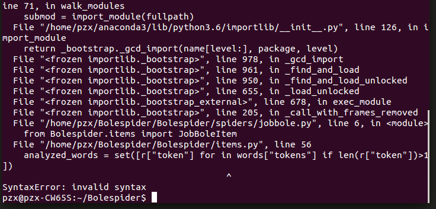

# ES结合django

## 1 ES实现自动补全和纠错
ES提供了一个实现自动补全和纠错的接口，只需要在定义`index`时在`mapping`中定义该字段即可。想要在`scrapy`中实现它，只需要修改一下`models/es_type.py`即可。
```Python
from elasticsearch_dsl.analysis import CustomAnalysis as _CustomAnalysis

#重写analyzer
class CustomAnalyzer(_CustomAnalysis):
    def get_analysis_definition(self):
        return { }
        
ik_analyzer = CustomAnalyzer("ik_max_word", filter=["lowercase"])

#伯乐在线文章字段
class ArticleType(DocType):
    suggest = Completion(analyzer=ik_analyzer)
    title = Text(analyzer="ik_max_word")
    create_date = Date()
```

运行一下：


报错了。`15`行，检查一下。是在模块引入是出了问题，单词拼写错误：`from elasticsearch_dsl.analysis import CustomAnalysis as _CustomAnalysis`改成`from elasticsearch_dsl.analysis import CustomAnalyzer as _CustomAnalyzer`

运行一下：


没有报错，再查看一下ES：


生成了索引，在`suggest`这一项中，可以看到：`type`变成了“completion”，接口开启了。接下来是爬取到的数据生成`suggest`。下面开始实现它。
编辑`items.py`文件
```Python
from elasticsearch_dsl.connections import connections
es = connections.create_connection(ArticleType._doc_type.using)

#全局函数，根据字符串生成搜索建议数组
def gen_suggests(index, info_tuple):
    used_words = set()
    suggests = []
    for text, weight in info_tuple:
        if text:
            #调用es的analyzer接口分析字符串
            words = es.indices.analyzer(index=index, analyzer="ik_max_word", params={'filter':["lowercase"]}, body=text)
            analyzed_words = set([r["token"] for in words["tokens"] if len(r["token"])>1])
            new_words = analyzed_words - used_words
        else:
            new_words = set()

        if new_words:
            suggests.append({"input":list(new_words), "weight":weight})

        return suggests
        
#把数据传入ES--伯乐在线数据
    def save_to_es(self):
        article = ArticleType()
        article.title = self['title']
        article.create_date =  self['create_date']
        article.url =  self['url']
        article.praise_num =  self['praise_num']
        article.comment_num =  self['comment_num']
        article.fav_num = self['fav_num']
        article.tags =  self['tags']
        article.content =  self['content']
        article.meta.id = self['url_object_id']

        #生成搜索建议词
        article.suggest = gen_suggests(ArticleType._doc_type.index, ((article.title, 10),(article.tags, 7)))

        article.save()

        return
```
运行一下爬虫项目：



报错了，检查一下这一行。原来是少了一个参数`r`：`analyzed_words = set([r["token"] for in words["tokens"] if len(r["token"])>1])`改成`analyzed_words = set([r["token"] for r in words["tokens"] if len(r["token"])>1])`
再次运行一下：


出错，数据无法写入。目前已知原因是在`items.py`文件内。这个函数有问题：
```Python
#全局函数，根据字符串生成搜索建议数组
def gen_suggests(index, info_tuple):
    used_words = set()
    suggests = []
    for text, weight in info_tuple:
        if text:
            #调用es的analyzer接口分析字符串
            words = es.indices.analyzer(index=index, analyzer="ik_max_word", params={'filter':["lowercase"]}, body=text)
            analyzed_words = set([r["token"] for r in words["tokens"] if len(r["token"])>1])
            new_words = analyzed_words - used_words
        else:
            new_words = set()

        if new_words:
            suggests.append({"input":list(new_words), "weight":weight})

    return suggests
```
