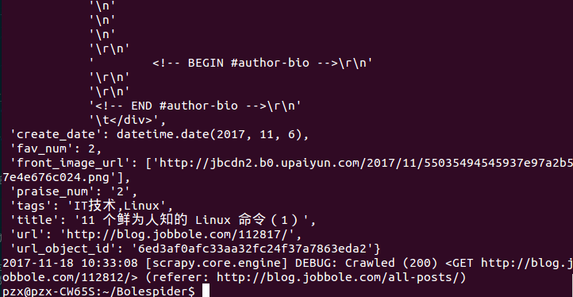
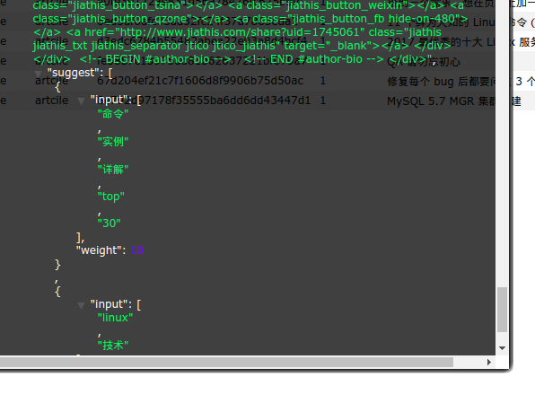

# 解决数据加入搜索提示存入ES时问题
由于昨天时间太晚，就没有继续下去，昨天已经找到问题在于这段代码：
```Python
#全局函数，根据字符串生成搜索建议数组
def gen_suggests(index, info_tuple):
    #根据字符串生成搜索建议数组
    used_words = set()
    suggests = []
    for text, weight in info_tuple:
        if text:
            #调用es的analyze接口分析字符串
            words = es.indices.analyze(index=index, analyzer="ik_max_word", params={'filter':["lowercase"]}, body=text)
            anylyzed_words = set([r["token"] for r in words["tokens"] if len(r["token"])>1])
            new_words = anylyzed_words - used_words
        else:
            new_words = set()

        if new_words:
            suggests.append({"input":list(new_words), "weight":weight})

    return suggests
```

今天，经过我找了多篇博客：
[第一篇](http://www.cnblogs.com/jp-mao/p/6937260.html)
[第二篇](http://lawtech0902.com/2017/07/20/django-elasticsearch/)
[第三篇](https://elasticsearch-dsl.readthedocs.io/)
然后发现代码是正确的。是代码的位置错误了，我在一个`class`里定义了一个全局函数。所以报错了。
解决方法如下：
1. 把这段代码改为这个`class`的内部函数
2. 把这个全局函数的代码放到`class`的外面。

问题就解决了：





`title`和`tags`这两个字段都进行了分词。