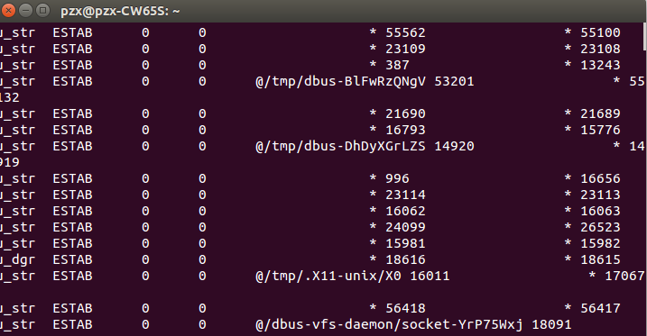

# 那些鲜为人知的Linux命令(1)

Linux命令行吸引了大多数Linux爱好者。一个正常的Linux用户一般掌握大约50-60个命令来处理每日的任务。Linux命令和它们的转换对于Linux用户、Shell脚本程序员和管理员来说是最有价值的宝藏。有些Linux命令很少人知道，但不管你是新手还是高级用户，它们都非常方便有用。

## 1 `sudo !!`命令
没有特定输入sudo命令而运行，将给出没有权限的错误。那么，你不需要重写整个命令，仅仅输入’!!‘就可以抓取最后的命令。


没有加权限，所以运行失败，接下来输入`sudo !!`试试：


## 2 `mtr`命令
我们大多数都熟悉ping和traceroute。那对于把两个命令的功能合二为一的mtr命令呢。如果mtr没在你的机子上安装，apt或者yum需要的包。
```
$ sudo apt-get install mtr
$ mtr baidu.com
```
现在运行mtr命令，开始查看mtr运行的主机和google.com直接的网络连接。


## 3 `Ctrl+x+e`命令
这个命令对于管理员和开发者非常有用。为了使每天的任务自动化，管理员需要通过输入vi、vim、nano等打开编辑器。
仅仅从命令行快速的敲击“Ctrl-x-e”，就可以在编辑器中开始工作了。

## 4 `shuf`命令
随机显示：
```
$ ls | shuf -n数字 //表示随机显示几个文件夹
```
“Shut”命令随机从一个文件或文件夹中选择行/文件/文件夹。首先使用ls命令来显示文件夹的内容。


随机显示一个：


随机显示2个：


## 5 `ss`命令
“ss”表示socket统计。这个命令调查socket，显示类似netstat命令的信息。它可以比其他工具显示更多的TCP和状态信息。




## 6 `last`命令
“last”命令显示的是上次登录用户的历史信息。这个命令通过搜索文件“/var/log/wtmp”，显示logged-in和logged-out及其tty‘s的用户列表。


## 6 `curl ifconfig.me`命令
获得外部IP地址。


## 7 `tree`命令
以树式的格式得到当前文件夹的结构。


## 8 `pstree`命令
这个命令显示当前运行的所有进程及其相关的子进程，输出的是类似‘tree’命令的树状格式。


