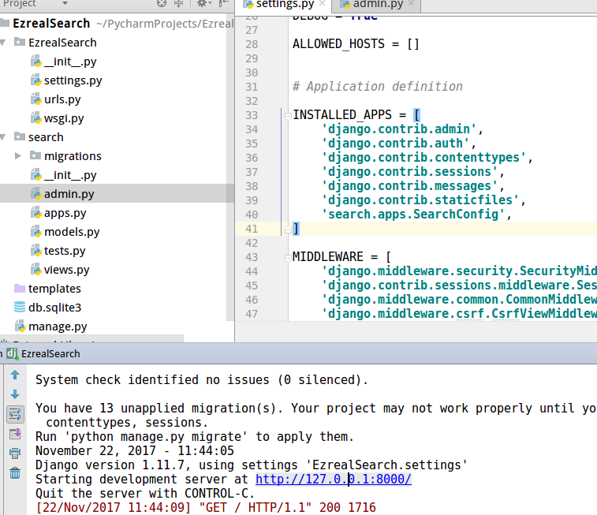
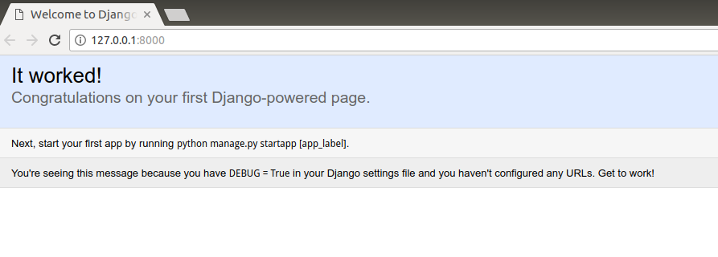
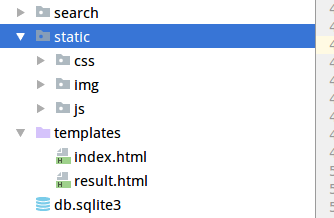
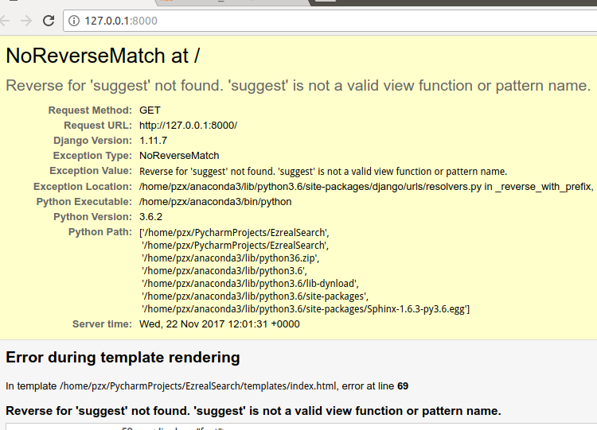
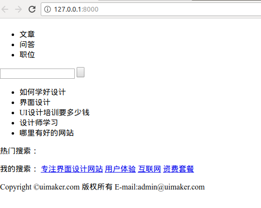
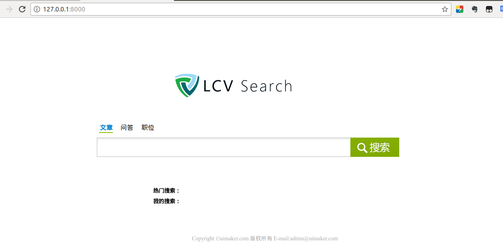
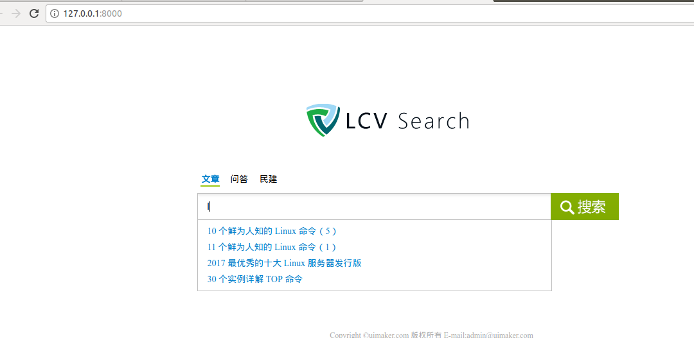

# python搭建ES搜索网站

## 1 安装Django
```
$ pip install -i https://pypi.douban.com/simple/ django
```
然后创建一个Django项目，启动试试：





## 2 静态页面嵌入Django
在根目录下新建`static`文件夹，用来存放`css`、`img`、`js`等静态文件；`HTML`文件放在已经存在的`templates`文件夹里面：



## 3 配置Django
首先，配置`Django`的url，打开`urls.py`文件：
```Python
from django.views.generic import TemplateView

urlpatterns = [
    url(r'^admin/', admin.site.urls),
    url(r'^$', TemplateView.as_view(template_name="index.html"), name="index"),
]
```
运行django项目试试URL是否配置成功：



报错了，找一下原因：
```
js还没有配置，所以找不到，先把`index.html`的68-117行注释然后在运行试试：
```



运行成功了，但是没有样式，这是因为我们还没有配置静态文件的路由，先把项目停掉，然后取消`index.html`68-117行的注释。然后配置静态文件的路由。
打开`settings.py`文件：
```Python
#css,js等静态文件的配置
STATICFILES_DIRS = [
    os.path.join(BASE_DIR, "static")
]
```
然后再打开`index.html`文件，在第一行加入``。然后引入css文件的地方修改成：
```html
#引入css
<link href= rel="stylesheet" type="text/css"/>
<link href= rel="stylesheet" type="text/css"/>

#引入Js
<script type="text/javascript" src=></script>
<script type="text/javascript" src=></script>
```
修改完成后运行一下：



**css和图片加载成功。**

## 4 完成搜索建议
先打开`search`文件夹，找到`views.py`文件，加入以下代码：
```Python
from django.shortcuts import render
from django.views.generic.base import View
from search.models import ArticleType
from django.http import HttpResponse
import json
# Create your views here.


class SearchSuggest(View):
    def get(self, request):
        key_words = request.GET.get('s', '')
        re_datas = []
        if key_words:
            s = ArticleType.search()
            s = s.suggest('my_suggest', key_words, completion={
                "field": "suggest","fuzzy":{
                    "fuzziness": 2
                },
                "size": 10

            })
            suggestions = s.execute_suggest()
            for match in suggestions.my_suggest[0].options:
                source = match._source
                re.datas.append(source['title'])

        return HttpResponse(json.dumps(re_datas), content_type="application/json")
```
然后打开`models.py`文件：
```Python
from django.db import models

# Create your models here.
from datetime import datetime
from elasticsearch_dsl import DocType, Date, Nested, Boolean, analyzer, InnerObjectWrapper, Completion, Keyword, Text, \
    Integer

from elasticsearch_dsl.analysis import CustomAnalyzer as _CustomAnalyzer

from elasticsearch_dsl.connections import connections

connections.create_connection(hosts=["localhost"])


# 重写analyzer
class CustomAnalyzer(_CustomAnalyzer):
    def get_analysis_definition(self):
        return {}


ik_analyzer = CustomAnalyzer("ik_max_word", filter=["lowercase"])


# 伯乐在线文章字段
class ArticleType(DocType):
    suggest = Completion(analyzer=ik_analyzer)
    title = Text(analyzer="ik_max_word")
    create_date = Date()
    url = Keyword()
    url_object_id = Keyword()
    praise_num = Integer()
    comment_num = Integer()
    fav_num = Integer()
    tags = Text(analyzer="ik_max_word")
    content = Text(analyzer="ik_max_word")

    class Meta:
        index = "jobbole"
        doc_type = "artcile"


if __name__ == "__main__":
    ArticleType.init()
```

最后打开`urls.py`文件：
```Python
from search.views import SearchSuggest

urlpatterns = [
    url(r'^admin/', admin.site.urls),
    #设置主页
    url(r'^$', TemplateView.as_view(template_name="index.html"), name="index"),
    #设置搜索建议
    url(r'^suggest/$', SearchSuggest.as_view(), name="suggest"),
]
```

然后运行`es`，并且新建一个搜索建议：
```Json
POST jobbole/_search?pretty
{
  "suggest":{
    "my_suggest":{
      "text": "linux",
      "completion":{
        "field": "suggest",
        "fuzzy":{
          "fuzziness":2
        }
      }
    }
  },
  "_source": "title"
}
```
运行后再运行django项目试试：



输入`l`以后，成功提出了搜索建议。