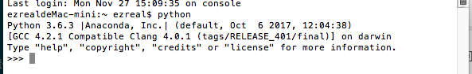
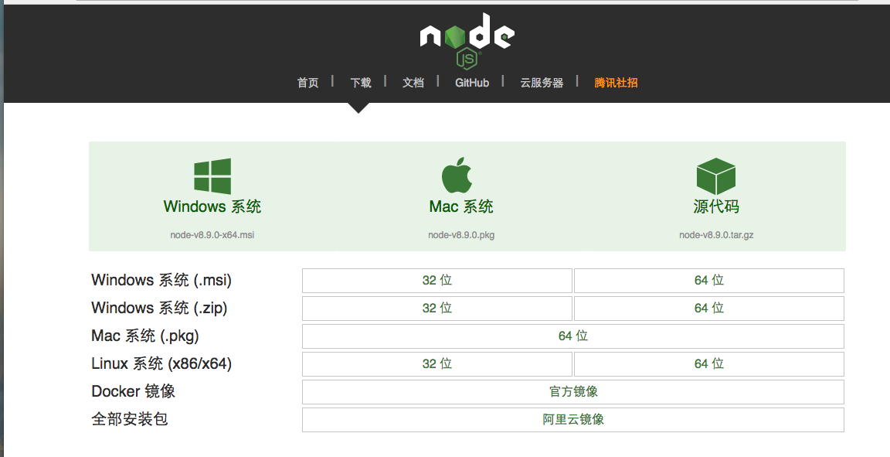
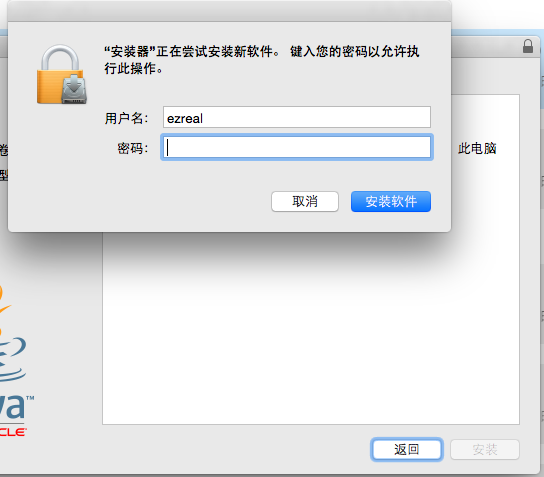
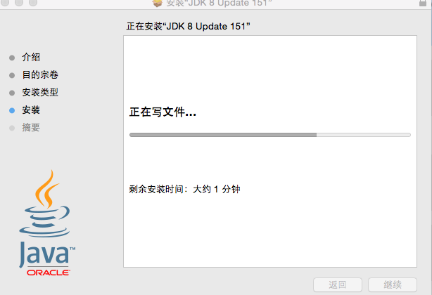
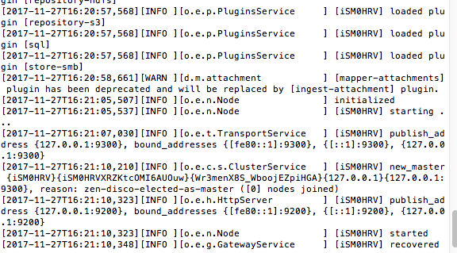

# Python项目移植到Mac
我之前的工作环境是在Ubuntu14.04下，后来实验室申请了Mac mini。所以准备把Ubuntu14.04上的项目都迁移过来。

## 1 Python安装
### 1.1 下载
打开浏览器，输入`anaconda`搜索一下：


第一个就是anaconda的官网，点击进入，然后下载适合自己系统的安装包：


anaconda是一个跨平台的开源的Python集成环境。官网上还可以查看各种平台下的安装方式。

### 1.2 安装

下载完成后开始安装，这里下载得到的直接是后缀为`.dmg`Mac可执行文件，直接点击运行就可以了。

安装完成后，在`应用程序`中直接就可以打开：


查看一下Python的版本：



Python的版本为3.6。

## 2 NodeJS安装

### 2.1 下载、安装

同样的打开浏览器，搜索`Node`：


然后选择“node.js 中文网”，进入到中文网的首页：


点击`下载`,进入到下载页面，在下载页面中，选择合适自己系统的版本：



我的是Mac OS，所以就选择中间那个。下载完成后直接安装就行，很简单。

### 2.2 测试
安装速速很快的，在一段时间的等待后，晚装完成了，然后打开终端，测试一下是否安装完成。

打开终端，依次输入`node -v`和`npm -v`，如果输出版本号的话就已经安装成功了：


### 2.3 安装Node版本管理器nvm

* [参考博客](http://www.imooc.com/article/14617)

nvm可以在node的各个版本件间进行切换，很适合测试，所以很有安装的必要。
```
brew install nvm
```

装完后，为了直接在shell使用nvm指令，必须在你的 .bash_profile 加入以下这行（习惯把设定放在.bashrc的人可以把以下的.bash_profile改成.bashrc）(注:如果没有这个文件,可以touch创建)

```
source $(brew --prefix nvm)/nvm.sh
```

然后重新source你的 .bash_profile 来让设定生效

```
~/.bash_profile
```

然后使用`nvm`来安装一个node的6.9版本试试：
```
nvm install -s 6.9.0
```
安装完成，查看一下：


## 3 Elasticsearch移植

### 3.1 Mac安装JDK8

* [参考博客](https://www.cnblogs.com/dingzhijie/p/7016397.html)

进入下载页面后，选择Mac OS系统的安装包进行下载：


由于这是可执行文件，所以下载完成后直接点击进行安装。


点击“Java Decelopment Kit”，然后点击“继续”：



输入密码，继续：



然后等待安装；


安装成功，打开终端，测试一下是否可用：


JDK8安装完成，接下来就是安装ES。

### 3.2 安装elasticsearch-rtf-5.1.1

进入`GitHub`，搜索`ElasticSearch-rtf`：


选择第一个，进入，然后下载这个项目。下载完成后先解压，把然后项目拷贝到用户目录下：
```
cd Downloads/
mv elasticsearch-rtf /Users/ezreal
```
然后就可以运行了。新建终端端口：
```
cd elasticsearch-rtf/
cd bin/
./elasticsearch
```
运行正常：



然后再打开浏览器，访问9200端口，看看是否有输出，如果有类似以下的输出的话，ES就已经正常运行了：


## 4 项目移植
环境已经配置好了，只需要把项目拷贝到Mac OS上，然后运行调试即可。
