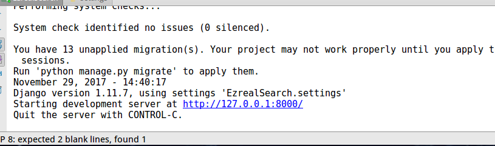

# 实现ES搜索功能

## 1 增加路由
打开`django`项目文件，找到`urls.py`，然后按照如下方法添加路由：
```python
 #实现搜索功能
    url(r'^search/$', SearchView.as_view(), name="search"),
```
然后在`views.py`中为它写一个view：
```python
#实现搜索功能
class SearchView(view):
    def get(self, request):
        key_words = request.GET.get("q", "")
        response = client.search(
            index = "jobbole",
            body = {
                "query":{
                    "multi_match":{
                        "query":key_words,
                        "fields":["tags", "title", "content"]
                    }
                },
                "from":0,
                "size":10,
                "highlight":{
                    "pre_tags": ['<span class="keyWord">'],
                    "post_tags": ['</span>'],
                    "fields":{
                        "title":{},
                        "content":{},
                    }
                }
            }
        )
        total_nums = response["hits"]["total"]
        hit_list = []
        for hit in response["hits"]["hits"]:
            hit_dict = {}
            if "title" in hit["highlight"]:
                hit_dict["title"] = hit["highlight"]["title"]
            else:
                hit_dict["title"] = hit["_source"]["title"]
            if "content" in hit["highlight"]:
                hit_dict["content"] = hit["highlight"]["content"][:400]
            else:
                hit_dict["content"] = hit["_source"]["content"][:400]

            hit_dict["create_date"] = hit["_source"]["create_date"]
            hit_dict["url"] = hit["_source"]["url"]
            hit_dict["score"] = hit["_score"]

            hit_list.append(hit_dict)

        return render(request, "result.html", {"all_hits":hit_list, "key_words":key_words})
```
然后编辑`result.html`文件，实现接收后台数据：
```css
<div class="resultList">
                    
                        <div class="resultItem">
                            <div class="itemHead">
                                <a href="{{ hit.url }}" target="_blank" class="title">
                                    {{ hit.title }}</a>
                                <span class="divsion">-</span>
                                <span class="fileType">
                                    <span class="label">来源：</span>
                                    <span class="value">伯乐在线</span>
                                </span>
                                <span class="dependValue">
                                    <span class="label">得分：</span>
                                    <span class="value">{{ hit.score }}</span>
                                </span>
                            </div>
                            <div class="itemBody">
                                
                                    {{ hit.content }}
                                
                            </div>
                            <div class=" itemFoot">
                                <span class="info">
                                    <label>网站：</label>
                                    <span class="value">伯乐在线</span>
                                </span>
                                <span class="info">
                                    <label>发布时间：</label>
                                    <span class="value">2017-04-23</span>
                                </span>
                            </div>
                        </div>
                    
                </div>
```
然后保存，运行一下：


报错了，根据提示，找了一下原因，是继承的类搞错了，是`View`而不是`view`,把它修改后:




运行成功，打开页面看一下：


输入“Java”进行搜索试试：


有搜索建议和搜索补全，然后点击搜索试试：


出现了搜索结果，而且关键词高亮显示。看一下后台的数据吧：


可以看到，我们每输入一个字符时，ES就会进行一次检索，然后把符合规则的结果返回给我们。