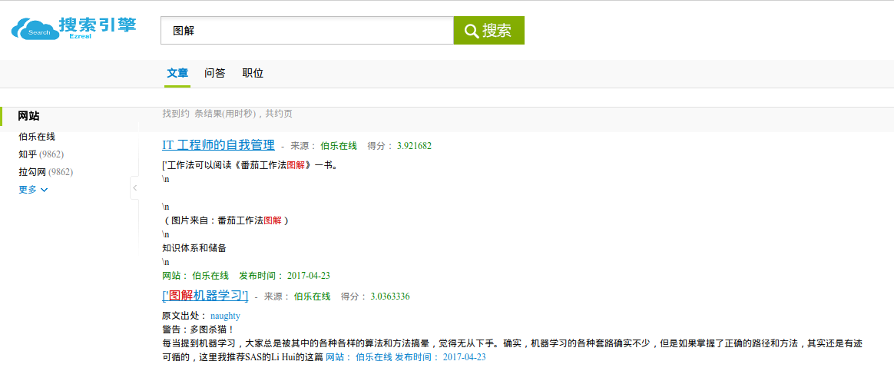

# ES界面优化

## 1 界面美化

昨天已经实现了ES的搜索功能，但是界面不太美观：



存在几个问题，首先，里面显示了爬虫保存下来的HTML标签，其次，高亮关键字居然是一个列表，所以需要优化一下，编辑`views.py`文件。修改这段代码：
```python
        for hit in response["hits"]["hits"]:
            hit_dict = {}
            if "title" in hit["highlight"]:
                hit_dict["title"] = hit["highlight"]["title"]
            else:
                hit_dict["title"] = hit["_source"]["title"]
            if "content" in hit["highlight"]:
                hit_dict["content"] = hit["highlight"]["content"][:400]
            else:
                hit_dict["content"] = hit["_source"]["content"][:400]

            hit_dict["create_date"] = hit["_source"]["create_date"]
            hit_dict["url"] = hit["_source"]["url"]
            hit_dict["score"] = hit["_score"]

            hit_list.append(hit_dict)
```
改成这样：
```python
        for hit in response["hits"]["hits"]:
            hit_dict = {}
            if "title" in hit["highlight"]:
                hit_dict["title"] = "".join(hit["highlight"]["title"])
            else:
                hit_dict["title"] = hit["_source"]["title"]
            if "content" in hit["highlight"]:
                hit_dict["content"] = "".join(hit["highlight"]["content"])[:400]
            else:
                hit_dict["content"] = hit["_source"]["content"][:400]

            hit_dict["create_date"] = hit["_source"]["create_date"]
            hit_dict["url"] = hit["_source"]["url"]
            hit_dict["score"] = hit["_score"]

            hit_list.append(hit_dict)
```
修改以后，运行一下：


爬虫带来的标签没有了，高亮关键字也去掉了数组符号。

## 2 在搜索结果页面实现搜索
我们已经实现了搜索功能，也美化了搜索结果页面，但是在搜索结果页面的搜索功能是无法使用的：


在这里点击“搜索”按钮是没有反应的，所以要给它加上这个功能。编辑`result.html`页面：
```javascript
<script type="text/javascript" src=></script>
<script type="text/javascript" src=></script>
<script type="text/javascript" src=></script>
<script type="text/javascript">
    var search_url = ""

    $('.searchList').on('click', '.searchItem', function () {
        $('.searchList .searchItem').removeClass('current');
        $(this).addClass('current');
    });

    $.each($('.subfieldContext'), function (i, item) {
        $(this).find('li:gt(2)').hide().end().find('li:last').show();
    });

    function removeByValue(arr, val) {
        for (var i = 0; i < arr.length; i++) {
            if (arr[i] == val) {
                arr.splice(i, 1);
                break;
            }
        }
    }
    $('.subfieldContext .more').click(function (e) {
        var $more = $(this).parent('.subfieldContext').find('.more');
        if ($more.hasClass('show')) {

            if ($(this).hasClass('define')) {
                $(this).parent('.subfieldContext').find('.more').removeClass('show').find('.text').text('自定义');
            } else {
                $(this).parent('.subfieldContext').find('.more').removeClass('show').find('.text').text('更多');
            }
            $(this).parent('.subfieldContext').find('li:gt(2)').hide().end().find('li:last').show();
        } else {
            $(this).parent('.subfieldContext').find('.more').addClass('show').find('.text').text('收起');
            $(this).parent('.subfieldContext').find('li:gt(2)').show();
        }

    });

    $('.sideBarShowHide a').click(function (e) {
        if ($('#main').hasClass('sideBarHide')) {
            $('#main').removeClass('sideBarHide');
            $('#container').removeClass('sideBarHide');
        } else {
            $('#main').addClass('sideBarHide');
            $('#container').addClass('sideBarHide');
        }

    });
    var key_words = "java"
    //分页
    $(".pagination").pagination({{ total_nums }}, {
        current_page: {{ page|add:'-1' }}, //当前页码
        items_per_page: 10,
        display_msg: true,
        callback: pageselectCallback
    });
    function pageselectCallback(page_id, jq) {
        window.location.href = search_url + '?q=' + key_words + '&p=' + page_id
    }

    setHeight();
    $(window).resize(function () {
        setHeight();
    });

    function setHeight() {
        if ($('#container').outerHeight() < $(window).height()) {
            $('#container').height($(window).height() - 33);
        }
    }
</script>
```
然后运行：


报错，待解决。。。