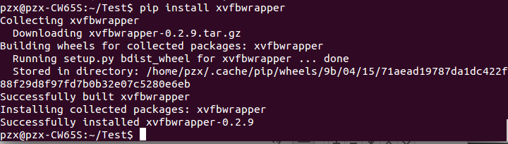

#selenium进阶使用
## 1 phantomjs无界面的浏览器
多进程情况下，性能会下降很严重。适用于服务器等没有可视化界面的终端使用。

### 1 安装
下载地址：[官网](http://phantomjs.org/download.html)。下载完成以后解压出来就可以了。

### 2 使用测试
```Python
from selenium import webdriver

browser = webdriver.PhantomJS(executable_path="/home/pzx/python/phantomjs/bin/phantomjs")
browser.get("https://item.taobao.com/item.htm?spm=a219r.lm843.14.33.381fb973zLgjyV&id=559190339371&ns=1&abbucket=13#detail")

print(browser.page_source)
browser.quit()
```
*执行一下：*：


## selenium集成到Scrapy
### 1 设置中间件
打开`middlewares.py`,新建一个中间件的类：
```Python
#通过Chrome动态请求网页中间件
from selenium import webdriver
from scrapy.http import HtmlResponse
class JSPageMiddlewares(object):
    def __init__(self):
        self.browser = webdriver.Chrome(executable_path="/home/pzx/webdriver/chromedriver")
        super(JSPageMiddlewares, self).__init__()


    def process_request(self, request, spider):
        if spider.name == "mooc":
            self.browser.get(request.url)
            import time
            time.sleep(5)
            self.browser.get_screenshot_as_file("/home/pzx/图片/mooc.png".format(request.url))
            print("正在访问:{0}".format(request.url))

            return HtmlResponse(url=self.browser.current_url, body=self.browser.page_source, encoding="utf-8", request=request)

```

然后在`settings.py`中设置下载器的地方加上刚刚写的middleware就可以了：


把注释取消，然后加入刚刚定义的middlewares的类就可以了：
```Python
# Enable or disable downloader middlewares
# See http://scrapy.readthedocs.org/en/latest/topics/downloader-middleware.html
DOWNLOADER_MIDDLEWARES = {
   # 'Test.middlewares.MyCustomDownloaderMiddleware': 543,
   'Test.middlewares.JSPageMiddlewares': 543,
}
```

*然后运行一下：*


可以成功的打开网页。

### 3 在Spider中使用selenium Chrome
```Python
from selenium import webdriver
from scrapy.xlib.pydispatch import dispatcher
from scrapy import signals

    def __init__(self):
        self.browser = webdriver.Chrome(executable_path="/home/pzx/webdriver/chromedriver")
        super(MoocSpider, self).__init__()
        dispatcher.connect(self.spider_closed, signals.spider_closed)

    def spider_closed(self, spider):
        print("爬虫结束")
        self.browser.quit()
```

### 4 Luinx无界面的Chrome浏览器
**安装：**
```
$ pip install pyvirtualdisplay 
```
*安装成功：*


**使用**
```Python
from selenium import webdriver
from pyvirtualdisplay import Display
display = Display(visible=0, size=(800, 600))
display.start()

browser = webdriver.Chrome(executable_path="/home/pzx/webdriver/chromedriver")
browser.get("https://www.taobao.com")
```
*运行一下：*


报错了。
解决方案：
```
$ sudo apt-get install xvfb
$ pip install xvfbwrapper
```




装完后解决了：

