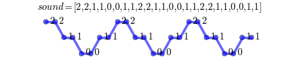
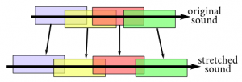
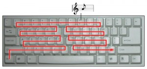

# Python打造模拟钢琴
一段音频，把它的音高改变50次并且把每一个新的音频匹配到键盘的一个键位，电脑可以模拟钢琴。
一段音频可以被编码为一组数值的数组（或者列表）：


我们可以在数组中每个一秒拿掉一秒的值来将这段音频的速度变成2倍：


这样不仅将音频的长度减半，而且我们还将它的频率翻倍。这样使得它拥有比原来更高的音高。
相反地，假如我们将数组中每个值重复一次，我们将得到一段更慢，周期更长，即音高更低的音频：



### 1 基础函数

建立一个可以按任意系数改变音频速度的Python函数：
```Python
import numpy as np

def speedx(snd_array, factor):
	#把音频速度乘以任意系数‘factory’
    indices = np.round(np.range(0, len(snd_array), factor))
    indices = indices[indices<len(snd_array)].astype(int)
    return snd_array[indices.astype(int)]
```

### 2 变速

变速可以通过传统的相位声码器来实现。首先将音频分解成重叠的比特，然后将这些比特重新排列使得他们重叠得更多（缩短音频的长度）或者更少（拉长音频的长度）：



困难之处在于重新排列的比特可能很严重的互相影响，那么这里就需要用到相位变换来确保它们之间没有影响。所以可以这样来实现：
```Python
#把音频按系数‘factor’拉伸
def stretch(snd_array, factor, window_size, h):
	phase = np.zeros(window_size)
    hanning_window = np.hanning(window_size)
    result = np.zeros(len(and_array)/factor+window_size)
    
    for i in np.arange(0, len(snd_array)-(window_size+h), h*factor):
    	#两个可能重叠的子数列
        a1 = snd_array[i:i+window_size]
        a2 = snd_array[i+h:i+window_size+h]
        #序列重排
        s1 = np.fft.fft(hanning_window*a1)
        s2 = np.fft.fft(hanning_window*a2)
        #重新设置数列频率
        phase = (phase+np.angle(s2/s1))%2*np.pi
        
        a2_rephased = np.fft.fft(np.abs(s2)*np.exp(1j*phase))
        i2 = int(i/factor)
        result[i2:i2+window_size] += hanning_window*a2_rephased.real
    #归一化（16bit）
    result = ((2**(16-4))*result/result.max())
    return result.astype('int16')
```
### 3 变调
实现变速以后，变调就不难了。如果需要一个更高的音高。可以先把这段音频拉伸并且保持音高不变，然后加快它的速度，这样得到的音频具有原始音频同样的长度，更高的频率，即是更高的音高。
把一段音频的频率翻倍将把音高提高一个八度，也就是12个半音。因此，要将音高提高n个半音的话，把频率乘以系数即可：2^(n/12):
```python
def pitchshift(snd_array, n, window_size=2**13, h=2**11):
    #把一个音提高‘n’个半音
    factor = 2**(1.0 * n / 12.0)
    stretched = stretch(snd_array, 1.0/factor, window_size, h)
    return speedx(stretched[window_size:], factor)
```
接下来我们基于之前的音频创造50个变调的音高，从很低到很高：
```Python
from scipy.io import wavfile
 
fps, bowl_sound = wavfile.read("bowl.wav")
tones = range(-25,25)
transposed = [pitchshift(bowl_sound, n) for n in tones]
```
接下来根据[这个文件](https://raw.githubusercontent.com/Zulko/pianoputer/master/typewriter.kb)中的顺序，我们把每一个音频匹配到键盘的一个键位，如下图所示：



我们只需要在代码中告诉计算机当一个键按下来的时候播放其对应的声音，然后当按键松开后停止播放就可以了：
```python
import pygame
 
pygame.mixer.init(fps, -16, 1, 512) # 太灵活了 ;)
screen = pygame.display.set_mode((640,480)) # 设置焦点
 
# 得到键盘的键位的正确顺序的列表
# ``keys`` 如 ['Q','W','E','R' ...] 一样排列
keys = open('typewriter.kb').read().split('\n')
 
sounds = map(pygame.sndarray.make_sound, transposed)
key_sound = dict( zip(keys, sounds) )
is_playing = {k: False for k in keys}
 
while True:
 
    event =  pygame.event.wait()
 
    if event.type in (pygame.KEYDOWN, pygame.KEYUP):
        key = pygame.key.name(event.key)
 
    if event.type == pygame.KEYDOWN:
 
        if (key in key_sound.keys()) and (not is_playing[key]):
            key_sound[key].play(fade_ms=50)
            is_playing[key] = True
 
        elif event.key == pygame.K_ESCAPE:
            pygame.quit()
            raise KeyboardInterrupt
 
    elif event.type == pygame.KEYUP and key in key_sound.keys():
 
        key_sound[key].fadeout(50) # 停止播放并50ms淡出
        is_playing[key] = False
```
就这样我们把计算机变成了一台钢琴！