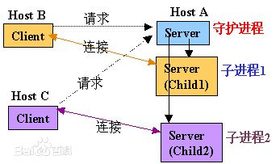
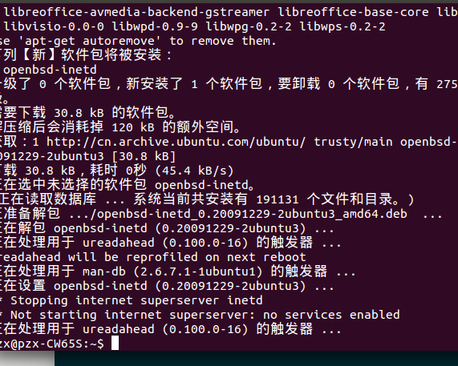
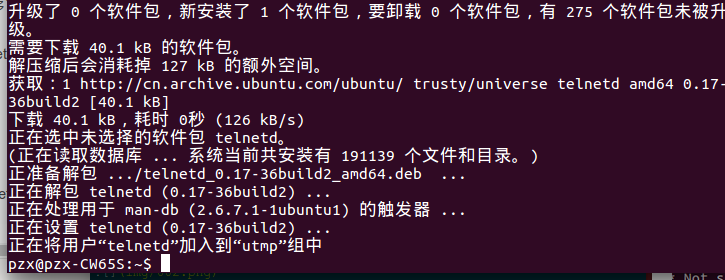
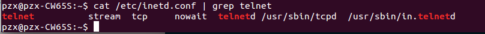
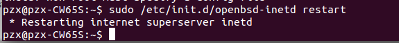
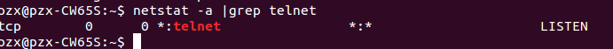
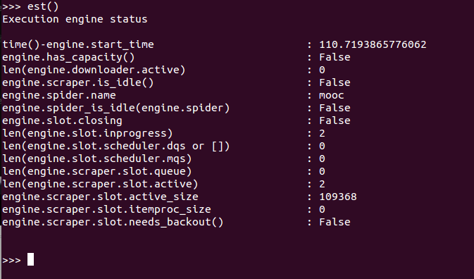

# scrapy 一些操作
### 1 Telnet
Telnet协议是TCP/IP协议族中的一员，是Internet远程登陆服务的标准协议和主要方式。它为用户提供了在本地计算机上完成远程主机工作的能力。在终端使用者的电脑上使用telnet程序，用它连接到服务器。终端使用者可以在telnet程序中输入命令，这些命令会在服务器上运行，就像直接在服务器的控制台上输入一样。可以在本地就能控制服务器。要开始一个telnet会话，必须输入用户名和密码来登录服务器。Telnet是常用的远程控制Web服务器的方法。



1、首先查看telnet运行状态
```
$ netstat -a | grep telent
```
*输出为空：*


表示没有启动该服务。也可能是没有安装：
2、安装openbsd-inetd
```
$ sudo apt-get install openbsd-inetd
```
*ok*



3、安装telnetd
```
$ sudo apt-get install telnetd
```
*安装完成：*



安装完之后，查看/etc/inetd.conf的内容会多了一行:
```
$ cat /etc/inetd.conf | grep telnet
```



4、重启openbsd-inetd
```
$  /etc/init.d/openbsd-inetd restart
```



5、查看telnet运行状态
```
$ netstat -a |grep telnet
```



6、telnet登陆测试
```
$ telnet localhost 6023
```



