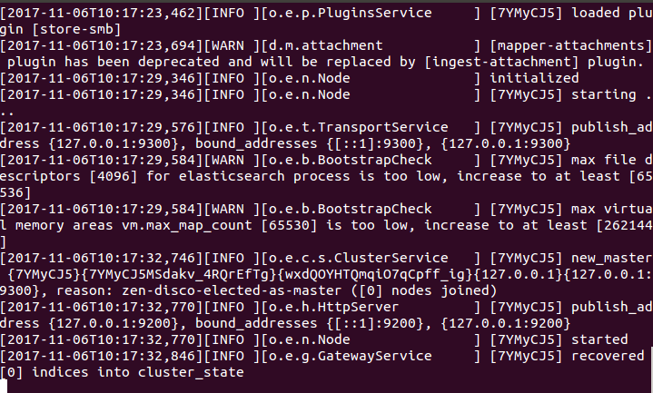
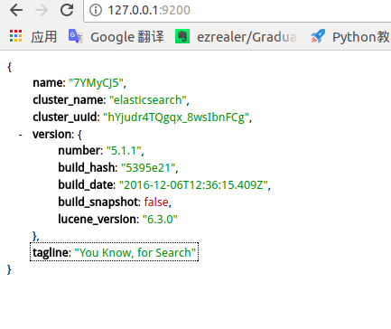
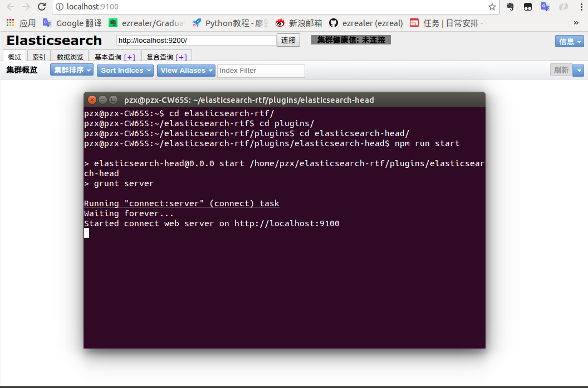
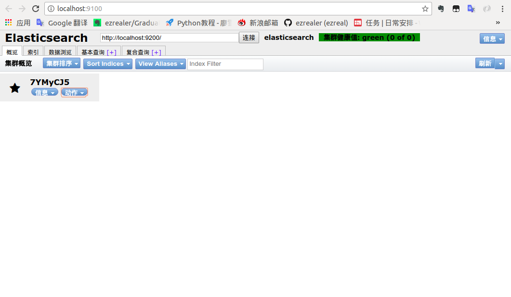
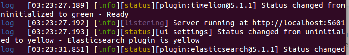
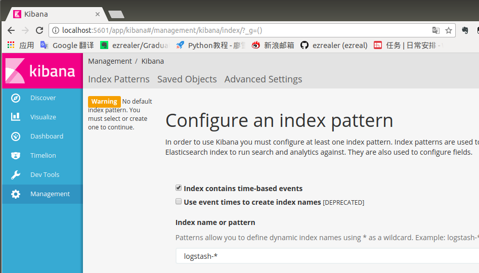

# Elasticsearch套件安装

### 1 elasticsearch
ElasticSearch是一个基于Lucene的搜索服务器。它提供了一个分布式多用户能力的全文搜索引擎，基于RESTful web接口。Elasticsearch是用Java开发的，并作为Apache许可条款下的开放源码发布，是当前流行的企业级搜索引擎。设计用于云计算中，能够达到实时搜索，稳定，可靠，快速，安装使用方便。

其他的搜索引擎：solr...

### 2 关系数据库搜索的缺点
1.无法把搜索得到的数据排序
2.无分布式
3.无法解析搜索请求
4.效率低
5.分词

### 3 安装
1.安装ElasticSearch-rtf
首先安装JDK，再安装[ElasticSearch-rtf](https://github.com/medcl/elasticsearch-rtf)。这个版本不仅稳定，还加入了许多插件和配置，大大节约了配置和上手的时间。

*运行完成：*



2 文件目录介绍：
`bin`:elastic的启动程序
`config/elasticsearch.yml`：elastic的配置文件
`data`：数据存放的文件夹
`lib`：elastic的依赖包
`logs`:日志
`modules`：模块
`plugins`：插件

访问：[本地9200端口](127.0.0.1:9200),如果有输出就表示elastic能够正常运行：



### 4 两个重要插件
1.head
一个基于浏览器elastic管理工具。[安装教程及下载地址](https://github.com/mobz/elasticsearch-head)

*安装完成后运行：*



运行成功后配置elasticSearch-head能够访问elasticSearch：
打开elastic的配置文件，加入下面的代码
```
http.cors.enabled: true
http.cors.allow-origin: '*'
http.cors.allow-methods: OPTIONS, HEAD, GET, POST, PUT, DELETE
http.cors.allow-headers: "X-Requested-With, Content-Type, Content-Length, X-User"
```
修改后重启elastic，刷新head：



成功连接了。

2.kibana
由于elasticSearch-rtf的版本是5.1.1的，所以kibana的版本也要和它保持一致。[下载地址](https://www.elastic.co/downloads/past-releases/kibana-5-1-1)
下载完成后：
```
$ tar -zxvf kibana-5.1.1-linux-x86_64.tar.gz
$ cd kibana-5.1.1-linux-x86_64/bin
$ ./kibana
```

然后可以看到kibana的监听端口是5061：



然后打开5601端口：



运行成功了。然后可以开始使用


