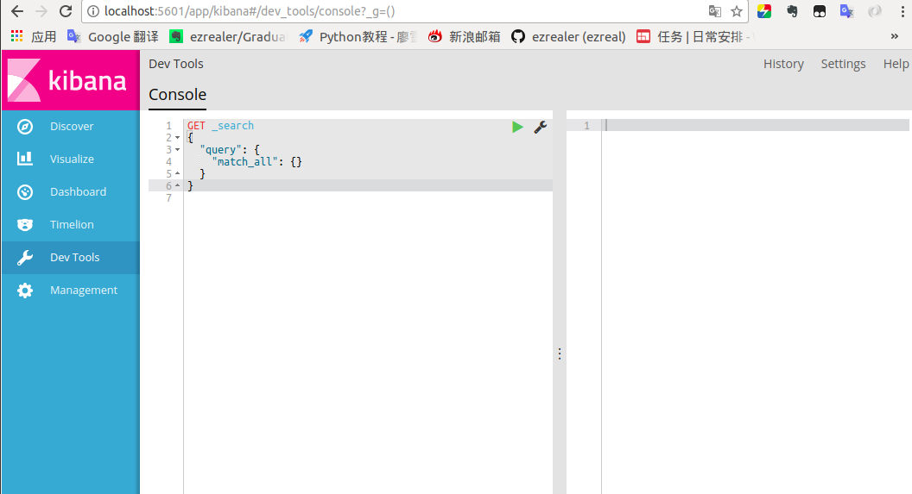
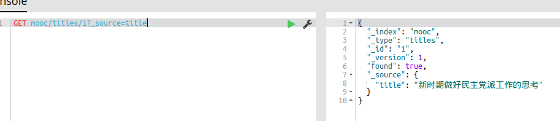

# ElasticSearch的文档、索引的CRUD操作

[TOC]

### 1 索引初始化
运行`kibana`，进入操作窗口：



在操作窗口中输入：
```Json
PUT 索引名称
{
  "settings": {
    "index":{
      "number_of_shards":5, //索引分片的数量，默认5个
      "number_of_replicas":1 //索引的副本数量，默认1个
    }
  }
}
```
运行一下，报错了：


原来是这个索引已经存在了，换个名字，再运行一下：


运行成功。也可以使用elasticSearch-head来创建，这个操作更加简单：


一旦创建完成后，分片的数量就是固定的，但是副本的数量可以修改

### 2 查询索引setting是信息
**获取单个索引里的settings信息：**
```Json
GET lagou/_settings
```


**获取所有索引的settings信息：**
```json
GET _all/_settings
```


**获取多个索引的settings**
```Json
GET mooc,lagou/_settings
```


### 3 更新(修改)索引settings数据
比如我们想把mooc这个索引的副本数量改成2个：
```Json
PUT mooc/_settings
{
  "number_of_replicas": 2
}
```


修改成功！

### 4 查看所有的索引
```Json
GET _all //查询所有索引的index
GET lagou //查询的那个索引的index
```


### 5 保存文档到索引
这是一段Json文档：
```Json
{"title": "新时期做好民主党派工作的思考",
 "create_time": "2008-12-02", 
"source": "论坛", 
"click_nums": "点击数:81 views"
}
```
然后把它保存进`mooc`这个索引里,`type`为：`titles`,`ID`是`1`：
```Json
PUT mooc/titles/1
{
"title": "新时期做好民主党派工作的思考",
"create_time": "2008-12-02", 
"source": "论坛", 
"click_nums": "点击数:81 views"
}
```
*插入成功：*


*可以在elasticSearch-head里查看一下：*


`ID`如果不指定的话可以由ES自动生成：
```json
POST mooc/titles/
{
  "title": "新的社会阶层是构建社会主义和谐社会的重要力量之一",
  "create_time": "2007-09-12",
  "source": "时讯要文", 
  "click_nums": "点击数:532 views"
}
```
*打开ES-head查看一下：*


可见id是由es随机生成的。

### 6 索引Type的查询
#### 1 获取所有字段
**查询格式：**
```json
GET 索引名字/Type名字/id
```
**查询实例：**
```json
GET mooc/titles/1
```
*查询成功：*


#### 2 获取具体字段
**使用方法：**
1.单个
```Json
GET 索引名字/type名字/id？source=字段名
```
2.多个
```Json
GET 索引名字/type名字/id？source=字段名,字段名,...,字段名
```
3.所有
```Json
GET 索引名字/type名字/id？source
```
*一个*



*多个*


*所有*


### 7 修改文档内容
1.覆盖式修改
```json
PUT mooc/titles/1
{
"title": "新时期做好民主党派工作的思考",
"create_time": "2008-12-02", 
"source": "时讯要闻", 
"click_nums": "点击数:81 views"
}
```
*修改成功：*


2.单个修改
**使用方法**
```Json
POST 索引名字/type名字/id/_update
{
	"doc":{
    	"需要修改的字段的名字":值
    }
}
```
**eg**
```json
POST mooc/titles/1/_update
{
  "doc": {
    "source": "会员"
  }
}
```
*修改成功：*


### 8 删除
1.删除文档
```Json
DELETE 索引名字/type名字/id
```
*删除结果：*


2.删除索引
```Json
DELETE 索引名字
```

