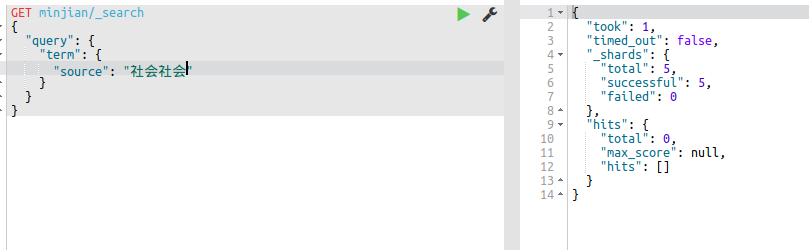
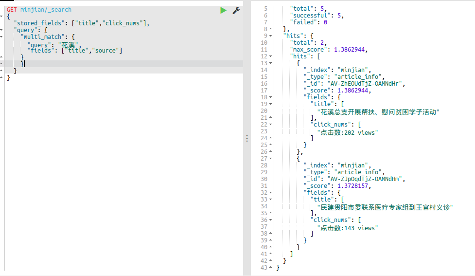

# ES查询方式
[TOC]

### 1 查询分类
ES是功能非常强大的搜索引擎，使用它的目的就是快速查询到需要的数据。
查询分类：
1.基本查询：使用es内置查询条件进行查询
2.组合查询：把多个查询组合在一起进行复合查询
3.过滤：在查询同时，通过filter条件在不影响打分情况下筛选数据

### 2 match查询
获得需要查询的关键词后进行分词处理再查询
**语法：**
```Json
GET 索引名字/_search(或者索引名字/type名字/_search，效果一样)
{
	"query":{
    	"match":{
        	"字段名":"关键词"
        }
    }
}
```
**例子**
查询标题包含关键词：`民建`的数据
```Json
GET minjian/_search
{
  "query": {
    "match": {
      "title": "民建"
    }
  }
}
```
在原始四条数据中，有两条的标题包含了`民建`这个词：


查询结果：


### 3 term查询
获得需要查询的关键词后不做任何处理就进行查询
**语法：**
```Json
GET 索引名字/_search
{
	"query":{
    	"term":{
        	"字段名"："关键词"
        }
    }
}
```
在关键词有多个时，不进行分词。
*查询：*


**term多个关键词：**



**match多个关键词：**


### 4 terms查询
```json
GET 索引名字/_search
{
	"query":{
    	"terms":["关键词1","关键词2","关键词3",..."关键词n"]
    }
}
表示只要数据源中含有关键词中的一个都会返结果
```
**例子**
```Json
GET minjian/_search
{
  "query": {
    "terms": {
      "title":["工作","核心"]
    }
  }
}
```

*执行结果：*


### 5 控制查询返回的数量
**语法：**
```json
GET 索引名字/_search
{
	"query":{
    	"match":{
        	"字段名":"关键词"
        }
    }，
    "from":数字,(从第几个开始显示)
    "size":数字（显示多少个）
}
```
**例子：**
```Json
GET minjian/_search
{
  "query": {
    "terms": {
      "title":["民建","工作","核心"]
    }
  },
  "from": 2, //从第二条数据开始返回 
   "size":2 //只返回两条数据
}
```
*结果：*


### 6 match_all
**语法：**
```Json
GET 索引名字/_search
{
	"query":{
    	"match_all":{}
    }
}
```
### 7 短语查询--match_phrase
**语法**
```Json
GET /索引名字/_search
{
	"query":{
    	"match_phrase":{
        	"字段名字":{
            	"query":"关键词", //会对关键词进行分词，分为若干个词条，当这些词条都在字段中出现，返回结果
                "slop":数字 //词条间的最小距离,小于他们间的距离时无法查询
                
            }
        }
    }
}
```
**例子**
```Json
GET /minjian/_search
{
  "query": {
    "match_phrase":{
      "title":{
        "query": "深入通知",
        "slop":9
      }
    }
  }
}
```
*结果：*


### 7 multi_match查询
这个查询可以指定多个字段。
**语法：**
```Json
GET 索引名字/_search
{
	"query":{
    	"multi_match":{
        	"query":"关键词",
            "fields":["字段“，...，”字段]
        }
    }
}
```
**例子**
```json
GET minjian/_search
{
  "query":{
    "multi_match": {
      "query": "花溪",
      "fields": ["title","source"]
    }
  }
}
可以为字段设置权重，使其优先显示：
"fields": ["title^3(倍数)","source"]
```
*执行结果：*


### 8 查询指定返回字段
**语法：**
```json
GET 索引名字/_search
{
	"stored_fields":["字段"，...，“字段”], //返回多个‘store=true’的字段
    "query":{
    	"match":{
        	"字段“:"关键词"
        }
    }
}
```
**例子：**
```json
GET minjian/_search
{
  "stored_fields": ["title","click_nums"],
  "query": {
    "multi_match": {
      "query": "花溪",
      "fields": ["title","source"]
    }
    }
  }
}
```
*结果：*



### 9 通过sort把结果排序
**语法**
```Json
GET 索引名字/_search
{
	"query":{
    	"match_all":{}
    },
    "sort":{
    	"需要排序的字段的名字":{
        	"order":"desc（或者asc）"
        }
    }
}
```
**例子**
把`minjian`这个索引下的所有文档通过`create_time`这个字段降序（desc）排序返回。
```Json
GET minjian/_search
{
  "query": {
    "match_all": {}
  },
  "sort": [
    {
      "create_time": {
        "order": "desc"
      }
    }
  ]
}
```
*执行结果：*


### 10 范围查询
查询一个字段是否在给定的范围：
gt表示大于
gte表示大于等于
lt表示小于
lte表示小于等于
**语法**
```Json
GET 索引名字/_search
{
	"query":{
    	"range":{
        	"字段名字”：{
            	"gte（下限值）"：下限值，
                "lte（上限值）":上限值，
                "boost(权重)": 2.0
            }
        }
    }
}
```
**例子**
查询在`minjian`这个索引中2013-10-10到2017-10-10的所有文章：
```json
GET minjian/_search
{
	"query":{
    	"range":{
        	"create_time":{
            	"gte":"2013-10-10",
                "lte":"2017-10-10"
            }
        }
    }
}
```


### 11 简单模糊查询--wildcard
**语法**
```Json
GET 索引名字/_search
{
	"query":{
    	"wildcard":{
        	{
            	"字段":{
                	"value": "关键*"，"boost":2.0
                }
            }
        }
    }
}
```
**例子**
查询`title`这个字段的值：`pyt**n`
```json
GET minjian/_search
{
  "query": {
    "wildcard": {
      "title": {
        "value": "pyt**n"
      }
    }
  }
}
```
*执行结果：*


