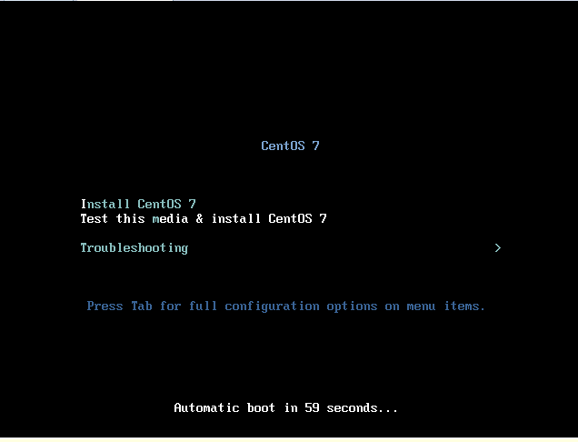
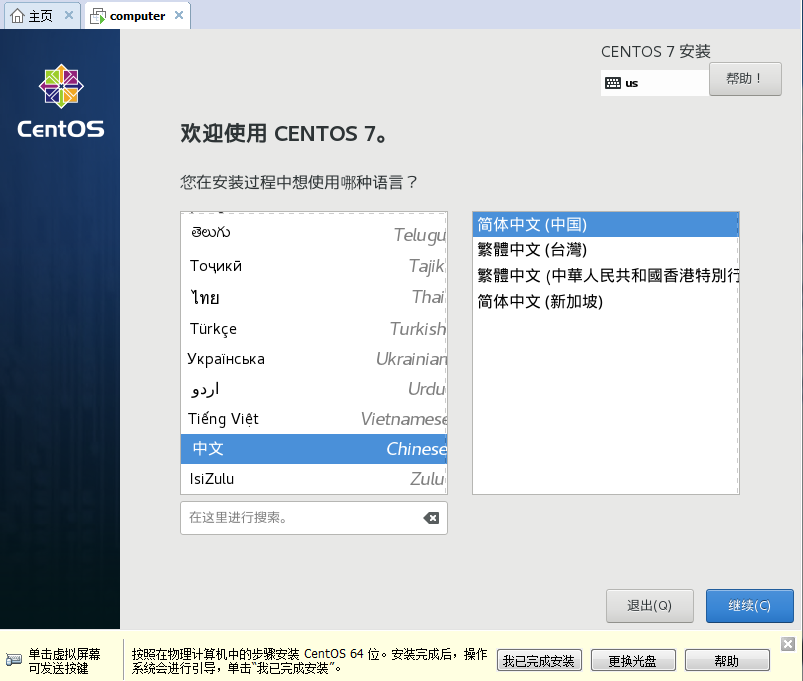
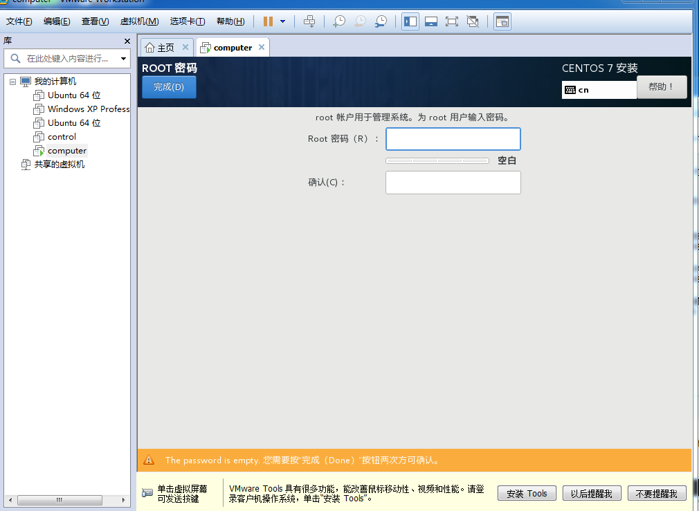

# CentOS7 64位搭建OpenStack过程

## 1 下载CentOS镜像
本次过程中使用到的镜像是[centos官网](http://mirrors.sohu.com/centos/7/isos/x86_64/CentOS-7-x86_64-Minimal-1708.iso )下载的镜像

## 2 在VMware workstation上安装CentOS虚拟机

首先，打开VMware Workstation，点击“创建新的虚拟机”：


选择“自定义”，然后点击“下一步”：


还是点击”下一步“：


然后选择“安装程序光盘映像文件”这一项，找到你的centos镜像存放的目录，选择centos镜像，再“下一步”即可：


然后是设置虚拟机的名字：


设置好以后“下一步”：


对虚拟机的处理器进行设置，根据你的电脑的实际情况选择，然后点击“下一步”：


然后是虚拟机的内存设置，也是根据自己的电脑的实际情况选择。选择好了以后，接下来的基本都是直接点击“下一步”就可以了：


然后虚拟机就会自动开启，进入安装界面：



选择第一项，“install CentOS 7”然后回车键。经过一段时间的等待后，进入了安装界面：


在这里选择安装过程中使用的语言，我选择“中文”：



然后点击右下角的“继续”。进入到下一个界面：


在这里对安装信息可以进行一些调整，然后点击“开始安装即可”：


然后可以选择设置root密码或者新建一个用户，我选的是设置root密码：



在这里输入root密码，输入完成后点击左上角的”完成“。然后等待centOS安装完成。安装完成后，点击“重启”就行：


安装完成后，使用同样的方法再安装一台名为`computer`的虚拟机。

## 3 配置CentOS

CentOS安装完成后，并不能直接就搭建OpenStack，要先对它进行一些配置。

首先，将已经安装完centos的虚拟机开启：


进入系统，输入用户名和密码就可以登录系统了：


进入系统后，先查看一下本机的IP地址：


测试一下网络是否接通：


报错了，报错信息的意思是`网络不可达`。把报错信息复制到浏览器进行搜索：


经过了解后，终于知道了原因：`没有正确的配置IP地址`,所以我参照[这篇博客](https://www.cnblogs.com/dplearning/p/5890332.html)来设置一下。

先进入到网卡配置文件夹：
```
$ cd /etc/sysconfig/network-scripts/
```


然后查看一下这个文件夹下的文件：
```
$ ll
```


第一个文件`ifcfg-ens33`就是我们要找的文件，使用`vi`编辑器打开它:
```
$ vi ifcfg-ens33
```


然后把最后一行的`ONBOOT=no`改成`ONBOOT=yes`,重启服务：
```
$ service network restart
```


然后在执行`IP a`查看一下IP地址


这下终于有了IP地址，然后ping测试一下是否畅通：


已经ok了，接下来就进行OpenStack的准备配置。

## 4 OpenStack搭建前配置

### 4.1 control配置

首先，是ip地址的配置：
```
$ cd /etc/sysconfig/network-scripts/
$ vim ifcfg-ens33
```


这是修改前的参数，修改后的参数：


然后保存退出，设置一下主机的名字。
```
$ hostnamectl set-hostname control
```


设置完成，重启下。

### 4.2 computer的配置

打开`computer`虚拟机，因为IP地址没有正确配置，所以是不能上网，先进行一下配置，然后就可以了：


接下来就是IP地址的配置，和`control`的配置过程差不多：
```
$ cd /etc/sysconfig/network-scripts/
$ vi ifcfg-ens33
```
因为`computer`里我没有安`Vim`，所以只能用`vi`


保存退出后进行系统主机名的设置：
```
$ hostnamectl set-hostname computer
```


然后查看一下IP地址：


IP地址设置正确。接下来，开始OpenStack的搭建。
首先，是参考文档：
* [centos安装OpenStack](https://docs.openstack.org/ocata/install-guide-rdo/)
* [各个系统安装OpenStack文档](https://docs.openstack.org/ocata/install/)

我的系统是centos7，所以就直接进入到[centos7的安装文档](https://docs.openstack.org/ocata/install-guide-rdo/)。


然后在左侧的菜单栏中选择`Environment`,再选择`OpenStack packages`：


然后把两台虚拟机打开。在Windows上使用ssh连接，方便操作。


在CentOS上，extras存储库提供了启用OpenStack存储库的RPM。 CentOS默认包含extras仓库，所以你可以简单地安装这个软件包来启用OpenStack仓库。
```
$ yum install centos-release-openstack-ocata
```
两台虚拟机上都执行这条命令。


安装完成：


下一步，在两台上执行：
```
$ yum install python-openstackclient
```
安装中：


安装完成：


接下来安装：