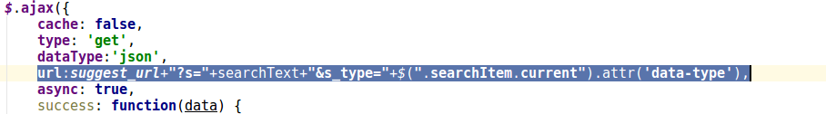
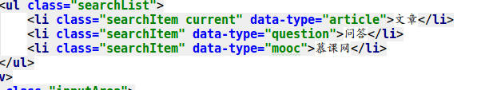
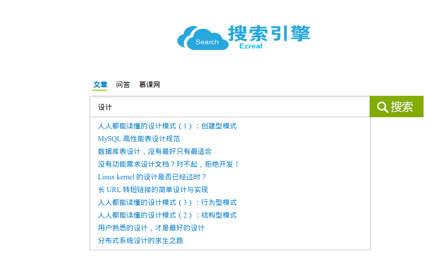

# ES搜索引擎分库查询

上次我的搜索引擎已经完成了基本的搜索功能，但是还不能处理用户的各种请求，也就是只能使用一个数据库。例如：


就像上面这样，我在另一个分类中搜索的结果是一样的，没有实现对不同类型的请求的处理。

首先，打开`index.html`，找到：



这一句定义了当我们点击搜索引擎主页的不同按钮时，他们会给后台传递一个不同的`s_type`。后台根据不同的`s_type`来区分用户请求的是哪一个数据库。

<b>这是3个类型的type名字：</b>



后台想要处理这些不同的请求，来调用不同的数据库，首先要在`models.py`文件中来定义它的类：
<b>知乎的class:</b>
```python
# 知乎问答字段
class AnswerType(DocType):
    suggest = Completion(analyzer=ik_analyzer)
    title = Text(analyzer="ik_max_word")
    url = Keyword()
    answer_num = Integer()
    topics = Text(analyzer="ik_max_word")
    crawl_time = Date()
    zhihu_id = Integer()
    content = Text(analyzer="ik_max_word")

    class Meta:
        index = 'zhihu'
        doc_type = 'answer'
```
<b>伯乐在线的class:</b>
```python
class ArticleType(DocType):
    suggest = Completion(analyzer=ik_analyzer)
    title = Text(analyzer="ik_max_word")
    create_date = Date()
    url = Keyword()
    url_object_id = Keyword()
    praise_num = Integer()
    comment_num = Integer()
    fav_num = Integer()
    tags = Text(analyzer="ik_max_word")
    content = Text(analyzer="ik_max_word")

    class Meta:
        index = "jobbole"
        doc_type = "artcile"
```
<b>慕课网的class:</b>
```python
class MoocType(DocType):
    suggest = Completion(analyzer=ik_analyzer)
    class_title = Text(analyzer="ik_max_word")
    class_diff = Keyword()
    class_stu = Integer()
    class_des = Text(analyzer="ik_max_word")
    class_url = Keyword()
    class_type = Keyword()

    class Meta:
        index = "mooc"
        doc_type = "class_info"
```
定义完成以后，就在`views.py`中的`SearchSuggest`的class中来实现它，首先，需要一个名为`s_type`的参数接收来自前台的`type`。然后对`s_type`进行判断，看看是请求伯乐在线还是知乎问答还是慕课网，然后分别对这些请求进行处理，最后把处理好的参数传递给前台：
```python
s_type = request.GET.get('s_type', 'article')
        re_datas = []
        if key_words:
            if (s_type=='question'):
                zhihu_s = AnswerType.search()
                zhihu_s = zhihu_s.suggest('my_suggest', key_words, completion={
                    "field": "suggest",
                    "fuzzy": {
                        "fuzziness": 2
                    },
                    "size": 10
                })
                suggestions = zhihu_s.execute_suggest()
            elif(s_type=='article'):
                jobbole_s = ArticleType.search()
                jobbole_s = jobbole_s.suggest('my_suggest', key_words, completion={
                    "field": "suggest", "fuzzy": {
                        "fuzziness": 2
                    },
                    "size": 10

                })
                suggestions = jobbole_s.execute_suggest()
            else:
                mooc_s = MoocType.search()
                mooc_s = mooc_s.suggest('my_suggest', key_words, completion={
                    "field": "suggest", "fuzzy": {
                        "fuzziness": 2
                    },
                    "size": 10

                })
                suggestions = mooc_s.execute_suggest()

            for match in suggestions.my_suggest[0].options:
                source = match._source
                if (s_type=='mooc'):
                    re_datas.append(source['class_title'])
                else:
                    re_datas.append(source['title'])
```
最后，把处理好的数据返回：
```python
        return HttpResponse(json.dumps(re_datas), content_type="application/json")
```
下面，运行项目试试效果如何：




可以看见，在不同的类型下，结果是不一样的，所以，已经实现了它的筛选功能。