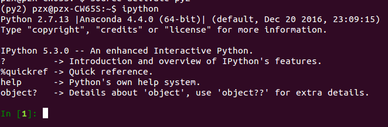
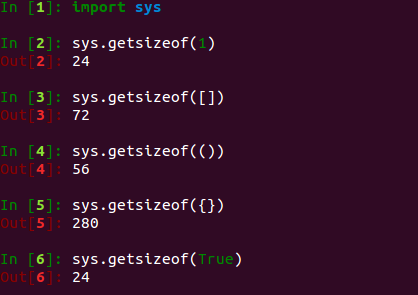
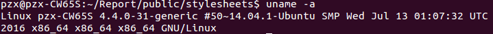
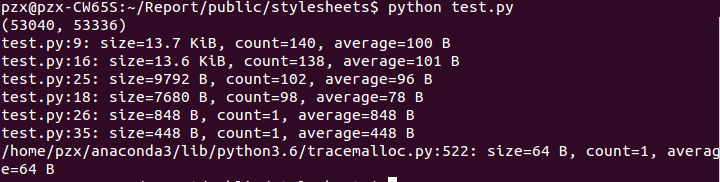
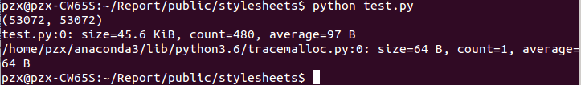
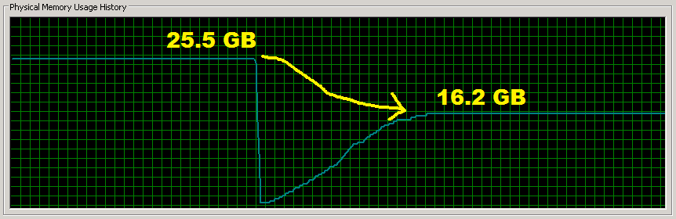
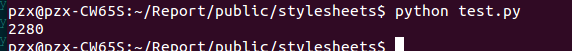

# Python 内存优化
<p style="text-indent: 2em">实际项目中，pythoner更加关注的是Python的性能问题。一般说来，如果不发生内存泄露，运行在服务端的Python代码不用太关心内存，但是如果运行在客户端（比如移动平台上），那还是有优化的必要。具体而言，本文主要针对的Cpython，而且不涉及C扩展。</p>

<p style="text-indent: 2em">我们知道，Python使用引用技术和垃圾回收来管理内存，底层也有各种类型的内存池，那我们怎么得知一段代码使用的内存情况呢？工欲善其事必先利其器，直接看windows下的任务管理器或者linux下的top肯定是不准的。</p>

<b style="color:red">Python版本:</b>



## 1 Pytracemalloc

<p style="text-indent: 2em">对于基本类型，可以通过sys.getsizeof()来查看对象占用的内存大小。以下是在64位Linux下的一些结果：</p>
```python
import sys
sys.getsizeof(1)
sys.getsizeof([])
sys.getsizeof(())
sys.getsizeof({})
sys.getsizeof(True)
```
<b style="color:red">结果：</b>



<p style="text-indent: 2em">可以看到，即使是一个int类型(1)也需要占用24个字节，远远高于C语言中int的范围。因为Python中一切都是对象，int也不例外（事实上是PyIntObject），除了真正存储的数值，还需要保存引用计数信息、类型信息，更具体的可以参见《Python源码剖析》。</p>

<p style="text-indent: 2em">而对于更复杂的组合类型，复杂的代码，使用getsizeof来查看就不准确了，因为在Python中变量仅仅指向一个对象，这个时候就需要更高级的工具，比如guppy，pysizer，pytracemalloc，objgraph。在这里重点介绍pytracemalloc。</p>

<p style="text-indent: 2em">在Python3.4中，已经支持了pytracemalloc，如果使用python2.7版本，则需要对源码打补丁，然后重新编译。pytracemalloc在pep454中提出，主要有以下几个特点：</p>
<ul><li>Traceback where an object was allocated</li><li>Statistics on allocated memory blocks per filename and per line number: total size, number and average size of allocated memory blocks</li><li>Compute the differences between two snapshots to detect memory leaks</li></ul>

<p style="text-indent: 2em">简单来说，pytracemalloc hook住了python申请和释放内存的接口，从而能够追踪对象的分配和回收情况。对内存分配的统计数据可以精确到每个文件、每一行代码，也可以按照调用栈做聚合分析。而且还支持快照（snapshot）功能，比较两个快照之间的差异可以发现潜在的内存泄露。</p>
<p style="text-indent: 2em">下面通过一个例子来简单介绍pytracemalloc的用法和接口，关于更详细用法和API，可以参考这份详尽的文档或者pytracemalloc的作者在pycon上的演讲ppt。</p>

```python
import tracemalloc
 
NUM_OF_ATTR =  10
NUM_OF_INSTANCE = 100
 
class Slots(object):
    __slots__ = ['attr%s'%i for i in range(NUM_OF_ATTR)]
    def __init__(self):
        value_lst = (1.0, True, [], {}, ())
        for i in range(NUM_OF_ATTR):
            setattr(self, 'attr%s'%i, value_lst[i % len(value_lst)])
 
 
class NoSlots(object):
    def __init__(self):
        value_lst = (1.0, True, [], {}, ())
        for i in range(NUM_OF_ATTR):
            setattr(self, 'attr%s'%i, value_lst[i % len(value_lst)])
 
 
 
def generate_some_objs():
    lst = []
    for i in range(NUM_OF_INSTANCE):
        o = Slots() if i % 2 else NoSlots()
        lst.append(o)
    return lst
 
 
if __name__ == '__main__':
    tracemalloc.start(3)
 
    t = generate_some_objs() 
 
    snapshot = tracemalloc.take_snapshot()
    top_stats = snapshot.statistics('lineno') # lineno filename traceback
 
    print(tracemalloc.get_traced_memory())
    for stat in top_stats[:10]:
        print(stat)
```

<p style="text-indent: 2em">在上面的代码中，用到了pytracemalloc几个核心的API：</p>

```python
start(nframe: int=1)
```

<p style="text-indent: 2em">pytracemalloc的一大好处就是可以随时启停，start函数即开始追踪内存分配，相应的stop会停止追踪。start函数有一个参数，nframes : 内存分配时记录的栈的深度，这个值越大，pytracemalloc本身消耗的内存越多，在计算cumulative数据的时候有用。</p>

```python
get_traced_memory()
```

<p style="text-indent: 2em">返回值是拥有两个元素的tuple，第一个元素是当前分配的内存，第二个元素是自内存追踪启动以来的内存峰值。</p>

```python
take_snapshot()
```

<p style="text-indent: 2em">返回当前内存分配快照，返回值是Snapshot对象，该对象可以按照单个文件、单行、单个调用栈统计内存分配情况</p>

<b style="color:red">运行环境：</b>



<b style="color:red">运行结果：</b>



<p style="text-indent: 2em">如果将第36行的`lineno`改成`filename`，那么结果如下:</p>

<b style="color:red">运行结果：</b>



## 2 Slots

<p style="text-indent: 2em">默认情况下，自定义的对象都使用dict来存储属性（通过obj.__dict__查看），而python中的dict大小一般比实际存储的元素个数要大（以此降低hash冲突概率），因此会浪费一定的空间。在新式类中使用__slots__，就是告诉Python虚拟机，这种类型的对象只会用到这些属性，因此虚拟机预留足够的空间就行了，如果声明了__slots__，那么对象就不会再有__dict__属性
<p style="text-indent: 2em">使用slots到底能带来多少内存优化呢，首先看看这篇文章，对于一个只有三个属性的Image类，使用__slots__之后内存从25.5G下降到16.2G，节省了9G的空间！</p>




<p style="text-indent: 2em">到底能省多少，取决于类自身有多少属性、属性的类型，以及同时存在多少个类的实例。下面通过一段简单代码测试一下：</p>

```python
# -*- coding: utf-8 -*-
import sys
import tracemalloc
 
NUM_OF_ATTR =  3 #3 # 10 # 30 #90
NUM_OF_INSTANCE = 10 # 10 # 100
 
class Slots(object):
    __slots__ = ['attr%s'%i for i in range(NUM_OF_ATTR)]
    def __init__(self):
        value_lst = (1.0, True, [], {}, ())
        for i in range(NUM_OF_ATTR):
            setattr(self, 'attr%s'%i, value_lst[i % len(value_lst)])
 
 
class NoSlots(object):
    def __init__(self):
        value_lst = (1.0, True, [], {}, ())
        for i in range(NUM_OF_ATTR):
            setattr(self, 'attr%s'%i, value_lst[i % len(value_lst)])
 
if __name__ == '__main__':
    clz = Slots if len(sys.argv) > 1 else NoSlots
    tracemalloc.start()
    objs = [clz() for i in range(NUM_OF_INSTANCE)]
    print(tracemalloc.get_traced_memory()[0])
```

<b style="color:red">运行结果：</b>



## 3 总结
<p style="text-indent: 2em">本文中介绍了Python内存优化的Profile工具，最有效的优化方法：使用slots，也介绍了在python3.6中新的dict实现。</p>
<p style="text-indent: 2em">当然，还有一些良好的编码习惯。比如尽量使用immutable而不是mutable对象：使用tuple而不是list，使用frozenset而不是set；另外，就是尽量使用迭代器，比如python2.7中，使用xrange而不是range，dict的iterxx版本。</p>


