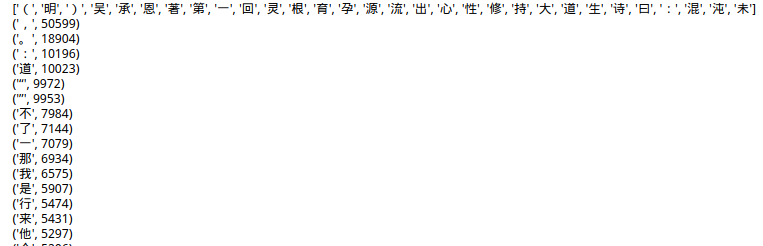
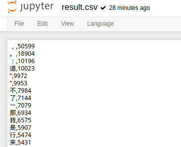
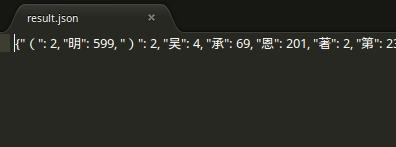

# 西游记用字统计

## 环境介绍

```
系统：Ubuntu14.04
Python3:（V3.6.0）
编辑工具：jupyter notebook
```

## 目标
统计《西游记》中：

      1.共出现了多少个不同的汉字；
      2.每个汉字出现了多少次；
      3.出现得最频繁的汉字有哪些。

## 涉及内容：
      1.读文件；
      2.字典的使用；
      3.字典的排序；
      4.写文件。

## 结果展示与分析
结果展示：



结果分析：
结果分为两个列表：
第一个列表展示的是《西游记》中所用到的每一个字（不重复的每一个字）；
第二个列表展示的是对《西游记》中每个字出现次数的统计

## 错误解析
1. 在读取文件时，使用python2无法得到正确结果。
         原因：《西游记》是中文，字符集为GBK，assci，而python没有这个字符集。
         解决方法：1.使用Python3；
                  2.将其转码为utf8或者unicode。
2. 在处理dict时出现问题：将字典转化为列表时，Python3中删除了stat.has_key()函数，所以就自己写了一个，完美解决：

```python
def dict2list(dic:dict):
    keys = dic.keys()
    vals = dic.values()
    lst = [(key, val) for key, val in zip(keys, vals)]
    return lst
```
最后，我把结果分别写入一个resul.json和一个resu.csv文件中。
LOOK CSV：



LOOK JSON:

