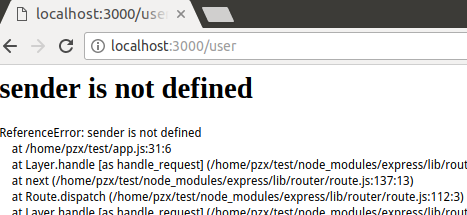

# 实现一个模板引擎
一个日益增长的趋势是，使用模板文件和应用程序数据，借助模板引擎来生成HTML；而不是从头开始构建HTML文件，或者使用静态文件。模板引擎基于由应用程序提供的值，使用template对象创建HTML。使用模板引擎提供了如下两个好处：

* **简单**：模板尽量做到容易生成HTML，那么用速记符号，要允许把JavaScript直接嵌入在HTML文档中。
* **速度**：模板引擎优化构建HTML文档的过程。许多进程编译一个模板并把编译后的版本存储在用于加快HTML响应生成的缓存中。

#### Jade
Jade使用HTML的速记符号模板，所以他的模板文件看上去并不像HTML。他的优点是模板文件非常小；易于掌握。缺点是，需要学习它的语义语法。

#### EJS 
EJS使用特殊的符号在正常的HTML文档中嵌入JavaScript。这使得他更容易从正常的HTML过度。其不足之处是HTML文档比原始文档要复杂得多，不如Jade模板整洁。

## 定义一个模板引擎
实现模板引擎的第一步是为Express应用程序定义一个默认的模板引擎。你可以通过在Express（）应用程序对象上对view engine设定进行设置来做到这一点。你还需要把views设置为你的模板引擎被存放的位置。例如，下面的代码把./views目录设置为模板文件的根并把Jade作为视图引擎：

```javascript
var app=express();
app.set('views', path.join(__dirname, 'views'));
app.set('view engine', 'jade');
```

然后，你需要为自己希望使用app.engine(ext, callback)方法来处理的模板模板拓展名注册模板引擎。ext参数是用于模板文件拓展名，calllback参数是支持Express的呈现功能函数。

* Jade

```JavaScript
app.set('view engine', 'jade');
```

* EJS

```javascript
app.set('view engine', 'ejs');
```

* HTML

```javascript
app.engine('.html', ejs.__express);
app.set('view engine', 'html');
```

## 创建模板
在呈现一个模板时，你需要创建模板文件。在创建模板文件时，请记住以下注意事项：

* **可重用性**：尽量让模板可在应用程序的其他部分和其他应用程序中重复使用。大多数模板引擎都通过缓存模板来加速性能。模板越多，引擎就要花费越多的缓存时间。
* **规模**：由于模板规模不断增长，因此他们往往会变得越来越臃肿。尽量将你的模板根据他们表示的数据类型分类别。举例来说，如果你有一个具有菜单栏、窗体和表格的模板，就可以把他们分割成三个独立的模板。
* **层次**：大多数网站和应用程序都按照某种层次建立。例如<head>部分以及横幅和菜单都可以在整个站点相同。你应该对出现在多个位置的组件使用一个独立的模板，并在并在建立你的最后一夜时只包括这些子模板

## 在响应中呈现模板
一旦你定义和配置了一个引擎模板，并创建了模板，就可以使用Express app对象或使用Response对象发送呈现后的模板。要呈现在Express app对象中的模板，你可以使用app.render()方法：

```javascript
app.render(view, [locals], callback)
```

view参数指定views目录中视图文件名。
要把模板呈现为一个响应，则可以使用res.render()函数，它的工作原理与app.render()完全一样，不同之处是不必有回调函数。回调函数在模板被呈现后执行，并应该接受错误对象作为第一个参数，并以呈现后的模板的字符串形式作为第二个参数。

## 结果展示&错误分析


错误原因：app.js中未定义ejs,在app.js中增加一行: var ejs = require('ejs')即可：


错误原因：app.js中定义的模板为HTML，将error.ejs改为error.html即可：


然后是自定义模板的呈现：
定义模板引擎：


增加路由：


错误：



错误原因：单词拼写错误，应为：res.render()。

成功的呈现了自定义模板：


## 完结