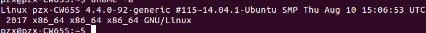
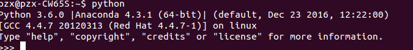
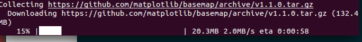
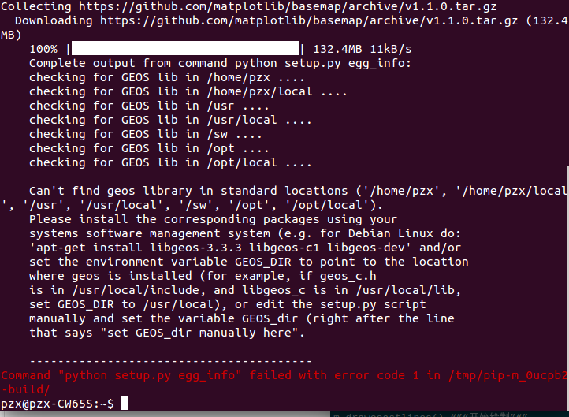

# Python绘制中国地图
[TOC]
## 开发环境：




## 安装Basemap：

```
$ pip install https://github.com/matplotlib/basemap/archive/v1.1.0.tar.gz
```
正在安装：



安装出错：


根据提示，应该是缺少了geos库。先按照提示，安装geos,
## 开始画图
1.先画一个世界地图：
```python
#-*- coding: utf-8 -*-
import matplotlib.pyplot as plt
from mpl_toolkits.basemap import Basemap

plt.figure(figsize=(16,8)) """定义地图的大小"""
m = Basemap() “”“调用函数”“”
m.drawcoastlines() “”“开始绘制”“”
plt.show() “”“打印出地图”“”
```