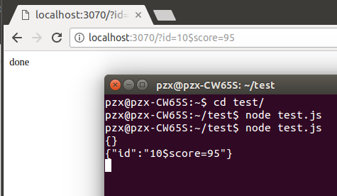

# 实现Express中间件

### 了解中间件

Express建立在Connect NPM模块上，提供了Connect所提供的底层中间件支持。下面是一些由Express支持的中间件组件：

* static：允许Express服务器以流式处理静态文件的GET请求。这个中间件是Express内置的，他可以通过express.static()访问。
* express-logger：实现一个格式化的请求记录器来跟踪对服务器的请求。
* basic-auth-connect：提供对基本的HTTP身份验证的支持。
* cookie-parser：你可以从请求读取cookie并在响应中设置cookie。
* cookie-session：提供基于cookie的会话支持。
* Express-session：提供了一个相当强大的会话实现。
* body-parser：爸POST请求正文中的JSON数据解析为req.body属性。
* compression：对发给客户端的大响应提供Gzip压缩支持。
* csurf:提供跨站点请求伪造保护。

##### 在全局范围内把中间件分配给某个路径
要对所有路由指定中间件，可以在Express app对象上实现use()方法。use()方法的语法如下：
```
use([path],middleware)
```

path变量是可选的，默认为/，这意味着所有的路径。middleware参数是一个函数，它的语法如下，其中req是Request对象，res是REsponse对象，next是要执行的下一个中间件函数：
```
function(req, res, next)
```

每个中间件组件都有一个构造函数，它返回相应的中间件功能。例如，要使用默认参数把body-parser中间见应用于所有路径，可以使用下面的语句：
```javascript
var express = require('express');
var bodyParser = require('body-parser');
var app = express();
app.use('/', bodyParser());
```

##### 把中间件分配到单个路由
你也可以通过把一个单独的路由放在path参数后来对其应用body-parser中间件。例如，下面的代码，对/parsedRoute的请求将被记录，但对/otherRoute的请求不会被记录：
```javascript
var express = reqiure('express');
var bodyParser = reqiure('body-parser');
var app = express();
app.get('/parsedRoute', bodyParser(), function(req, res){
res.send('This request was logged.');
});
app.get('/otherRoute', function(req, res){
res.send('This request was not logged.');
});
```

##### 添加多个中间函数
你可以根据需要在全局范围和路由上分配任意多的中间件函数。例如，下面的代码将分配body-parser、cookie-parser、expres-session中间件模块：
```javascript
var express = require('express');
var bodyParser = require('body-parser');
var cookieParser = reqiure('cookie-parser');
var session - require('cexpress-session');
var app = express();
app.use('/', bodyParser());
app.use('/', cookieParser());
app.use('/', session());
```
**记住**，你分配函数的顺序就是它们在请求中被应用的顺序。一些中间件函数需要被添加在别的中间件函数前面。

### 使用query中间件
query将一个查询字符串从URL转换到javascript对象，并将其保存为Request对象的query属性。从Express4.x开始，此功能在内置请求解析器中存在，而不需要额外的中间件。
下面的代码片段显示了利用query中间件的基本方法：
```javascript
var express = require('express');
var app = express();
app.get('/', function(req, res){
var id =req.query.id;
var score = req.query.score;
console.log(JSON.stringify(req.query));
res.send("done");
});
```
查询结果入下：



### 提供静态文件服务
static中间件是很常用的Express中间件。static中间件可以让你直接从磁盘对客户端提供静态文件服务。你可以使用static支持不会改变的JavaScript文件、CSS文件、图像文件和HTML文件之类的东西。static使用以下语法实现：

```
express.static(path, [options])
path 参数指定将在请求中引用的静态文件所在的根路径。options参数允许你设置以下属性：

  * maxAge:浏览器缓存maxAge（最长保存时间）。单位是毫秒。默认0
  * hidden：一个布尔值，如果为True，表示启用隐藏文件传输功能，默认为false。
  * redirect：一个布尔值，True表示若请求路径是一个目录，则该请求将被重定向到有一个尾随/的路径。默认为true。
  * index：根路径的默认文件名。默认为index.html.
```
