# python绘制中国地图
由于昨天时间太晚，所以今天来解决昨天运行错误的问题，首先goolge python3安装Basemap，找到了这篇博客(http://curbzz.blog.163.com/blog/static/244250045201751912327320/)
然后根据提示，去到了这个网站： (https://anaconda.org/conda-forge/basemap/files) ,选择了符合我系统的安装包：


安装ing：

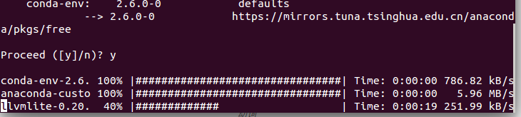

结果下载不了，然后我直接在终端安装了pyproj```npm install pyproj```

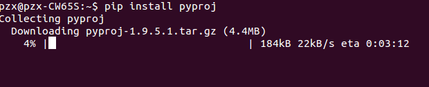

再次运行，还是失败了：

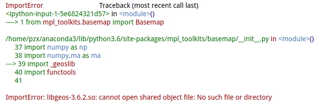

把报错信息复制到google,选择了这一篇文章 (https://stackoverflow.com/questions/35716830/basemap-with-python-3-5-anaconda-on-windows) ,然后输入了：
```
$ conda install -c conda-forge basemap=1.0.8.dev0
$ conda install -c conda-forge basemap-data-hires
```
速度实在是太慢了,没多大希望了：

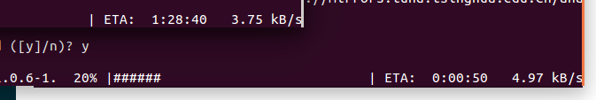

等待下载期间，我又去了这里: (https://mirrors.tuna.tsinghua.edu.cn/anaconda/pkgs/free/linux-64/), 下载了这个压缩包：```basemap-1.0.7-np113py36_0.tar.bz2 ``` 和这个压缩包: ```pyproj-1.9.5.1-py36_0.tar.bz2``` 顺便这个也下了```geos-3.4.2-0.tar.bz2```

果然通过终端安装的方法没有用，因为网络原因，挂掉了：

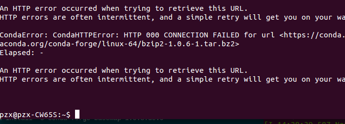

我猜想可能是geos、Basemap、版本差距大，不兼容，所以换低版本试一试。
结果我在geos-3.4.2-0.tar.bz2的README.md文件中发现：


所以我又去下载了一个低于3.0版本的geos，结果又出错了：
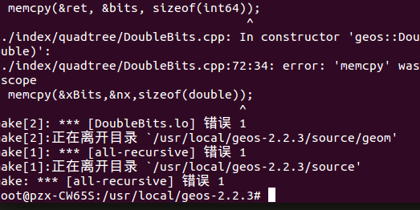

换个3.3的试试吧，感觉这次会成功：

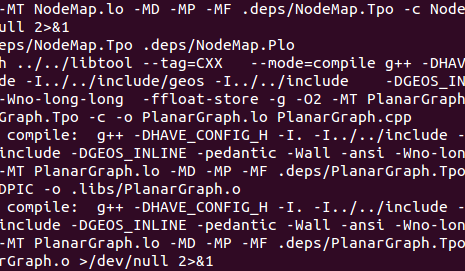

果然成功了：

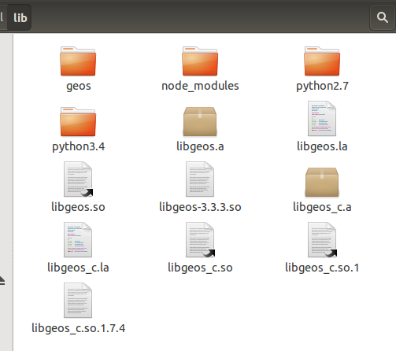

我找到了一篇文章，它详细的介绍了安装Basemap所需要的lib： (https://matplotlib.org/basemap/users/installing.html) ,我根据提示开始安装。
现在，缺少的只有proj4,我已经安装成功了：

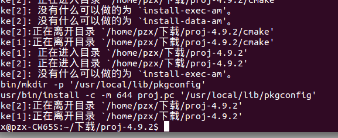

接下来，开始安装Basemap，安装成功，接下来测试一下，还是失败了：

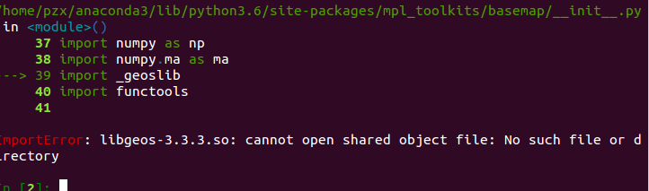

试一试把geos安装在```/home/pzx```目录下
结果还是失败：


屡败屡战的我又开始在百度找，不在Google找了，但是都是千篇一律的没那样用。终于，我看到了希望。找到了这篇博客：(http://www.zhimengzhe.com/bianchengjiaocheng/qitabiancheng/159495.html) ,根据提示，我截取了有用的部分：
```
$ conda search -c conda-forge --platform linux-64 geos
```
终端显示：

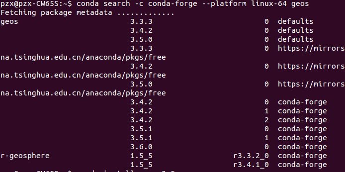

于是我安装了geos3.5:
```
$ conda install geos=3.5
```
安装成功了，然后测试：
成功了！！！！！！！！！！！！！！！！！！！！！！！！！！，经历了10多个小时，终于成功了！！！！！！！！！！！！
来张图庆祝一下：

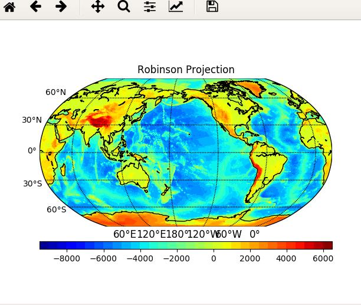

## 开始绘制中国地图
打开```jupyter notebook``` 进入昨天创建的文件，先绘制一个世界地图输入下面的代码：
```python
import numpy as np 
import matplotlib.pyplot as plt
from mpl_toolkits.basemap import Basemap
plt.figure(figsize=(16,8))
m = Basemap()
m.drawcoastlines()

plt.show()
```
执行一下，结果：
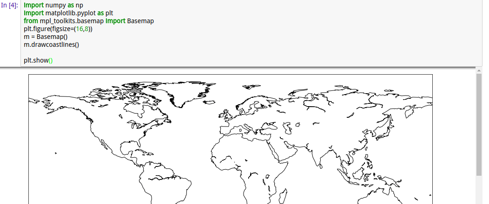

然后开始绘制**中国**